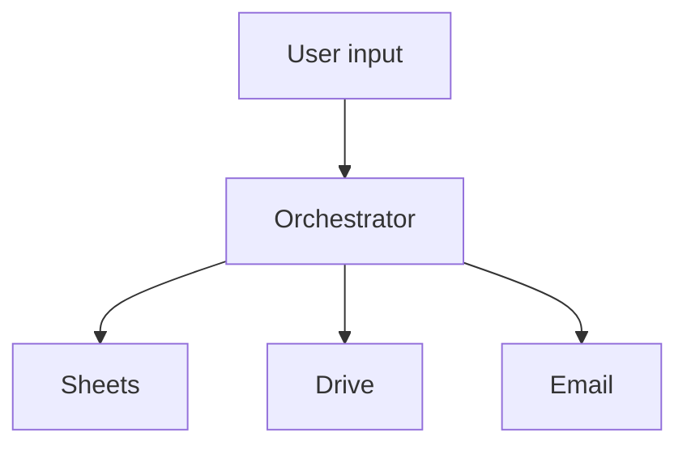

# [Nama Capstone Project Anda]

> Template README untuk submission Capstone. Isi semua bagian yang ber-tanda `<...>`.

## Overview

**Tema**: <Tema A / B / C / Custom>
**Author**: <nama Anda>
**Repo**: <URL GitHub>

Singkat (2-3 paragraf): apa masalah yang dipecahkan, untuk siapa, dan apa solusi yang Anda buat.

---

## Arsitektur

**Stack**:
- Google Apps Script (V8 runtime)
- Google Sheets sebagai database
- Google Drive untuk file storage
- Gmail untuk notifikasi
- <tambahkan service lain yang Anda pakai>

---

## Fitur

### Wajib
- [x] <Fitur 1>
- [x] <Fitur 2>
- [ ] <Fitur 3>

### Bonus
- [ ] <Fitur bonus 1>
- [ ] <Fitur bonus 2>

---

## Setup

### 1. Buat resource Google Workspace

1. Buat Google Sheet `<nama Sheet>` dengan tab:
   - **<tab1>**: header `<...>`
   - **<tab2>**: header `<...>`
   - **Audit-Log**: header `Timestamp | User | Handler | Status | Payload`

2. Buat folder Drive `<nama folder>` untuk output.

3. (Kalau pakai Doc template) Buat Google Doc `<nama template>` dengan placeholder `{{...}}`.

4. (Kalau pakai Form) Buat Google Form dengan field:
   - <field 1>
   - <field 2>

### 2. Setup project Apps Script

1. Buka [script.google.com](https://script.google.com), New project.
2. Beri nama "<nama project>".
3. Copy semua file `.gs` dan `.html` dari repo ini ke project.
4. **Project Settings** → **Script Properties** → tambahkan:

| Key | Value |
|---|---|
| `MASTER_SHEET_ID` | ID dari Sheet master |
| `AUDIT_SHEET_ID` | ID dari Sheet audit (boleh sama dengan master) |
| `DRIVE_FOLDER_ID` | ID folder Drive output |
| `TEMPLATE_DOC_ID` | ID Doc template (kalau ada) |
| `ADMIN_EMAIL` | Email admin/HR untuk notif |
| `WEB_APP_URL` | URL Web App (isi setelah deploy) |

### 3. Deploy

1. Run `validasiConfig()` — pastikan tidak error.
2. Deploy → New deployment → Web app:
   - Execute as: **Me**
   - Who has access: **<sesuaikan>**
3. Copy URL → set ke Script Property `WEB_APP_URL`.
4. Run `pasangSemuaTrigger()`.

### 4. Test

Run function `_test_<nama>()` untuk test setiap workflow utama.

---

## Cara Pakai

### Untuk <Aktor 1>:
1. <Step 1>
2. <Step 2>

### Untuk <Aktor 2>:
1. <Step 1>
2. <Step 2>

---

## Demo

Atau screenshot:

---

## Reflection

### Apa yang menantang?

<Tulis 1-2 paragraf>

### Apa yang dipelajari?

<Tulis 1-2 paragraf>

### Kalau punya waktu lebih, akan ditambah:

- <ide 1>
- <ide 2>
- <ide 3>

---

## Lisensi

MIT (atau sesuaikan).
