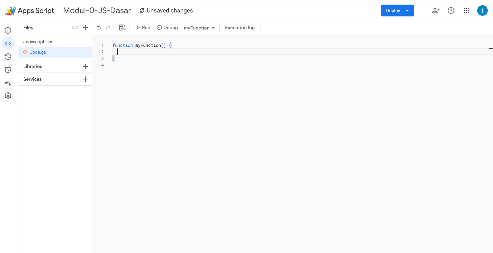
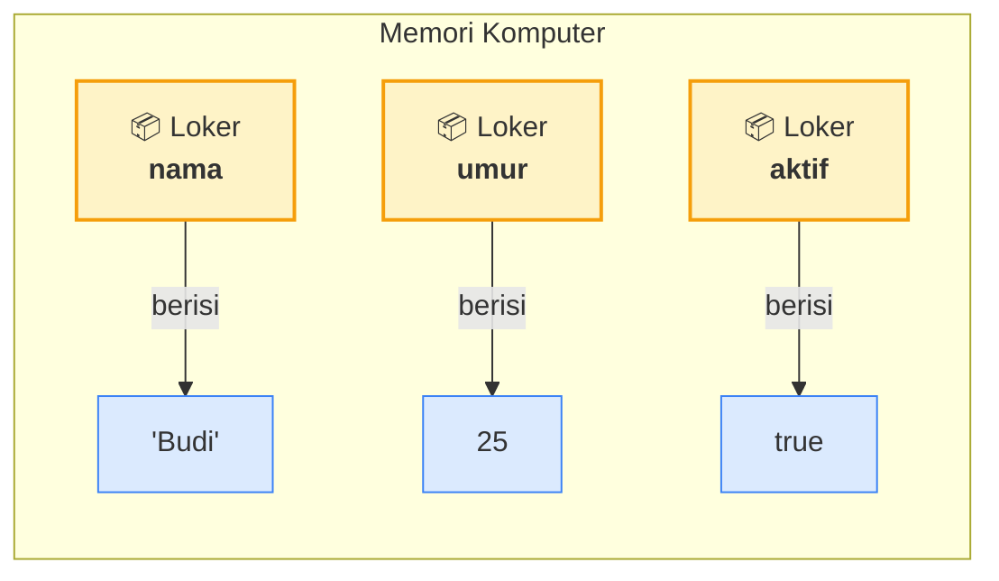
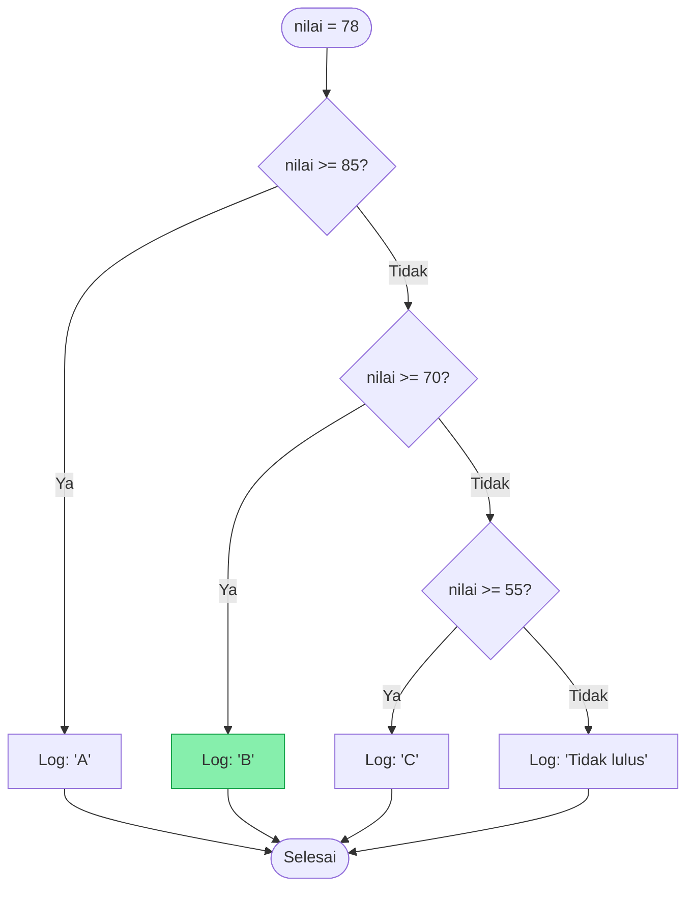
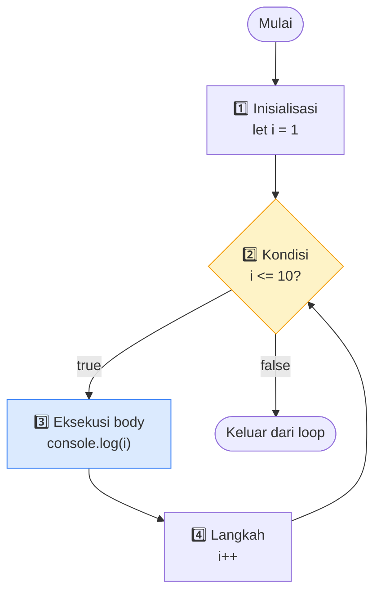
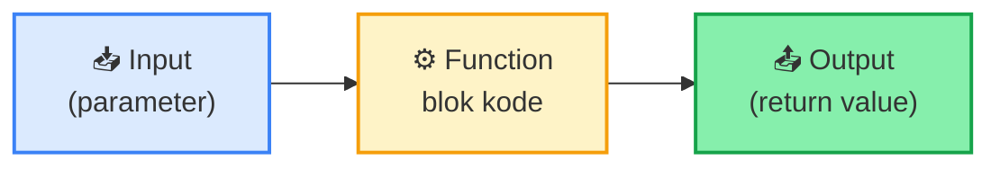
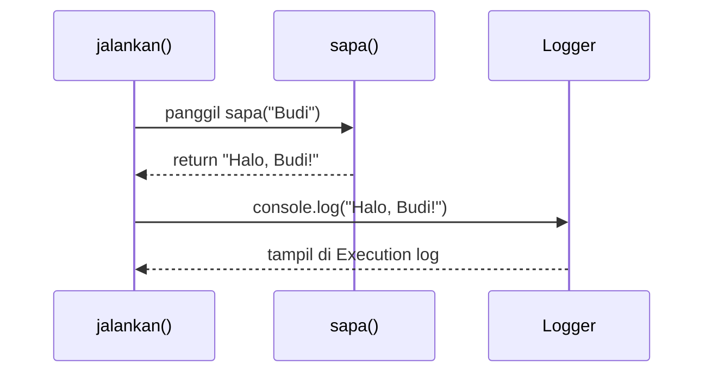
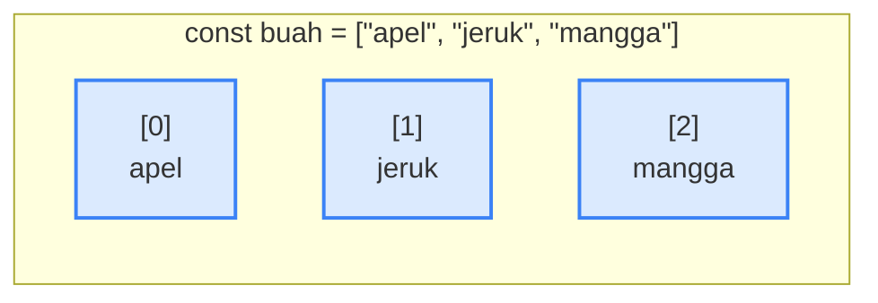
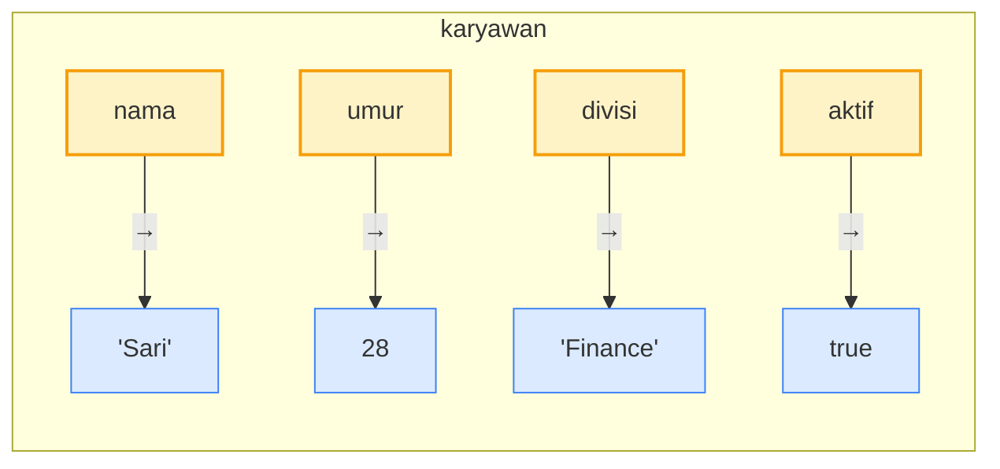

# Modul 0 — JavaScript Dasar

---

## Mengapa JavaScript dulu?

Google Apps Script (GAS) adalah platform otomatisasi Google Workspace yang **bahasa pemrogramannya adalah JavaScript**. Artinya: apapun yang akan kita lakukan di Sheets, Gmail, Drive, dan Calendar nanti — semua ditulis dalam JavaScript. Modul ini fokus ke **fondasi bahasa**, belum menyentuh API Google. Kalau pondasinya kuat, modul-modul berikutnya jadi lancar.

> **Catatan**: Kita sengaja menulis kode langsung di Apps Script Editor, bukan di console browser. Tujuannya supaya environment yang dipakai sejak awal sudah sama dengan environment kerja di modul-modul selanjutnya.

---

## Persiapan Lingkungan

1. Buka [https://script.google.com](https://script.google.com) — login dengan akun Google.
2. Klik **New project** (kiri atas).
3. Project baru terbuka dengan file `Code.gs` berisi `function myFunction() {}`.
4. Hapus isi default, lalu klik **Save** (ikon disket).
5. Untuk **menjalankan**: pilih nama function di dropdown "Select function" → klik **Run** ▶.
6. Untuk **melihat output**: buka panel **Execution log** di bawah, atau menu **View → Logs**.



**Bagian-bagian editor**:
- **Sidebar kiri** — navigasi: Editor (`< >`), Triggers (⏰), Executions (📜), Project Settings (⚙️).
- **Panel Files** — daftar file project. Default ada `Code.gs` dan `appsscript.json` (manifest).
- **Toolbar atas** — Save, Undo/Redo, **Run** ▶, Debug, dropdown function aktif, **Execution log**.
- **Area editor** — tempat menulis kode (mirip VS Code, ada syntax highlight & auto-complete).
- **Tombol Deploy** (kanan atas) — untuk publish project sebagai Web App / Library / Add-on.

> Pertama kali menjalankan kode, Google akan minta autorisasi. Klik **Review permissions** → pilih akun → **Advanced** → **Go to (project name) (unsafe)** → **Allow**. Ini normal untuk project pribadi.

---

## 1. Variabel & Tipe Data

### 1.1 Apa itu variabel?

Variabel adalah **wadah** untuk menyimpan data yang nantinya bisa kita pakai dan ubah. Bayangkan loker dengan label nama: labelnya adalah **nama variabel**, isinya adalah **nilai**.



### 1.2 Tiga cara mendeklarasikan variabel

```javascript
const namaSaya = "Budi";   // nilainya tidak boleh diubah lagi
let umur = 25;             // nilainya boleh diubah
var kota = "Jakarta";      // gaya lama, hindari di kode baru
```

**Aturan praktis** yang dipakai di seluruh pelatihan ini:
- Default pakai `const`.
- Pakai `let` hanya kalau memang nilainya akan diubah.
- Jangan pakai `var`. Cukup tahu kalau ketemu di kode lama.

### 1.3 Tipe data dasar

| Tipe | Contoh | Keterangan |
|---|---|---|
| **String** | `"Halo"`, `'Budi'` | Teks, diapit petik |
| **Number** | `25`, `3.14`, `-7` | Angka, tidak ada perbedaan int/float |
| **Boolean** | `true`, `false` | Hanya dua nilai: benar / salah |
| **Null** | `null` | Sengaja kosong |
| **Undefined** | `undefined` | Belum diisi |

Cek tipe data dengan `typeof`:

```javascript
function cekTipe() {
  console.log(typeof "Halo");   // string
  console.log(typeof 25);        // number
  console.log(typeof true);      // boolean
}
```

### 1.4 Operator

**Aritmatika**: `+`, `-`, `*`, `/`, `%` (sisa bagi), `**` (pangkat)

```javascript
console.log(10 + 3);   // 13
console.log(10 % 3);   // 1
console.log(2 ** 8);   // 256
```

**Perbandingan**: `===`, `!==`, `>`, `<`, `>=`, `<=`

> **Penting**: Selalu pakai `===` (tiga sama dengan), bukan `==`. Yang `===` membandingkan nilai **dan** tipe sehingga tidak ada hasil mengejutkan.
>
> ```javascript
> console.log(2 == "2");   // true  ← menyesatkan
> console.log(2 === "2");  // false ← jelas
> ```

**Logika**: `&&` (AND), `||` (OR), `!` (NOT)

**Penggabungan string** dengan `+` atau template literal:

```javascript
const nama = "Budi";
const umur = 25;

const pesan1 = "Halo " + nama + ", umur " + umur;
const pesan2 = `Halo ${nama}, umur ${umur}`;   // template literal — disarankan
```

### Hands-on Sesi 1
Buka Apps Script Editor, ketik function `cekTipe` di atas, jalankan, lihat hasilnya di Execution log. Lalu modifikasi: tambah variabel `tinggiBadan` dan `sudahMakan`, log keduanya beserta tipenya.

---

## 2. Struktur Kontrol — Percabangan & Perulangan

### 2.1 Percabangan: `if` / `else if` / `else`

```javascript
function cekNilai() {
  const nilai = 78;

  if (nilai >= 85) {
    console.log("A");
  } else if (nilai >= 70) {
    console.log("B");
  } else if (nilai >= 55) {
    console.log("C");
  } else {
    console.log("Tidak lulus");
  }
}
```

Kondisi dievaluasi berurutan. Yang pertama bernilai `true` akan dieksekusi, sisanya dilewati.



### 2.2 Operator ternary (versi singkat `if/else`)

```javascript
const status = umur >= 17 ? "Dewasa" : "Anak-anak";
```

Pakai hanya untuk kondisi sederhana. Kalau berbelit, kembali ke `if/else` biasa.

### 2.3 `switch` untuk banyak kondisi diskret

```javascript
function namaHari(angka) {
  switch (angka) {
    case 1: return "Senin";
    case 2: return "Selasa";
    case 3: return "Rabu";
    default: return "Hari tidak dikenal";
  }
}
```

### 2.4 Perulangan `for`

```javascript
function hitungSampai10() {
  for (let i = 1; i <= 10; i++) {
    console.log(i);
  }
}
```

Tiga bagian dalam `for`: **inisialisasi** (`let i = 1`), **kondisi lanjut** (`i <= 10`), **langkah** (`i++` artinya `i = i + 1`).



### 2.5 Perulangan `while`

```javascript
function hitungMundur() {
  let n = 5;
  while (n > 0) {
    console.log(n);
    n--;
  }
}
```

Pakai `while` kalau jumlah iterasi belum diketahui di awal. Hati-hati infinite loop — pastikan kondisi suatu saat menjadi `false`.

---

## 3. Function, Array, dan Object

### 3.1 Function — blok kode yang bisa dipanggil ulang



```javascript
function sapa(nama) {
  return `Halo, ${nama}!`;
}

function jalankan() {
  const pesan = sapa("Budi");
  console.log(pesan);
}
```

- `nama` adalah **parameter** (input).
- `return` mengembalikan **nilai keluaran**.
- Function tanpa `return` mengembalikan `undefined`.

**Alur eksekusi `jalankan()`**:



**Arrow function** — bentuk ringkas, sering dipakai untuk callback:

```javascript
const tambah = (a, b) => a + b;
console.log(tambah(3, 4));   // 7
```

### 3.2 Array — daftar berurutan



> Index **mulai dari 0**, bukan 1. Ini sumber bug paling umum bagi pemula.

```javascript
const buah = ["apel", "jeruk", "mangga"];

console.log(buah[0]);          // apel  (index mulai dari 0)
console.log(buah.length);      // 3

buah.push("pisang");          // tambah di akhir → ["apel","jeruk","mangga","pisang"]
buah.pop();                   // hapus dari akhir
buah.unshift("anggur");       // tambah di awal
```

**Iterasi array** — cara paling sering kita pakai di Apps Script:

```javascript
const angka = [10, 20, 30, 40];

// Cara 1: forEach
angka.forEach(function(nilai, index) {
  console.log(`Index ${index}: ${nilai}`);
});

// Cara 2: arrow function (lebih ringkas)
angka.forEach((nilai) => console.log(nilai));

// Cara 3: for klasik
for (let i = 0; i < angka.length; i++) {
  console.log(angka[i]);
}
```

**Method array yang sering dipakai**:

| Method | Fungsi |
|---|---|
| `map(fn)` | Bikin array baru dengan transformasi tiap elemen |
| `filter(fn)` | Bikin array baru berisi elemen yang lolos kondisi |
| `find(fn)` | Cari satu elemen pertama yang cocok |
| `includes(x)` | Cek apakah `x` ada di array |
| `join(sep)` | Gabung jadi string |

```javascript
const nilai = [78, 55, 90, 42, 88];
const lulus = nilai.filter((n) => n >= 70);   // [78, 90, 88]
const naikSatu = nilai.map((n) => n + 1);     // [79, 56, 91, 43, 89]
```

### 3.3 Object — kumpulan pasangan key–value



Kalau **array** itu daftar berurutan (akses pakai angka index), **object** itu berlabel — akses pakai nama (`key`).

```javascript
const karyawan = {
  nama: "Sari",
  umur: 28,
  divisi: "Finance",
  aktif: true
};

console.log(karyawan.nama);          // Sari
console.log(karyawan["divisi"]);     // Finance

karyawan.umur = 29;                 // ubah nilai
karyawan.email = "sari@kantor.id";  // tambah property baru
```

**Object di dalam array** — struktur paling sering muncul di data Sheets:

```javascript
const daftarKaryawan = [
  { nama: "Sari", divisi: "Finance",   gaji: 8000000 },
  { nama: "Budi", divisi: "Marketing", gaji: 7500000 },
  { nama: "Tina", divisi: "Finance",   gaji: 9000000 }
];

// Total gaji semua karyawan
const totalGaji = daftarKaryawan
  .map((k) => k.gaji)
  .reduce((a, b) => a + b, 0);
console.log(totalGaji);   // 24500000

// Ambil hanya divisi Finance
const finance = daftarKaryawan.filter((k) => k.divisi === "Finance");
console.log(finance.length);   // 2
```

Pola di atas adalah **pola inti** yang akan kita pakai berulang di Modul 4 (Sheets) dan seterusnya.

---

## 4. Penutup

**Yang harus dikuasai sebelum lanjut ke modul berikutnya**:

- [ ] Sudah berhasil membuat project di [script.google.com](https://script.google.com)
- [ ] Sudah pernah menjalankan minimal 1 function dan melihat output di Execution log
- [ ] Memahami beda `const` vs `let`
- [ ] Bisa membuat function dengan parameter dan return value
- [ ] Bisa iterasi array dengan `forEach` atau `for`
- [ ] Bisa membaca property object dengan notasi titik (`obj.nama`)

**Tugas wajib sebelum lanjut**:
Kerjakan `latihan.md` di folder ini. Kalau stuck, kunci ada di `latihan-solusi.js` — tapi cobalah sendiri dulu minimal 15 menit per soal sebelum buka kunci.

**Selanjutnya: Modul 1 — Introduction to Google Apps Script.**

---

## Lampiran — Daftar File Modul

| File | Isi |
|---|---|
| `materi.md` | Narasi & alur sesi (file ini) |
| `contoh.js` | 17 function contoh siap dijalankan di Apps Script |
| `latihan.md` | 10 soal latihan untuk peserta |
| `latihan-solusi.js` | Solusi referensi (untuk instruktur / setelah peserta mencoba sendiri) |

