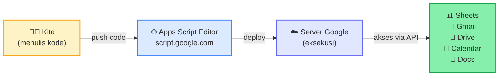
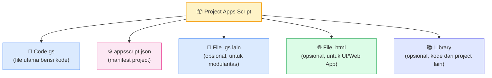
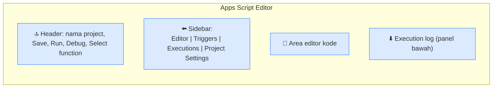
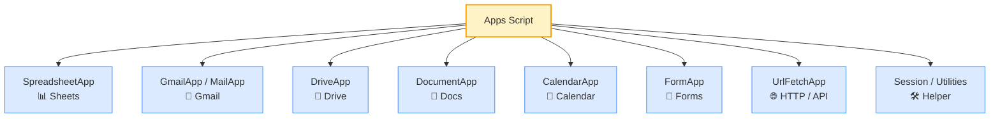

# Modul 1 — Introduction to Google Apps Script

---

## 1. Apa itu Google Apps Script?

**Google Apps Script (GAS)** adalah platform scripting milik Google yang memungkinkan kita **mengotomatisasi pekerjaan di Google Workspace** — Sheets, Docs, Gmail, Drive, Calendar, Forms, Slides — menggunakan JavaScript. Kode kita dieksekusi di **server Google (cloud)**, bukan di komputer kita atau di browser.



### Kenapa Apps Script (bukan Python/Node biasa)?

| Aspek | Apps Script | Python/Node + API |
|---|---|---|
| Setup | Buka browser, langsung coding | Install runtime, library, kelola credential |
| Akses Google Workspace | Built-in service (`SpreadsheetApp`, `GmailApp`, dll) — tidak perlu OAuth manual | Pakai `google-api-python-client` + setup OAuth credentials |
| Hosting | Otomatis di server Google, gratis | Perlu VPS / cloud function sendiri |
| Trigger terjadwal | Built-in scheduler | Cron / cloud scheduler eksternal |
| Deploy sebagai Web App | 1 klik | Setup web framework + hosting |
| Cocok untuk | Otomatisasi internal Workspace | Aplikasi besar / lintas platform |

**Kesimpulan**: Untuk kebutuhan otomatisasi seputar Google Workspace, Apps Script jauh lebih cepat dan ringkas. Inilah kenapa banyak tim operasional, HR, finance, dan admin pakai Apps Script untuk reporting, notifikasi, dan workflow internal.

### Contoh kasus nyata

- **HR**: Auto-kirim email kontrak dari template Doc, isi disesuaikan data Sheet karyawan.
- **Finance**: Generate invoice PDF tiap akhir bulan dari data transaksi Sheet.
- **Marketing**: Dashboard di Sheet yang tarik data Form pendaftaran realtime + auto-balas konfirmasi.
- **IT/Admin**: Backup Drive folder mingguan, audit user license, sync data antar Sheet.
- **Manajemen**: Approval cuti via web form yang nge-update kalender dan kirim notifikasi.

---

## 2. Anatomi Project Apps Script

Setiap project Apps Script terdiri dari beberapa komponen.



### 2.1 File `Code.gs`

Tempat menulis function. Ekstensi `.gs` (Google Script) adalah **JavaScript dengan ekstensi sintaks Apps Script**. Kalau punya project besar, bisa pecah ke beberapa file `.gs` untuk rapi (mis. `Sheets.gs`, `Email.gs`, `Utilities.gs`). Semua file di project sama-sama dapat saling memanggil function tanpa `import`.

### 2.2 File `appsscript.json` — manifest

Berisi konfigurasi project: timezone, runtime version, scope autorisasi, library yang dipakai. Default-nya tersembunyi. Untuk menampilkan: **Project Settings** (ikon roda gigi di kiri) → centang **Show "appsscript.json" manifest file in editor**.

Contoh isi default:
```json
{
  "timeZone": "Asia/Jakarta",
  "dependencies": {},
  "exceptionLogging": "STACKDRIVER",
  "runtimeVersion": "V8"
}
```

> **V8 runtime** artinya Apps Script pakai engine JavaScript modern (sama dengan Chrome/Node). Sintaks ES6+ (arrow function, template literal, `let`/`const`) sepenuhnya didukung. Kalau ketemu kode lama tanpa ini — itu runtime Rhino lawas; abaikan saja, semua project baru otomatis V8.

### 2.3 Tampilan Editor



| Bagian | Fungsi |
|---|---|
| **Editor** (ikon `< >`) | Tempat menulis kode, file `.gs` dan `.html` |
| **Triggers** (ikon ⏰) | Mengatur eksekusi otomatis (akan dibahas di Modul 6) |
| **Executions** (ikon 📜) | Histori eksekusi script — sangat berguna untuk debug |
| **Project Settings** (ikon ⚙️) | Konfigurasi project, timezone, manifest |

---

## 3. Project Pertama Anda

Mari buat project pertama yang **mencatat informasi user** dan **mengirim email konfirmasi ke diri sendiri**. Ini ujian sederhana yang sekaligus mengenalkan dua service: `Session` dan `MailApp`.

### Langkah 1 — Buat project

1. Buka [https://script.google.com](https://script.google.com).
2. Klik **+ New project**.
3. Klik nama "Untitled project" di pojok kiri atas → ganti jadi **"Latihan Modul 1"**.
4. Klik **Save** (Ctrl/Cmd + S).

> **Tip**: Selalu beri nama project yang deskriptif sejak awal. Default "Untitled project" akan jadi mimpi buruk kalau project Anda tumbuh banyak.

### Langkah 2 — Tulis function pertama

Hapus isi default `Code.gs`, ganti dengan:

```javascript
function sapaUser() {
  const email = Session.getActiveUser().getEmail();
  const pesan = `Halo, ${email}! Selamat datang di Apps Script.`;
  console.log(pesan);
}
```

Apa yang baru:
- **`Session.getActiveUser().getEmail()`** — mengambil email user yang sedang menjalankan script. Ini adalah panggilan ke **built-in service** pertama kita (`Session`).
- Sisanya adalah JavaScript murni dari Modul 0.

Pilih `sapaUser` di dropdown **Select function** → klik **Run** ▶.

### Langkah 3 — Autorisasi pertama

Karena script mengakses data user (email), Google butuh persetujuan kita. Dialog akan muncul:

1. **Review permissions** → pilih akun Google Anda.
2. Layar **"Google hasn't verified this app"** muncul → klik **Advanced**.
3. Klik **Go to Latihan Modul 1 (unsafe)**.
4. Periksa daftar permission yang diminta → klik **Allow**.

> **"Unsafe"** terlihat menakutkan, tapi ini **standar untuk script personal yang kita tulis sendiri**. Apps Script wajib lewat alur verifikasi seperti Web App publik kalau mau dirilis ke umum tanpa peringatan; untuk pemakaian internal/personal, klik Advanced adalah jalur normal.

Setelah Allow, script jalan. Buka **Execution log** — Anda akan lihat email Anda tertampil.

### Langkah 4 — Kirim email konfirmasi

Tambahkan function baru di bawah `sapaUser`:

```javascript
function kirimKonfirmasi() {
  const email = Session.getActiveUser().getEmail();

  MailApp.sendEmail({
    to: email,
    subject: "Halo dari Apps Script!",
    body: "Ini email pertama yang dikirim oleh script Anda. 🎉"
  });

  console.log(`Email terkirim ke ${email}`);
}
```

Pilih `kirimKonfirmasi` → Run. Kali ini autorisasi tambahan diminta (untuk akses Gmail) → Allow lagi. Cek inbox Anda — email harus masuk dalam beberapa detik.

> Anda baru saja menulis program **6 baris** yang **mengirim email lewat infrastruktur Gmail**. Tanpa server, tanpa SMTP setup, tanpa library. Inilah daya tarik Apps Script.

---

## 4. Built-in Services — Peta Singkat

Setiap service Google Workspace punya class global di Apps Script. Berikut yang paling sering dipakai (detail di modul-modul berikutnya):



| Service | Kapan dipakai | Modul |
|---|---|---|
| `SpreadsheetApp` | Baca/tulis Google Sheets | M3 |
| `DriveApp` | Manajemen file & folder | M2 |
| `DocumentApp` | Manipulasi Google Docs | M2 |
| `CalendarApp` | Buat/baca event Calendar | M2 |
| `GmailApp` / `MailApp` | Kirim & baca email | M4 |
| `FormApp` | Buat & proses Google Form | M2/M5 |
| `UrlFetchApp` | Panggil API eksternal (HTTP request) | M7 |
| `Session` | Info user yang sedang aktif | (sudah dipakai di sini) |
| `Utilities` | Helper: encoding, sleep, format | sepanjang modul |

Tidak perlu hafal semua sekarang. Yang penting: **tahu bahwa daftar ini ada**, supaya nanti saat butuh fitur tertentu Anda tahu mau cari ke mana.

> 📚 Referensi resmi: [https://developers.google.com/apps-script/reference](https://developers.google.com/apps-script/reference)

---

## 5. Logging dengan `console`

Untuk menampilkan output ke **Execution log**, pakai `console`:

```javascript
console.log("Halo");                          // pesan biasa
console.info("Info: data tersimpan");         // info (ikon biru)
console.warn("Hati-hati: data hampir penuh"); // warning (ikon kuning)
console.error("Gagal kirim email");           // error (ikon merah)
```

**Karakteristik**:
- Tampil di **Execution log** (panel bawah editor) **dan** **Cloud Logging** (Stackdriver) — log persisten, bisa dibaca berhari-hari kemudian.
- Mendukung argumen multi-objek: `console.log("User:", obj, "Time:", time)`.
- Object/array di-print dengan struktur lengkap, jauh lebih informatif dibanding stringify manual.
- Empat level severity (`log`, `info`, `warn`, `error`) berguna untuk filter log saat debug.

> **Catatan**: Apps Script juga punya `Logger.log` (warisan runtime lama, sebelum V8). Fungsionalitasnya tumpang-tindih dengan `console.log` tapi dengan output lebih sederhana. Di pelatihan ini kita pakai `console.log` saja — lebih modern dan support semua skenario.

---

## 6. Cara Membaca Histori Eksekusi

Klik **Executions** (ikon 📜 di sidebar). Daftar histori eksekusi script muncul: status (success/failed), durasi, fungsi yang dijalankan, dan trigger source (Manual/Time-driven/dll).

Klik salah satu untuk lihat detail log dan error stack trace. Ini **alat utama untuk debug** terutama untuk script yang dijalankan otomatis (trigger).

---

## 7. Best Practices Awal

1. **Beri nama project deskriptif** sejak awal — bukan "Untitled project (12)".
2. **Modularkan ke beberapa file `.gs`** kalau project mulai > 200 baris. Tidak perlu `import`/`export` — semua function global di project sama bisa saling panggil.
3. **Jangan hard-code data sensitif** (email penerima, ID Sheet, API key) langsung di kode. Pakai `PropertiesService` (akan dibahas di Modul 4–7).
4. **Selalu cek Execution log saat run pertama kali** — error pasti ada di awal, lebih cepat diperbaiki kalau langsung dilihat.
5. **Restart editor (refresh browser)** kalau auto-complete mendadak hilang atau error aneh muncul. Editor kadang stale.

---

## 8. Penutup

**Yang harus dikuasai sebelum lanjut**:

- [ ] Bisa membuat project baru di [script.google.com](https://script.google.com) dengan nama yang baik.
- [ ] Paham struktur project: `Code.gs`, `appsscript.json`, sidebar Editor/Triggers/Executions/Settings.
- [ ] Berhasil menjalankan minimal 2 function (`sapaUser`, `kirimKonfirmasi`) dan menerima email pertama.
- [ ] Tahu cara pakai `console.log`, `.info`, `.warn`, `.error` untuk debug.
- [ ] Tahu di mana melihat histori eksekusi.
- [ ] Mengenal nama-nama service utama (SpreadsheetApp, GmailApp, DriveApp, dll) — tidak perlu hafal semua method, cukup tahu peta-nya.

**Tugas wajib sebelum lanjut**:
Kerjakan `latihan.md` di folder ini.

**Selanjutnya: Modul 2 — Google Workspace Integration (Drive, Docs, Calendar).**

---

## Lampiran — Daftar File Modul

| File | Isi |
|---|---|
| `materi.md` | Narasi & alur sesi (file ini) |
| `contoh.js` | Function contoh siap dijalankan di Apps Script |
| `latihan.md` | Soal latihan untuk peserta |
| `latihan-solusi.js` | Solusi referensi |
