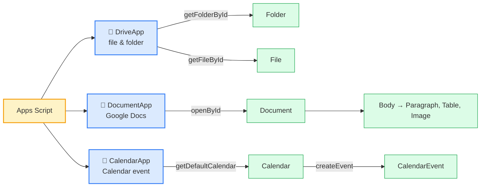
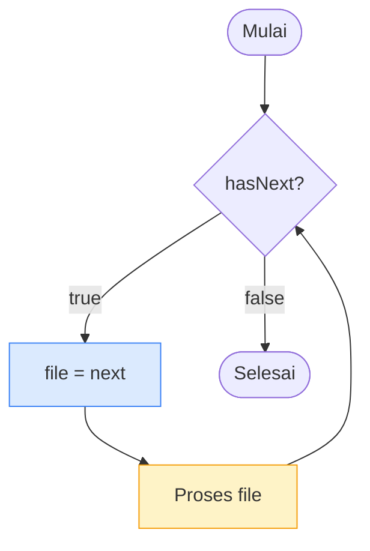
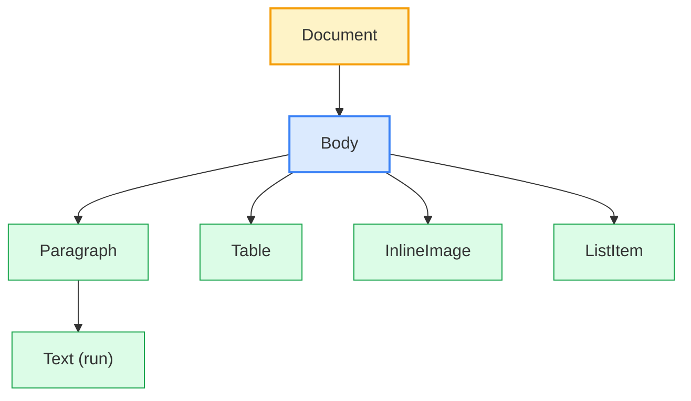
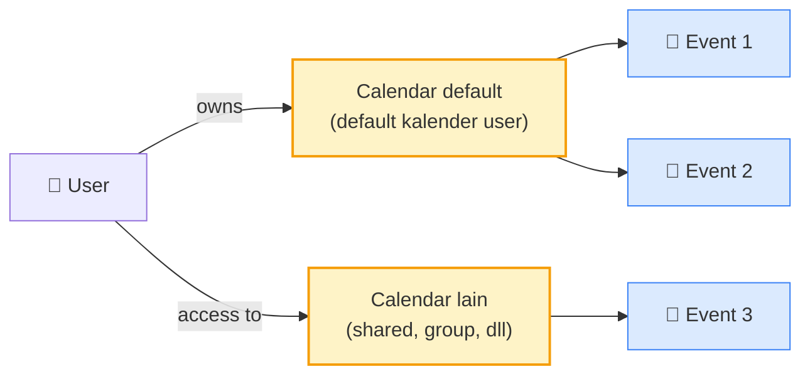
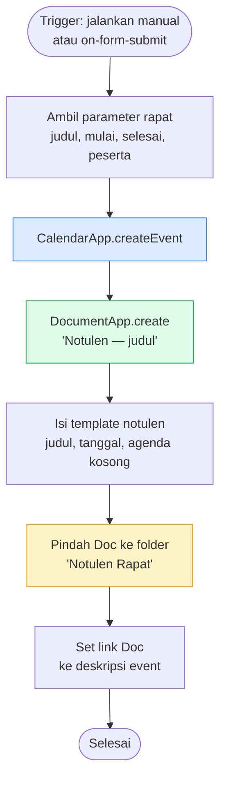

# Modul 2 — Google Workspace Integration

Setelah Modul 1 mengenalkan platform Apps Script, Modul 2 fokus ke **tiga service inti yang sering dipakai bersama**: Drive (file & folder), Docs (dokumen tulis), dan Calendar (event/jadwal). Tiga service ini biasanya jadi pasangan kerja: Drive menyimpan output, Docs menghasilkan dokumen jadi, Calendar mencatat jadwal terkait.

---

## 1. Peta Service & Class



**Pola umum** untuk semua service Apps Script:

```
ServiceApp.getXxxById(id)        → ambil object berdasarkan ID
ServiceApp.getActiveXxx()        → ambil object yang sedang aktif (kontekstual)
ServiceApp.createXxx(...)        → buat object baru
object.getName() / setName()     → baca/tulis property
object.getFiles() / getFolders() → iterasi anak (return iterator, bukan array)
```

> **Penting**: hampir semua method "list" di Drive (`getFiles`, `getFolders`) mengembalikan **iterator**, bukan array. Cara pakainya beda — kita bahas di §2.

---

## 2. DriveApp — File & Folder

### 2.1 Mengambil file/folder berdasarkan ID

Setiap file/folder di Drive punya **ID unik**. Cara ambil ID: buka file di browser → URL berisi `.../d/<ID>/edit` atau `.../folders/<ID>`.

```javascript
const folder = DriveApp.getFolderById("1AbcXyz...");
const file   = DriveApp.getFileById("1MnoPqr...");

console.log(folder.getName());
console.log(file.getName() + " — " + file.getMimeType());
```

### 2.2 Membuat file & folder baru

```javascript
function buatFolderProyek() {
  const root = DriveApp.getRootFolder();   // "My Drive"
  const folder = root.createFolder("Proyek-Otomasi-2026");
  console.log("Folder dibuat: " + folder.getUrl());
}

function buatFileTeks() {
  const folder = DriveApp.getFoldersByName("Proyek-Otomasi-2026").next();
  const file = folder.createFile("catatan.txt", "Halo dari Apps Script", "text/plain");
  console.log("File: " + file.getUrl());
}
```

### 2.3 Iterasi file dalam folder — pola iterator

`getFiles()` dan `getFolders()` mengembalikan iterator dengan dua method utama: `hasNext()` dan `next()`.



```javascript
function listSemuaFile() {
  const folder = DriveApp.getFolderById("1AbcXyz...");
  const files = folder.getFiles();   // iterator

  while (files.hasNext()) {
    const f = files.next();
    console.log(`${f.getName()} (${f.getMimeType()})`);
  }
}
```

> **Kenapa iterator, bukan array?** Folder bisa berisi ribuan file. Kalau langsung dimuat semua sebagai array, script bisa crash/timeout. Iterator memuat satu-satu sesuai kebutuhan.

### 2.4 Operasi umum lain

```javascript
file.setName("nama-baru.txt");
file.makeCopy("salinan.txt", folder);
file.moveTo(folderTujuan);
file.setTrashed(true);                              // pindah ke sampah
file.addEditor("rekan@example.com");                // share sebagai editor
file.addViewer("rekan@example.com");                // share sebagai viewer
const link = file.getUrl();                          // dapatkan link Drive
const downloadUrl = "https://drive.google.com/uc?id=" + file.getId();
```

### 2.5 Pencarian file dengan query

`DriveApp.searchFiles(query)` menerima query string mirip Google Drive search syntax:

```javascript
function cariPDFBaru() {
  const query = "mimeType='application/pdf' and modifiedDate > '2026-01-01'";
  const files = DriveApp.searchFiles(query);

  while (files.hasNext()) {
    const f = files.next();
    console.log(f.getName());
  }
}
```

**Operator query yang sering dipakai**:
- `mimeType='...'` — `application/pdf`, `application/vnd.google-apps.spreadsheet`, dll
- `title contains 'kata'` — substring match (case-insensitive)
- `title = 'nama-persis.pdf'` — cocok persis (case-sensitive)
- `fullText contains 'kata'` — cari di isi file (untuk Doc/Sheet/Slide)
- `modifiedDate > 'yyyy-mm-dd'`
- `'<folder-id>' in parents` — filter berdasarkan folder
- `trashed = false`
- Boolean: `and`, `or`, `not`, `(...)`

### Cari berdasarkan nama — pilihan cara

| Kebutuhan | Cara | Contoh |
|---|---|---|
| Cari **persis** satu nama di **My Drive** | `DriveApp.getFilesByName("nama")` | shortcut, return iterator |
| Cari **persis** satu nama di **folder spesifik** | `folder.getFilesByName("nama")` | scoped ke folder itu saja |
| Substring di **semua Drive** | `DriveApp.searchFiles("title contains 'X'")` | flexible, bisa dikombinasi filter lain |
| Substring **di folder spesifik** | kombinasi `title contains` + `'<folder-id>' in parents` | lihat contoh di bawah |

```javascript
// 1. Cara cepat — cari di seluruh Drive, nama persis
function cariByName(nama) {
  const files = DriveApp.getFilesByName(nama);   // iterator
  while (files.hasNext()) {
    const f = files.next();
    console.log(`${f.getName()} — ${f.getUrl()}`);
  }
}

// 2. Cari di folder spesifik, nama persis
function cariDiFolder(folderId, nama) {
  const folder = DriveApp.getFolderById(folderId);
  const files = folder.getFilesByName(nama);
  while (files.hasNext()) {
    const f = files.next();
    console.log(`${f.getName()} — ${f.getUrl()}`);
  }
}

// 3. Substring + filter di seluruh Drive
function cariBerisiKata(kata) {
  const query = `title contains '${kata}' and trashed = false`;
  const files = DriveApp.searchFiles(query);
  while (files.hasNext()) {
    const f = files.next();
    console.log(`${f.getName()} — ${f.getUrl()}`);
  }
}

// 4. Substring DI folder spesifik (kombinasi parents + title)
function cariDiFolderBerisiKata(folderId, kata) {
  const query = `title contains '${kata}' and '${folderId}' in parents and trashed = false`;
  const files = DriveApp.searchFiles(query);
  while (files.hasNext()) {
    const f = files.next();
    console.log(`${f.getName()} — ${f.getUrl()}`);
  }
}
```

> ⚠️ **Pitfall**: jangan panggil `files.next()` dua kali dalam satu iterasi — iterator akan maju dua langkah, file ganjil ke-skip. **Selalu simpan ke variabel dulu**:
>
> ```javascript
> // ❌ Salah — next() dipanggil 2×, file di-skip
> while (files.hasNext()) {
>   console.log(files.next().getName());
>   console.log(files.next().getUrl());   // ← file beda dari baris di atas
> }
>
> // ✓ Benar
> while (files.hasNext()) {
>   const f = files.next();   // 1× per iterasi
>   console.log(f.getName(), f.getUrl());
> }
> ```

> **Hati-hati quoting**: kalau `kata` mengandung tanda petik `'`, escape dengan backslash: `title contains 'O\\'Brien'`. Untuk keamanan, hindari membangun query dari input user mentah — bisa jadi "query injection" mini.

> Referensi MIME type: [https://developers.google.com/drive/api/guides/mime-types](https://developers.google.com/drive/api/guides/mime-types)
> Referensi query syntax lengkap: [https://developers.google.com/drive/api/guides/search-files](https://developers.google.com/drive/api/guides/search-files)

---

## 3. DocumentApp — Google Docs

### 3.1 Anatomi Document



Setiap Doc punya satu `Body`, dan Body berisi koleksi elemen (paragraph, table, image, list item) yang berurutan.

### 3.2 Membuat Doc baru dari kode

```javascript
function buatDoc() {
  const doc = DocumentApp.create("Laporan Otomatis");
  const body = doc.getBody();

  body.appendParagraph("Laporan Bulanan").setHeading(DocumentApp.ParagraphHeading.HEADING1);
  body.appendParagraph("Disusun otomatis oleh Apps Script.");
  body.appendParagraph("");
  body.appendListItem("Total transaksi: 132");
  body.appendListItem("Total nilai: Rp 1.250.000.000");
  body.appendListItem("Customer baru: 18");

  console.log("Doc dibuat: " + doc.getUrl());
}
```

### 3.3 Pola placeholder — template Doc

Pola **paling sering dipakai di kantor**: Doc template berisi placeholder seperti `{{nama}}`, `{{tanggal}}`, `{{nominal}}`. Script men-copy template, mengganti placeholder dengan data nyata.

> 📄 **Template lengkap siap pakai** ada di [`template-surat.md`](./template-surat.md) — copy isinya ke Google Doc baru, copy ID Doc dari URL, lalu set sebagai `TEMPLATE_ID` di kode.

```javascript
function generateSurat() {
  const templateId = "1AbcXyz...";        // Doc template
  const folderId   = "1FolderId...";       // folder output
  const folder     = DriveApp.getFolderById(folderId);

  const data = {
    nama: "Sari Wulandari",
    tanggal: "10 Mei 2026",
    nominal: "Rp 5.000.000"
  };

  // 1) Copy template ke folder output
  const copy = DriveApp.getFileById(templateId)
    .makeCopy(`Surat - ${data.nama}`, folder);

  // 2) Buka hasil copy & ganti placeholder
  const doc = DocumentApp.openById(copy.getId());
  const body = doc.getBody();

  Object.keys(data).forEach((key) => {
    body.replaceText(`\\{\\{${key}\\}\\}`, data[key]);
  });

  doc.saveAndClose();
  console.log("Surat siap: " + doc.getUrl());
}
```

> **Catatan**: `replaceText` menerima **regular expression**. Kurung kurawal `{` dan `}` adalah karakter spesial regex, jadi perlu di-escape dengan `\\{`. Pola `\\{\\{nama\\}\\}` mencocokkan teks literal `{{nama}}`.

Pola ini = template engine sederhana. Kombinasi dengan loop array karyawan = generator surat massal.

### 3.4 Mengekspor Doc ke PDF

```javascript
function exportPDF() {
  const doc = DocumentApp.openById("1AbcXyz...");
  doc.saveAndClose();

  const pdfBlob = DriveApp.getFileById(doc.getId()).getAs("application/pdf");
  const folder  = DriveApp.getFolderById("1FolderId...");
  const pdfFile = folder.createFile(pdfBlob).setName(doc.getName() + ".pdf");

  console.log("PDF: " + pdfFile.getUrl());
}
```

`getAs("application/pdf")` menghasilkan **Blob** — representasi binary file. Blob bisa dijadikan attachment email (lihat Modul 4) atau disimpan ke Drive.

---

## 4. CalendarApp — Event & Jadwal

### 4.1 Konsep dasar



Satu user bisa punya akses ke banyak kalender (default + shared). Setiap kalender berisi banyak event.

### 4.2 Membuat event sederhana

```javascript
function buatRapat() {
  const cal = CalendarApp.getDefaultCalendar();

  const mulai   = new Date("2026-05-15T10:00:00+07:00");
  const selesai = new Date("2026-05-15T11:00:00+07:00");

  const event = cal.createEvent("Rapat Sprint Planning", mulai, selesai, {
    description: "Diskusi sprint 21",
    location: "Ruang Meeting Lt. 3",
    guests: "anggota1@kantor.id,anggota2@kantor.id",
    sendInvites: true
  });

  console.log("Event ID: " + event.getId());
}
```

### 4.3 Event seharian (all-day)

```javascript
function buatLibur() {
  const cal = CalendarApp.getDefaultCalendar();
  const tanggal = new Date("2026-05-17");

  cal.createAllDayEvent("Libur Hari Pendidikan", tanggal, {
    description: "Hari libur nasional"
  });
}
```

### 4.4 Event berulang (recurring)

```javascript
function buatRapatMingguan() {
  const cal = CalendarApp.getDefaultCalendar();
  const mulai   = new Date("2026-05-13T09:00:00+07:00");
  const selesai = new Date("2026-05-13T10:00:00+07:00");

  // Setiap Rabu selama 8 minggu
  const recurrence = CalendarApp.newRecurrence()
    .addWeeklyRule()
    .onlyOnWeekday(CalendarApp.Weekday.WEDNESDAY)
    .times(8);

  cal.createEventSeries("Standup Tim", mulai, selesai, recurrence);
}
```

### 4.5 Membaca event yang sudah ada

```javascript
function eventHariIni() {
  const cal = CalendarApp.getDefaultCalendar();
  const events = cal.getEventsForDay(new Date());

  events.forEach((e) => {
    console.log(`${e.getStartTime().toLocaleTimeString("id-ID")} — ${e.getTitle()}`);
  });
}

function eventMingguIni() {
  const cal = CalendarApp.getDefaultCalendar();
  const sekarang = new Date();
  const tujuhHari = new Date();
  tujuhHari.setDate(tujuhHari.getDate() + 7);

  const events = cal.getEvents(sekarang, tujuhHari);
  console.log(`Total event 7 hari ke depan: ${events.length}`);
}
```

> Berbeda dengan Drive yang pakai iterator, `getEvents(...)` di Calendar **return array** langsung. API tiap service punya konvensi sendiri — jangan asumsikan semua sama.

---

## 5. Mini-Project Terpadu — "Pencatat Rapat"

Skenario nyata yang menggabungkan tiga service:

> **Target**: Setiap kali rapat dibuat di Calendar, otomatis bikin Doc "Notulen — [judul rapat]" di folder Drive khusus, lalu link Doc ditempelkan ke deskripsi event.

### Alur



### Implementasi

```javascript
function buatRapatDenganNotulen(judul, mulaiISO, selesaiISO, peserta) {
  const cal = CalendarApp.getDefaultCalendar();
  const mulai   = new Date(mulaiISO);
  const selesai = new Date(selesaiISO);

  // 1) Bikin folder notulen kalau belum ada
  const folderName = "Notulen Rapat";
  let folder;
  const cari = DriveApp.getFoldersByName(folderName);
  if (cari.hasNext()) {
    folder = cari.next();
  } else {
    folder = DriveApp.createFolder(folderName);
  }

  // 2) Bikin Doc notulen
  const doc = DocumentApp.create(`Notulen — ${judul}`);
  const body = doc.getBody();
  body.appendParagraph(judul).setHeading(DocumentApp.ParagraphHeading.HEADING1);
  body.appendParagraph(`Tanggal: ${mulai.toLocaleString("id-ID")}`);
  body.appendParagraph(`Peserta: ${peserta}`);
  body.appendParagraph("");
  body.appendParagraph("Agenda").setHeading(DocumentApp.ParagraphHeading.HEADING2);
  body.appendListItem("(isi agenda)");
  body.appendParagraph("");
  body.appendParagraph("Catatan").setHeading(DocumentApp.ParagraphHeading.HEADING2);
  body.appendParagraph("(notulen rapat)");
  doc.saveAndClose();

  // 3) Pindah Doc ke folder Notulen
  const docFile = DriveApp.getFileById(doc.getId());
  docFile.moveTo(folder);

  // 4) Bikin event Calendar dengan link Doc
  const linkDoc = doc.getUrl();
  const event = cal.createEvent(judul, mulai, selesai, {
    description: `Notulen: ${linkDoc}`,
    guests: peserta,
    sendInvites: true
  });

  console.log("Event: " + event.getId());
  console.log("Doc  : " + linkDoc);

  return { eventId: event.getId(), docUrl: linkDoc };
}

function ujiRapatNotulen() {
  buatRapatDenganNotulen(
    "Sprint Review #21",
    "2026-05-20T14:00:00+07:00",
    "2026-05-20T15:00:00+07:00",
    "anggota1@kantor.id,anggota2@kantor.id"
  );
}
```

**Pola yang baru muncul di sini**:
- **Cek-lalu-buat**: cari folder, kalau tidak ada bikin baru. Pola umum supaya idempoten.
- **Object antar service**: ambil `doc.getUrl()` lalu pakai sebagai bahan input ke `cal.createEvent`. Service Apps Script saling melengkapi.
- **Return value**: function tidak hanya log, tapi juga return ID — supaya caller bisa lanjut proses (mis. simpan ID ke Sheet).

---

## 6. Pertimbangan Kuota & Performa

Apps Script bukan tanpa batas. Setiap akun punya **kuota harian**:

| Operasi | Kuota harian (akun gratis Gmail) |
|---|---|
| Email sent | 100/hari |
| Calendar events created | ~10.000/hari |
| Drive files created | ~250/hari (untuk file Drive) |
| URL Fetch calls | 20.000/hari |
| Total runtime per script | 6 menit/eksekusi |

Kuota lebih besar untuk Workspace (G Suite) berbayar. Detail terbaru: [https://developers.google.com/apps-script/guides/services/quotas](https://developers.google.com/apps-script/guides/services/quotas).

**Tip optimasi**:
- **Batch operasi**, jangan satu-satu. Kita akan bahas mendalam di Modul 3 (Sheets) — pola `getValues` sekali untuk semua data lebih cepat ratusan kali ketimbang `getValue` per cell.
- Hindari memanggil API berulang dalam loop — cache hasilnya di variabel.
- Kalau eksekusi mendekati 6 menit, pecah jadi **batch + trigger lanjutan** (akan dibahas di Modul 6).

---

## 7. Penutup

**Yang harus dikuasai sebelum lanjut**:

- [ ] Bisa ambil Drive folder/file by ID dan iterasi isinya pakai pola `hasNext`/`next`.
- [ ] Bisa bikin Doc baru, isi paragraph dan list, lalu set heading.
- [ ] Paham pola template Doc dengan `replaceText` untuk placeholder.
- [ ] Bisa export Doc → PDF → simpan ke Drive.
- [ ] Bisa bikin event Calendar (sekali, all-day, dan berulang).
- [ ] Bisa baca event hari ini dan minggu ini.
- [ ] Paham bahwa method "list" Drive return iterator, sedangkan Calendar return array.
- [ ] Sadar adanya kuota harian — bukan unlimited.

**Tugas wajib sebelum lanjut**:
Kerjakan `latihan.md`. Khusus latihan ini Anda akan butuh **dummy folder** di Drive — siapkan satu folder kosong bernama `Latihan-M2` lalu copy ID-nya.

**Selanjutnya: Modul 3 — Google Sheets Automation.**

---

## Lampiran — Daftar File Modul

| File | Isi |
|---|---|
| `materi.md` | Narasi & alur sesi (file ini) |
| `contoh.js` | Function contoh per service + mini-project terpadu |
| `latihan.md` | Soal latihan untuk peserta |
| `latihan-solusi.js` | Solusi referensi |
