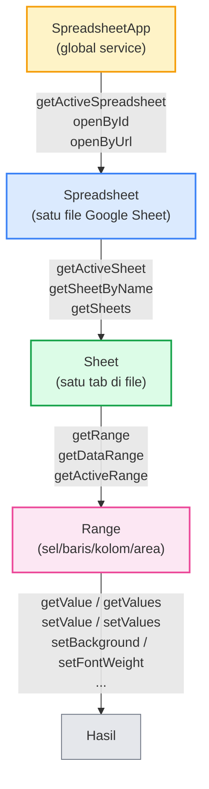
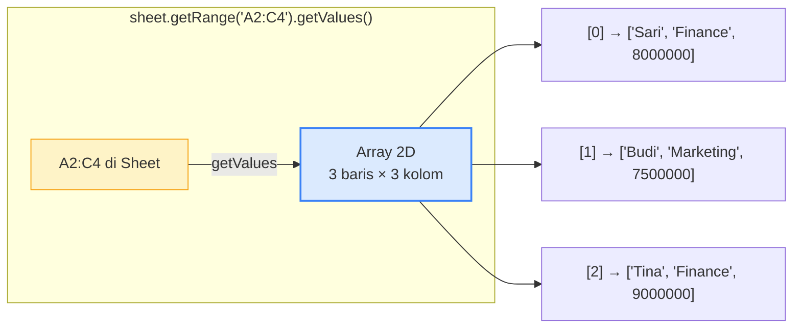
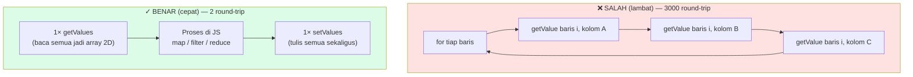
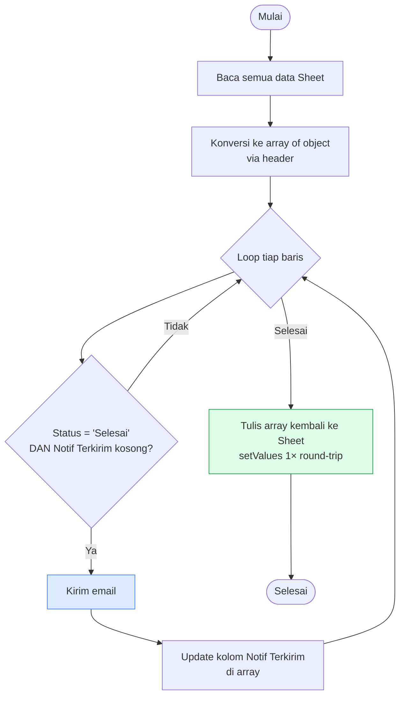

# Modul 3 — Google Sheets Automation

Sheets adalah service yang **paling sering** dipakai di Apps Script. Kalau Modul 2 mengenalkan tiga service horizontal (Drive/Docs/Calendar), Modul 3 menggali **dalam** ke satu service yang jadi backbone hampir setiap project otomatisasi: Google Sheets.

---

## 1. Hierarki Object Sheets

Pahami hierarki ini sebelum apa-apa — semua method method Sheets cuma berputar di empat level berikut.



| Level | Cara dapat | Contoh method |
|---|---|---|
| **SpreadsheetApp** | Global, langsung dipakai | `.getActiveSpreadsheet()`, `.openById(id)` |
| **Spreadsheet** | Dari `SpreadsheetApp` | `.getSheetByName("Data")`, `.getSheets()`, `.getName()` |
| **Sheet** | Dari `Spreadsheet` | `.getRange("A1")`, `.getDataRange()`, `.appendRow([...])` |
| **Range** | Dari `Sheet` | `.getValue()`, `.getValues()`, `.setValue(...)`, `.setBackground(...)` |

Semua kode Sheets adalah variasi dari rantai ini.

---

## 2. Mengakses Spreadsheet

### 2.1 Tiga cara

```javascript
// (a) Spreadsheet yang script-nya container-bound (script melekat ke sheet)
const ss = SpreadsheetApp.getActiveSpreadsheet();

// (b) Buka by ID — yang paling fleksibel & disarankan untuk standalone script
const ss = SpreadsheetApp.openById("1AbcXyz...");

// (c) Buka by URL
const ss = SpreadsheetApp.openByUrl("https://docs.google.com/spreadsheets/d/1AbcXyz.../edit");
```

> **Container-bound vs standalone**:
> - **Container-bound** = script "menempel" ke satu Sheet, dibuat lewat menu **Extensions → Apps Script** dari dalam Sheet. Bisa pakai `getActiveSpreadsheet()` dan trigger `onEdit/onOpen`.
> - **Standalone** = project terpisah di [script.google.com](https://script.google.com), tidak terikat ke Sheet manapun. Wajib pakai `openById()`.
>
> Untuk pelatihan ini default kita pakai **standalone + openById** supaya project lebih portabel.

### 2.2 Akses Sheet (tab) di dalam Spreadsheet

```javascript
const ss = SpreadsheetApp.openById("...");

const sheet = ss.getSheetByName("Karyawan");   // by nama tab
const semua = ss.getSheets();                   // array semua sheet

semua.forEach((s) => console.log(s.getName()));
```

---

## 3. Range — Hati Operasi Sheets

### 3.1 Notasi A1 vs koordinat numerik

```javascript
sheet.getRange("A1");              // satu sel
sheet.getRange("A1:C5");           // area persegi panjang
sheet.getRange("A:A");             // seluruh kolom A
sheet.getRange("1:1");             // seluruh baris 1

sheet.getRange(1, 1);              // (row, col) → A1
sheet.getRange(2, 1, 5, 3);        // (row, col, numRows, numCols) → A2:C6
```

> **Numbering** dimulai dari **1**, bukan 0. Beda dengan array JavaScript. Sumber bug klasik.

### 3.2 Membaca: `getValue` vs `getValues`

```javascript
// Satu sel — return primitive (string/number/boolean/Date)
const nama = sheet.getRange("A2").getValue();

// Banyak sel — return ARRAY 2D, baris-pertama
const data = sheet.getRange("A2:C10").getValues();
//   data[0]      → row pertama (array 3 elemen)
//   data[0][0]   → A2
//   data[0][1]   → B2
//   data[2][1]   → B4
```



### 3.3 Menulis: `setValue` vs `setValues`

```javascript
// Satu sel
sheet.getRange("A2").setValue("Halo");

// Banyak sel — input HARUS array 2D dengan dimensi PERSIS sama dengan range
sheet.getRange("A2:C3").setValues([
  ["Sari", "Finance",   8000000],
  ["Budi", "Marketing", 7500000]
]);
// → 2 baris × 3 kolom, sesuai range A2:C3
```

> **Error paling umum pemula**: dimensi array tidak match range. Range 5×3 perlu array `[5][3]`. Salah ukuran = exception `The number of rows... does not match`.

### 3.4 Aturan emas: BATCH — bukan loop satu-satu

Setiap `getValue`/`setValue` = **satu round-trip** ke server. Untuk 1000 baris, itu 1000 round-trip (lambat sekali). Selalu **baca semua sekaligus, proses di JavaScript, tulis semua sekaligus**.



Contoh: tambah kolom baru "Status" berdasarkan gaji.

```javascript
function tandaiGajiTinggi() {
  const sheet = SpreadsheetApp.openById("...").getSheetByName("Karyawan");
  const range = sheet.getDataRange();           // semua data terisi
  const data  = range.getValues();              // 1× round-trip

  // baris 0 = header
  const headerRow = data[0];
  const colGaji   = headerRow.indexOf("Gaji");
  const colStatus = headerRow.indexOf("Status");

  // proses di memori — tidak ada round-trip
  for (let i = 1; i < data.length; i++) {
    data[i][colStatus] = data[i][colGaji] >= 8000000 ? "Tinggi" : "Normal";
  }

  range.setValues(data);                         // 1× round-trip
}
```

Untuk 1000 baris, ini selesai dalam ~1 detik. Versi `getValue/setValue` per-cell bisa makan 30+ detik.

---

## 4. Pola "Header → Object"

Array 2D dari `getValues` susah dibaca (`row[3]`, `row[7]` — kolom apa itu?). Pola yang **sangat sering dipakai**: konversi ke array of object dengan key = nama header.

```javascript
function bacaSebagaiObject() {
  const sheet = SpreadsheetApp.openById("...").getSheetByName("Karyawan");
  const data  = sheet.getDataRange().getValues();

  const headers = data.shift();   // ambil baris pertama, sisanya data
  const rows = data.map((row) => {
    const obj = {};
    headers.forEach((key, i) => { obj[key] = row[i]; });
    return obj;
  });

  // Sekarang lebih nyaman:
  rows.forEach((r) => {
    console.log(`${r.Nama} (${r.Divisi}): ${r.Gaji}`);
  });
}
```

Setelah jadi array of object, semua method JavaScript dari Modul 0 (filter, map, reduce, find) bisa langsung dipakai.

### Konversi balik: Object → Array of arrays untuk `setValues`

```javascript
function tulisDariObject(rows, headers) {
  return rows.map((obj) => headers.map((h) => obj[h] ?? ""));
}
```

---

## 5. Operasi Praktis

### 5.1 Append baris baru

```javascript
// Cara cepat (1 baris)
sheet.appendRow(["Andi", "IT", 9500000, new Date()]);

// Append banyak baris (lebih efisien daripada appendRow berulang)
const newRows = [
  ["Andi",  "IT",      9500000],
  ["Rina",  "HR",      6500000],
  ["Joko",  "Finance", 7800000]
];
sheet.getRange(sheet.getLastRow() + 1, 1, newRows.length, newRows[0].length)
     .setValues(newRows);
```

### 5.2 Hapus baris

```javascript
sheet.deleteRow(5);                  // hapus baris ke-5
sheet.deleteRows(5, 3);              // hapus 3 baris mulai dari baris 5
```

### 5.3 Cari baris berdasarkan nilai

```javascript
function cariBaris(sheet, kolom, nilai) {
  const data = sheet.getDataRange().getValues();
  const headerIdx = data[0].indexOf(kolom);

  for (let i = 1; i < data.length; i++) {
    if (data[i][headerIdx] === nilai) {
      return i + 1;   // +1 karena baris di Sheet mulai dari 1
    }
  }
  return -1;
}

// Contoh: cari baris Sari
const baris = cariBaris(sheet, "Nama", "Sari Wulandari");
if (baris > 0) {
  sheet.getRange(baris, 4).setValue("VERIFIED");
}
```

### 5.4 Format kondisional via kode

```javascript
function highlightGajiTinggi() {
  const sheet = SpreadsheetApp.openById("...").getSheetByName("Karyawan");
  const data  = sheet.getDataRange().getValues();
  const colGaji = data[0].indexOf("Gaji") + 1;   // +1 untuk Sheet (1-indexed)

  for (let i = 1; i < data.length; i++) {
    if (data[i][colGaji - 1] >= 8000000) {
      sheet.getRange(i + 1, colGaji)
           .setBackground("#fef3c7")
           .setFontWeight("bold");
    }
  }
}
```

> Untuk kasus production besar, lebih baik pakai **Conditional Formatting bawaan Sheets** lewat menu (atau via API). Versi script di atas pas untuk logika yang tidak bisa diekspresikan via Conditional Formatting biasa.

---

## 6. Custom Function — Formula buatan sendiri

Function di Apps Script yang bisa dipanggil sebagai **formula di sel** seperti `=SUM(...)`. Sangat berguna untuk logika spesifik bisnis.

```javascript
/**
 * Hitung diskon berbasis volume.
 *
 * @param {number} subtotal  Subtotal sebelum diskon
 * @return {number}          Diskon (rupiah)
 * @customfunction
 */
function HITUNG_DISKON(subtotal) {
  if (subtotal > 1000000) return subtotal * 0.10;
  if (subtotal > 500000)  return subtotal * 0.05;
  return 0;
}
```

Setelah di-save, di Sheet ketik `=HITUNG_DISKON(A2)` di sel manapun → hasil otomatis terhitung.

> **Aturan custom function**:
> - Wajib ada JSDoc `@customfunction`.
> - **Tidak boleh** memanggil service yang butuh autorisasi user (MailApp, GmailApp, dll).
> - Harus deterministik & cepat (< 30 detik). Sheet me-recalculate tiap kali input berubah.

---

## 7. Trigger Sederhana — `onEdit` & `onOpen`

(Pendalaman trigger ada di Modul 6. Di sini cukup pengenalan agar Anda lihat kemungkinannya.)

```javascript
// Otomatis jalan saat user mengetik di sheet
function onEdit(e) {
  const range = e.range;
  if (range.getColumn() === 4 && range.getValue() === "DONE") {
    range.setBackground("#dcfce7");
  }
}

// Otomatis jalan saat sheet dibuka — bikin custom menu
function onOpen() {
  SpreadsheetApp.getUi()
    .createMenu("Otomasi")
    .addItem("Tandai gaji tinggi", "tandaiGajiTinggi")
    .addItem("Reset format",       "resetFormat")
    .addToUi();
}
```

> Trigger `onEdit`/`onOpen` hanya bekerja kalau script **container-bound** (dibuat lewat **Extensions → Apps Script** dari dalam Sheet). Standalone script tidak punya konteks Sheet aktif.

---

## 8. Mini-Project — Sinkronisasi Sheet → Email

Skenario: Sheet "Pesanan" punya kolom `Status`. Tiap baris yang baru saja diubah jadi `Selesai` dikirim email konfirmasi ke kolom `Email Customer`, lalu kolom `Notif Terkirim` diisi tanggal hari ini.



Implementasi:

```javascript
function kirimNotifPesananSelesai() {
  const sheet = SpreadsheetApp.openById("SHEET_ID").getSheetByName("Pesanan");
  const range = sheet.getDataRange();
  const data  = range.getValues();

  const headers = data[0];
  const colStatus = headers.indexOf("Status");
  const colEmail  = headers.indexOf("Email Customer");
  const colNotif  = headers.indexOf("Notif Terkirim");
  const colNomor  = headers.indexOf("Nomor Pesanan");

  const tanggal = Utilities.formatDate(
    new Date(), Session.getScriptTimeZone(), "yyyy-MM-dd HH:mm"
  );

  let terkirim = 0;
  for (let i = 1; i < data.length; i++) {
    const row = data[i];
    if (row[colStatus] === "Selesai" && !row[colNotif]) {
      MailApp.sendEmail({
        to: row[colEmail],
        subject: `Pesanan ${row[colNomor]} Selesai`,
        body: `Halo,\n\nPesanan ${row[colNomor]} Anda telah selesai diproses.\n\nTerima kasih.`
      });
      data[i][colNotif] = tanggal;
      terkirim++;
    }
  }

  range.setValues(data);
  console.log(`${terkirim} email dikirim.`);
}
```

**Pola yang muncul**:
- Header → object (akses kolom by name, tidak by index nomor).
- Filter logic di JS, bukan di Sheet (lebih cepat & fleksibel).
- Idempotent: kolom `Notif Terkirim` berfungsi sebagai marker — kalau script dijalankan ulang, baris yang sudah dapat email tidak akan dikirim lagi.
- 2× round-trip ke Sheets total (read + write), tidak peduli berapa banyak baris.

---

## 9. Penutup

**Yang harus dikuasai sebelum lanjut**:

- [ ] Bisa naik–turun hierarki: SpreadsheetApp → Spreadsheet → Sheet → Range.
- [ ] Bisa baca area dengan `getValues` dan paham hasilnya array 2D.
- [ ] Bisa tulis area dengan `setValues` dan paham dimensi harus match.
- [ ] Memahami **kenapa** batch (`getValues`/`setValues`) jauh lebih cepat dari per-cell.
- [ ] Bisa konversi array 2D ↔ array of object pakai header.
- [ ] Bisa append baris dan cari baris by value.
- [ ] Bisa bikin Custom Function untuk dipanggil sebagai formula.
- [ ] Tahu adanya `onEdit` / `onOpen` (detail lebih jauh di Modul 6).

**Tugas wajib sebelum lanjut**:
Kerjakan `latihan.md`. Siapkan **satu Google Sheet baru** untuk latihan, dengan data dummy yang formatnya mengikuti template di petunjuk latihan.

**Selanjutnya: Modul 4 — Gmail Automation.**

---

## Lampiran — Daftar File Modul

| File | Isi |
|---|---|
| `materi.md` | Narasi & alur sesi (file ini) |
| `contoh.js` | Function contoh per topik + mini-project |
| `latihan.md` | Soal latihan + skema data dummy |
| `latihan-solusi.js` | Solusi referensi |
