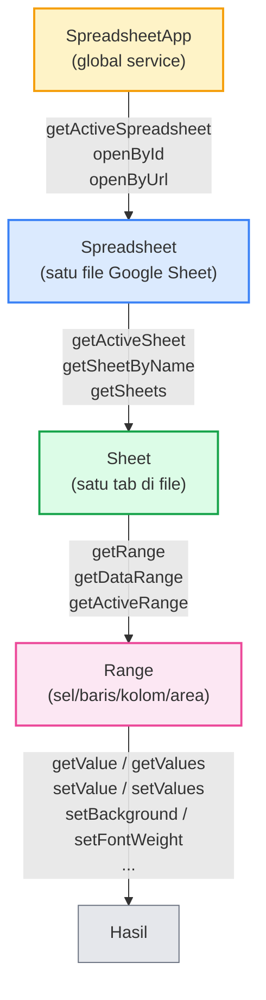
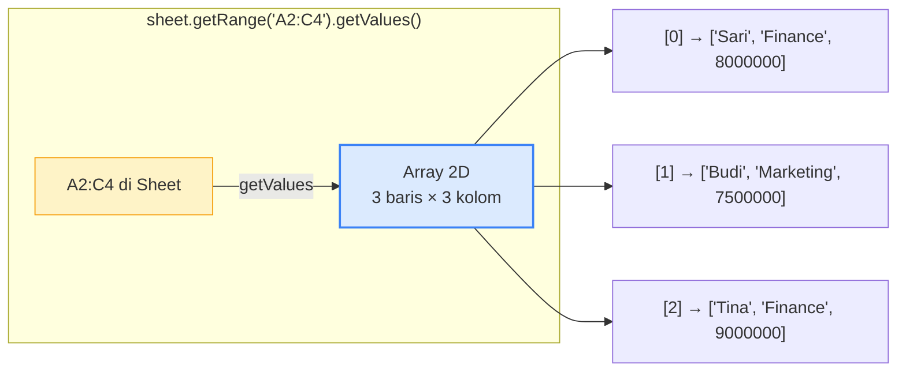
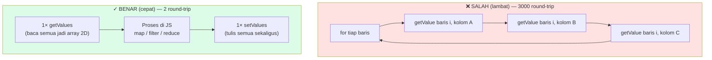
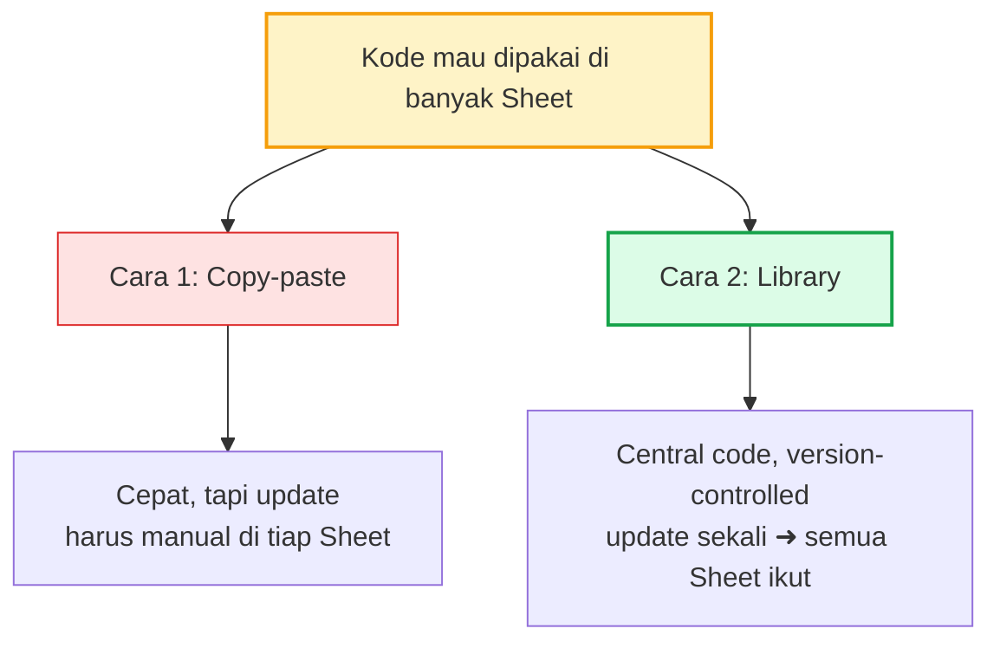
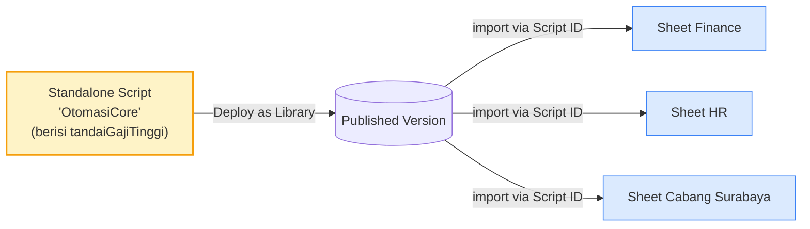
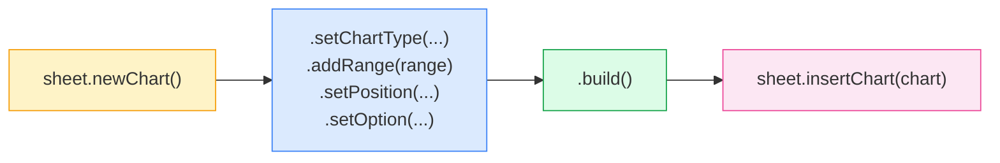

# Modul 3 — Google Sheets Automation

Sheets adalah service yang **paling sering** dipakai di Apps Script. Kalau Modul 2 mengenalkan tiga service horizontal (Drive/Docs/Calendar), Modul 3 menggali **dalam** ke satu service yang jadi backbone hampir setiap project otomatisasi: Google Sheets.

---

## 0. Siapkan Spreadsheet Template

Semua contoh kode di modul ini berjalan di atas spreadsheet dengan struktur tetap. Bikin dulu Sheet-nya supaya Anda tidak menebak-nebak format data tiap kali menyalin kode.

### Langkah Setup

1. Buka [https://sheets.google.com](https://sheets.google.com) → klik **Blank** untuk Sheet baru.
2. Rename file jadi **"Modul-3-Sheets-Automation"**.
3. Bikin **dua tab** sesuai daftar di bawah (klik **+** di kiri bawah untuk tab baru, lalu rename).
4. Copy header + sample data ke tab masing-masing.
5. Copy ID Sheet dari URL — bagian setelah `/d/` dan sebelum `/edit`:
   ```
   https://docs.google.com/spreadsheets/d/  <-- ID DI SINI -->  /edit
   ```
6. Ganti placeholder `"SHEET_ID"` di semua contoh kode dengan ID itu.

> **Tip format**: kolom `Gaji` di-set **Number → Number** (bukan Currency). Format Rupiah biar di-handle oleh script supaya output-nya terkontrol.

### Tab `Karyawan`

Tab utama yang dipakai di section 3, 4, 5, 6, 8, dan 9.

| Nama  | Divisi    | Gaji    | Status |
|-------|-----------|---------|--------|
| Sari  | Finance   | 8000000 |        |
| Budi  | Marketing | 7500000 |        |
| Tina  | Finance   | 9000000 |        |
| Andi  | IT        | 9500000 |        |
| Rina  | HR        | 6500000 |        |

- Kolom **Status** sengaja kosong — akan diisi oleh contoh `tandaiGajiTinggi_*` dan `cariBaris`.
- Baris 1 = header; data mulai baris 2.

### Tab `Pesanan`

Dipakai di mini-project section 10 (Sinkronisasi Sheet → Email).

| Nomor Pesanan | Email Customer    | Status     | Notif Terkirim |
|---------------|-------------------|------------|----------------|
| PSN-001       | (email Anda)      | Selesai    |                |
| PSN-002       | (email Anda)      | Selesai    |                |
| PSN-003       | (email Anda)      | Diproses   |                |
| PSN-004       | (email Anda)      | Dibatalkan |                |

- **Wajib** ganti `(email Anda)` dengan email Anda sendiri supaya notifikasi masuk ke inbox sendiri saat testing.
- Kolom **Notif Terkirim** akan diisi otomatis dengan timestamp setelah email terkirim.

### CSV (alternatif import cepat)

Kalau lebih cepat **File → Import → Upload → Replace current sheet** ketimbang copy-paste:

```csv
Nama,Divisi,Gaji,Status
Sari,Finance,8000000,
Budi,Marketing,7500000,
Tina,Finance,9000000,
Andi,IT,9500000,
Rina,HR,6500000,
```

```csv
Nomor Pesanan,Email Customer,Status,Notif Terkirim
PSN-001,GANTI@EMAIL.ANDA,Selesai,
PSN-002,GANTI@EMAIL.ANDA,Selesai,
PSN-003,GANTI@EMAIL.ANDA,Diproses,
PSN-004,GANTI@EMAIL.ANDA,Dibatalkan,
```

> Untuk soal di `latihan.md`, ada dua tab tambahan (`Penjualan` & `Produk`) — struktur lengkapnya ada di petunjuk latihan, tidak perlu disetup sekarang.

---

## 1. Hierarki Object Sheets

Pahami hierarki ini sebelum apa-apa — semua method method Sheets cuma berputar di empat level berikut.



| Level | Cara dapat | Contoh method |
|---|---|---|
| **SpreadsheetApp** | Global, langsung dipakai | `.getActiveSpreadsheet()`, `.openById(id)` |
| **Spreadsheet** | Dari `SpreadsheetApp` | `.getSheetByName("Data")`, `.getSheets()`, `.getName()` |
| **Sheet** | Dari `Spreadsheet` | `.getRange("A1")`, `.getDataRange()`, `.appendRow([...])` |
| **Range** | Dari `Sheet` | `.getValue()`, `.getValues()`, `.setValue(...)`, `.setBackground(...)` |

Semua kode Sheets adalah variasi dari rantai ini.

---

## 2. Mengakses Spreadsheet

### 2.1 Tiga cara

```javascript
// (a) Spreadsheet yang script-nya container-bound (script melekat ke sheet)
const ss = SpreadsheetApp.getActiveSpreadsheet();

// (b) Buka by ID — yang paling fleksibel & disarankan untuk standalone script
const ss = SpreadsheetApp.openById("1AbcXyz...");

// (c) Buka by URL
const ss = SpreadsheetApp.openByUrl("https://docs.google.com/spreadsheets/d/1AbcXyz.../edit");
```

> **Container-bound vs standalone**:
> - **Container-bound** = script "menempel" ke satu Sheet, dibuat lewat menu **Extensions → Apps Script** dari dalam Sheet. Bisa pakai `getActiveSpreadsheet()` dan trigger `onEdit/onOpen`.
> - **Standalone** = project terpisah di [script.google.com](https://script.google.com), tidak terikat ke Sheet manapun. Wajib pakai `openById()`.
>
> Untuk pelatihan ini default kita pakai **standalone + openById** supaya project lebih portabel.

### 2.2 Akses Sheet (tab) di dalam Spreadsheet

```javascript
const ss = SpreadsheetApp.openById("...");

const sheet = ss.getSheetByName("Karyawan");   // by nama tab
const semua = ss.getSheets();                   // array semua sheet

semua.forEach((s) => console.log(s.getName()));
```

---

## 3. Range — Hati Operasi Sheets

### 3.1 Notasi A1 vs koordinat numerik

```javascript
sheet.getRange("A1");              // satu sel
sheet.getRange("A1:C5");           // area persegi panjang
sheet.getRange("A:A");             // seluruh kolom A
sheet.getRange("1:1");             // seluruh baris 1

sheet.getRange(1, 1);              // (row, col) → A1
sheet.getRange(2, 1, 5, 3);        // (row, col, numRows, numCols) → A2:C6
```

> **Numbering** dimulai dari **1**, bukan 0. Beda dengan array JavaScript. Sumber bug klasik.

### 3.2 Membaca: `getValue` vs `getValues`

```javascript
// Satu sel — return primitive (string/number/boolean/Date)
const nama = sheet.getRange("A2").getValue();

// Banyak sel — return ARRAY 2D, baris-pertama
const data = sheet.getRange("A2:C10").getValues();
//   data[0]      → row pertama (array 3 elemen)
//   data[0][0]   → A2
//   data[0][1]   → B2
//   data[2][1]   → B4
```



### 3.3 Menulis: `setValue` vs `setValues`

```javascript
// Satu sel
sheet.getRange("A2").setValue("Halo");

// Banyak sel — input HARUS array 2D dengan dimensi PERSIS sama dengan range
sheet.getRange("A2:C3").setValues([
  ["Sari", "Finance",   8000000],
  ["Budi", "Marketing", 7500000]
]);
// → 2 baris × 3 kolom, sesuai range A2:C3
```

> **Error paling umum pemula**: dimensi array tidak match range. Range 5×3 perlu array `[5][3]`. Salah ukuran = exception `The number of rows... does not match`.

### 3.4 Aturan emas: BATCH — bukan loop satu-satu

Setiap `getValue`/`setValue` = **satu round-trip** ke server. Untuk 1000 baris, itu 1000 round-trip (lambat sekali). Selalu **baca semua sekaligus, proses di JavaScript, tulis semua sekaligus**.



Contoh: tambah kolom "Status" berdasarkan Gaji. Kita banding **dua versi**: lambat (per-cell) vs cepat (batch).

#### ❌ Versi LAMBAT — `getValue` & `setValue` per-cell

```javascript
function tandaiGajiTinggi_lambat() {
  const sheet = SpreadsheetApp.openById("SHEET_ID").getSheetByName("Karyawan");
  const lastRow = sheet.getLastRow();

  // Cari indeks kolom (1-indexed di Sheet API)
  const headers   = sheet.getRange(1, 1, 1, sheet.getLastColumn()).getValues()[0];
  const colGaji   = headers.indexOf("Gaji")   + 1;
  const colStatus = headers.indexOf("Status") + 1;

  const t0 = Date.now();

  for (let r = 2; r <= lastRow; r++) {                            // mulai dari baris 2 (skip header)
    const gaji = sheet.getRange(r, colGaji).getValue();           // ← 1 round-trip baca
    const status = gaji >= 8000000 ? "Tinggi" : "Normal";
    sheet.getRange(r, colStatus).setValue(status);                // ← 1 round-trip tulis
  }

  console.log(`Lambat: ${Date.now() - t0} ms — ${(lastRow - 1) * 2} round-trip`);
}
```

**Untuk 5 baris**: 5 × 2 = **10 round-trip** ke server.
**Untuk 1000 baris**: 2.000 round-trip → bisa **30+ detik**, kadang timeout di 6 menit.

#### ✓ Versi CEPAT — `getValues` & `setValues` batch

```javascript
function tandaiGajiTinggi_cepat() {
  const sheet = SpreadsheetApp.openById("SHEET_ID").getSheetByName("Karyawan");
  const range = sheet.getDataRange();
  const data  = range.getValues();                                // ← 1 round-trip baca SEMUA

  const headers   = data[0];
  const colGaji   = headers.indexOf("Gaji");                       // 0-indexed di array
  const colStatus = headers.indexOf("Status");

  const t0 = Date.now();

  for (let i = 1; i < data.length; i++) {                          // proses di memori
    data[i][colStatus] = data[i][colGaji] >= 8000000 ? "Tinggi" : "Normal";
  }

  range.setValues(data);                                           // ← 1 round-trip tulis SEMUA

  console.log(`Cepat: ${Date.now() - t0} ms — 2 round-trip`);
}
```

**Untuk berapapun baris**: tetap **2 round-trip** (1 baca + 1 tulis).
**Untuk 1000 baris**: selesai dalam **~1 detik**.

#### Perbandingan

| Aspek | ❌ Lambat (per-cell) | ✓ Cepat (batch) |
|---|---|---|
| Round-trip untuk N baris | `2 × N` | **2 (konstan)** |
| Untuk 5 baris | 10 round-trip | 2 round-trip |
| Untuk 1000 baris | 2.000 round-trip → 30s+ | 2 round-trip → ~1s |
| Skala | O(N) | **O(1)** |
| Indeks kolom | **1-indexed** (untuk `getRange(r, c)`) | **0-indexed** (untuk array `data[i][c]`) |
| Risiko timeout | Tinggi pada > 500 baris | Sangat rendah |

> **Aturan**: kalau melihat `getValue`/`setValue` di dalam `for` loop → hampir selalu bug performa. Ubah jadi pola `getValues` → proses array → `setValues`.

#### Bonus: ukur sendiri

Kedua function di atas log durasinya. Tempel ke project Apps Script, isi `Karyawan` dengan data dummy (mis. duplicate 5 baris jadi 500), lalu Run kedua-duanya — bedanya akan terlihat sangat jelas di Execution log.

---

## 4. Pola "Header → Object"

Array 2D dari `getValues` susah dibaca (`row[3]`, `row[7]` — kolom apa itu?). Pola yang **sangat sering dipakai**: konversi ke array of object dengan key = nama header.

```javascript
function bacaSebagaiObject() {
  const sheet = SpreadsheetApp.openById("...").getSheetByName("Karyawan");
  const data  = sheet.getDataRange().getValues();

  const headers = data.shift();   // ambil baris pertama, sisanya data
  const rows = data.map((row) => {
    const obj = {};
    headers.forEach((key, i) => { obj[key] = row[i]; });
    return obj;
  });

  // Sekarang lebih nyaman:
  rows.forEach((r) => {
    console.log(`${r.Nama} (${r.Divisi}): ${r.Gaji}`);
  });
}
```

Setelah jadi array of object, semua method JavaScript dari Modul 0 (filter, map, reduce, find) bisa langsung dipakai.

### Konversi balik: Object → Array of arrays untuk `setValues`

```javascript
function tulisDariObject(rows, headers) {
  return rows.map((obj) => headers.map((h) => obj[h] ?? ""));
}
```

---

## 5. Operasi Praktis

### 5.1 Append baris baru

```javascript
// Cara cepat (1 baris)
sheet.appendRow(["Andi", "IT", 9500000, new Date()]);

// Append banyak baris (lebih efisien daripada appendRow berulang)
const newRows = [
  ["Andi",  "IT",      9500000],
  ["Rina",  "HR",      6500000],
  ["Joko",  "Finance", 7800000]
];
sheet.getRange(sheet.getLastRow() + 1, 1, newRows.length, newRows[0].length)
     .setValues(newRows);
```

### 5.2 Hapus baris

```javascript
sheet.deleteRow(5);                  // hapus baris ke-5
sheet.deleteRows(5, 3);              // hapus 3 baris mulai dari baris 5
```

### 5.3 Cari baris berdasarkan nilai

```javascript
function cariBaris(sheet, kolom, nilai) {
  const data = sheet.getDataRange().getValues();
  const headerIdx = data[0].indexOf(kolom);

  for (let i = 1; i < data.length; i++) {
    if (data[i][headerIdx] === nilai) {
      return i + 1;   // +1 karena baris di Sheet mulai dari 1
    }
  }
  return -1;
}

// Contoh: cari baris Sari
const baris = cariBaris(sheet, "Nama", "Sari Wulandari");
if (baris > 0) {
  sheet.getRange(baris, 4).setValue("VERIFIED");
}
```

### 5.4 Format kondisional via kode

```javascript
function highlightGajiTinggi() {
  const sheet = SpreadsheetApp.openById("...").getSheetByName("Karyawan");
  const data  = sheet.getDataRange().getValues();
  const colGaji = data[0].indexOf("Gaji") + 1;   // +1 untuk Sheet (1-indexed)

  for (let i = 1; i < data.length; i++) {
    if (data[i][colGaji - 1] >= 8000000) {
      sheet.getRange(i + 1, colGaji)
           .setBackground("#fef3c7")
           .setFontWeight("bold");
    }
  }
}
```

> Untuk kasus production besar, lebih baik pakai **Conditional Formatting bawaan Sheets** lewat menu (atau via API). Versi script di atas pas untuk logika yang tidak bisa diekspresikan via Conditional Formatting biasa.

---

## 6. Custom Function — Formula buatan sendiri

Function di Apps Script yang bisa dipanggil sebagai **formula di sel** seperti `=SUM(...)`. Sangat berguna untuk logika spesifik bisnis.

```javascript
/**
 * Hitung diskon berbasis volume.
 *
 * @param {number} subtotal  Subtotal sebelum diskon
 * @return {number}          Diskon (rupiah)
 * @customfunction
 */
function HITUNG_DISKON(subtotal) {
  if (subtotal > 1000000) return subtotal * 0.10;
  if (subtotal > 500000)  return subtotal * 0.05;
  return 0;
}
```

Setelah di-save, di Sheet ketik `=HITUNG_DISKON(A2)` di sel manapun → hasil otomatis terhitung.

> **Aturan custom function**:
> - Wajib ada JSDoc `@customfunction`.
> - **Tidak boleh** memanggil service yang butuh autorisasi user (MailApp, GmailApp, dll).
> - Harus deterministik & cepat (< 30 detik). Sheet me-recalculate tiap kali input berubah.

---

## 7. Reuse Kode di Banyak Spreadsheet

Skenario nyata: kode `tandaiGajiTinggi` yang kita buat sangat berguna, dan kita ingin **memakainya di banyak Sheet sekaligus** (Sheet Finance, Sheet HR, Sheet cabang Surabaya, dll) — tanpa copy-paste manual ke tiap project.

Apps Script menawarkan **2 pendekatan utama** untuk kebutuhan ini.



> Ada juga cara ketiga lewat **Web App + `UrlFetchApp`** untuk integrasi lintas platform. Tapi pola itu lebih relevan saat kita butuh memanggil kode dari **luar Apps Script** (Slack, server eksternal, dll), dan akan dibahas lengkap di **Modul 7**.

### 8.1 Cara 1 — Copy-Paste (paling sederhana)

Buka tiap Sheet → `Extensions → Apps Script` → paste kode → save. Selesai.

**Pros**: 0 setup, langsung jalan.
**Cons**: tiap update logic, harus copy ulang ke **semua** Sheet. Cocok untuk 1–2 Sheet, tidak skala.

### 8.2 Cara 2 — Library (recommended untuk reuse serius)

Publish standalone script sebagai **Library**, import di tiap container-bound Sheet, panggil function-nya.



**Langkah di standalone script (yang akan dipakai bersama):**

1. Buka [script.google.com](https://script.google.com), bikin project baru `OtomasiCore`.
2. Tulis function yang reusable:
   ```javascript
   // OtomasiCore — function bersama
   function tandaiGajiTinggi(sheetId, sheetName) {
     const sheet = SpreadsheetApp.openById(sheetId).getSheetByName(sheetName);
     const range = sheet.getDataRange();
     const data  = range.getValues();
     const colGaji   = data[0].indexOf("Gaji");
     const colStatus = data[0].indexOf("Status");

     for (let i = 1; i < data.length; i++) {
       data[i][colStatus] = data[i][colGaji] >= 8000000 ? "Tinggi" : "Normal";
     }
     range.setValues(data);
   }
   ```
3. **Project Settings → copy Script ID**.
4. **Deploy → New deployment → Type: Library → Save**. (Versi awal akan jadi `Version 1`.)

> ⚠️ **Setiap update kode di library, harus deploy versi baru** (`Deploy → Manage deployments → Edit → New version`). Container yang import bisa pilih: pakai versi yang di-pin atau auto-pakai versi `HEAD`.

**Langkah di container-bound Sheet (yang akan pakai library):**

1. Buka Sheet → `Extensions → Apps Script`.
2. Klik **+** di sidebar **Libraries** → paste Script ID `OtomasiCore` → pilih versi → kasih identifier (mis. `OC`) → Add.
3. Pakai function library lewat identifier:
   ```javascript
   function onOpen() {
     SpreadsheetApp.getUi()
       .createMenu("Otomasi")
       .addItem("Tandai gaji tinggi", "menuTandai")    // ← stub di sini
       .addToUi();
   }

   // Stub lokal — diperlukan karena addItem tidak menerima "OC.tandaiGajiTinggi"
   function menuTandai() {
     const ss = SpreadsheetApp.getActiveSpreadsheet();
     OC.tandaiGajiTinggi(ss.getId(), "Karyawan");      // ← panggil ke library
   }
   ```

**Kenapa butuh stub `menuTandai`?** Karena `addItem(label, functionName)` cuma menerima nama function yang ada di **project itu sendiri** (sebagai string), bukan path `"OC.tandaiGajiTinggi"`. Stub adalah jembatan.

**Pros**: kode tersentralisasi. Update di library sekali → semua Sheet ikut update (kalau pakai versi `HEAD`) atau bertahap (kalau pakai pinned version).
**Cons**: setup awal sedikit lebih panjang, perlu disiplin versioning.

### 8.3 Perbandingan

| Aspek | Copy-paste | Library |
|---|---|---|
| Setup awal | 0 | Sedang |
| Update logic ke semua Sheet | Manual per Sheet | Otomatis (atau versi-pin) |
| Versioning | Tidak ada | Built-in |
| Cocok untuk | 1–2 Sheet, project kecil | Banyak Sheet, satu organisasi |
| Performance | Native (paling cepat) | Native + sedikit overhead resolve |

### 8.4 Tip Praktis

- **Mulai dari copy-paste**, naik ke library kalau Sheet sudah > 2.
- **Library identifier** dibuat singkat (`OC`, `Util`, `HR`) — akan muncul di setiap pemakaian, panjang malah berisik.
- **Pinned version vs HEAD**: untuk production pakai pinned version (mis. `v3`) supaya tidak kena breaking change tanpa sengaja. Untuk dev/test, pakai HEAD.
- **Library tidak punya akses ke `SpreadsheetApp.getActive()`** — selalu kirim `sheetId` sebagai parameter, lalu library buka via `openById()`. Ini juga membuat library bisa dites tanpa attached ke Sheet manapun.

---

## 8. Trigger Sederhana — `onEdit` & `onOpen`

(Pendalaman trigger ada di Modul 6. Di sini cukup pengenalan agar Anda lihat kemungkinannya.)

> Catatan: kalau Anda pakai pola Library dari §7, ingat — `addItem(label, "namaFunction")` hanya menerima nama function yang ada di project container-bound itu sendiri. Untuk panggil function dari library, bungkus pakai stub lokal seperti contoh `menuTandai()` di §7.2.

```javascript
// Otomatis jalan saat user mengetik di sheet
function onEdit(e) {
  const range = e.range;
  if (range.getColumn() === 4 && range.getValue() === "DONE") {
    range.setBackground("#dcfce7");
  }
}

// Otomatis jalan saat sheet dibuka — bikin custom menu
function onOpen() {
  SpreadsheetApp.getUi()
    .createMenu("Otomasi")
    .addItem("Tandai gaji tinggi", "tandaiGajiTinggi")
    .addItem("Reset format",       "resetFormat")
    .addToUi();
}
```

> Trigger `onEdit`/`onOpen` hanya bekerja kalau script **container-bound** (dibuat lewat **Extensions → Apps Script** dari dalam Sheet). Standalone script tidak punya konteks Sheet aktif.

---

## 9. Chart & Visualisasi

Selain manipulasi data, Apps Script juga bisa **bikin, update, dan hapus chart** di Sheet secara programatik. Cocok untuk auto-update dashboard tanpa harus klik manual.

### 8.1 Pola umum — Chart Builder

Chart dibuat lewat **builder pattern**: rangkai konfigurasi step-by-step, lalu `.build()` di akhir.



### 8.2 Chart Kolom (Column Chart) — yang paling sering

```javascript
function bikinChartKolom() {
  const sheet = SpreadsheetApp.getActiveSpreadsheet().getSheetByName("Karyawan");

  const chart = sheet.newChart()
    .setChartType(Charts.ChartType.COLUMN)
    .addRange(sheet.getRange("A1:C6"))    // header + data (Nama, Divisi, Gaji)
    .setPosition(2, 6, 0, 0)               // anchor di sel F2
    .setOption("title", "Gaji per Karyawan")
    .setOption("hAxis.title", "Nama")
    .setOption("vAxis.title", "Gaji (Rp)")
    .setOption("legend", { position: "none" })
    .build();

  sheet.insertChart(chart);
  console.log("Chart kolom dibuat.");
}
```

> **Parameter `setPosition(anchorRow, anchorCol, offsetX, offsetY)`**: chart akan menempel di sel `(anchorRow, anchorCol)`, dengan offset pixel X/Y dari sel itu. Untuk default, pakai `(row, col, 0, 0)`.

### 8.3 Jenis chart yang sering dipakai

```javascript
// Pie chart — proporsi
sheet.newChart()
  .setChartType(Charts.ChartType.PIE)
  .addRange(sheet.getRange("A1:B6"))   // 2 kolom: label + value
  .setOption("title", "Komposisi per Divisi")
  .setPosition(2, 6, 0, 0)
  .build();

// Line chart — tren waktu
sheet.newChart()
  .setChartType(Charts.ChartType.LINE)
  .addRange(sheet.getRange("A1:B30"))   // tanggal di kolom A, nilai di B
  .setOption("title", "Tren Penjualan Harian")
  .setPosition(2, 6, 0, 0)
  .build();

// Bar chart — horizontal
sheet.newChart()
  .setChartType(Charts.ChartType.BAR)
  .addRange(sheet.getRange("A1:B6"))
  .setPosition(2, 6, 0, 0)
  .build();

// Area chart
.setChartType(Charts.ChartType.AREA)

// Scatter
.setChartType(Charts.ChartType.SCATTER)

// Combo (mix bar + line)
.setChartType(Charts.ChartType.COMBO)
```

**Tipe chart yang tersedia** (`Charts.ChartType.XXX`):
`COLUMN`, `BAR`, `LINE`, `AREA`, `PIE`, `SCATTER`, `COMBO`, `HISTOGRAM`, `TABLE`, `GAUGE`, `RADAR`, `WATERFALL`.

### 8.4 Opsi styling yang sering dipakai

Pakai `.setOption(key, value)`. Beberapa opsi penting:

| Opsi | Fungsi | Contoh |
|---|---|---|
| `title` | Judul chart | `"Penjualan 2026"` |
| `legend` | Posisi legend | `{ position: "right" }` / `"none"` / `"top"` |
| `hAxis.title` / `vAxis.title` | Label sumbu | `"Bulan"`, `"Nilai (Rp)"` |
| `colors` | Warna seri | `["#3b82f6", "#16a34a", "#f59e0b"]` |
| `backgroundColor` | Warna background | `"#ffffff"` atau `"transparent"` |
| `width` / `height` | Ukuran (pixel) | `600`, `400` |
| `is3D` | 3D effect (pie/column) | `true` |
| `pieHole` | Donut chart (0–0.9) | `0.4` |

```javascript
sheet.newChart()
  .setChartType(Charts.ChartType.PIE)
  .addRange(sheet.getRange("A1:B6"))
  .setPosition(2, 6, 0, 0)
  .setOption("title", "Distribusi Gaji per Divisi")
  .setOption("pieHole", 0.4)                              // jadi donut
  .setOption("colors", ["#3b82f6", "#16a34a", "#f59e0b", "#ec4899", "#8b5cf6"])
  .setOption("legend", { position: "right", textStyle: { fontSize: 12 } })
  .setOption("width", 500)
  .setOption("height", 350)
  .build();
```

### 8.5 Update Chart yang Sudah Ada

Daripada hapus-bikin-baru tiap update, kita bisa edit chart yang sudah ada:

```javascript
function updateChartPertama() {
  const sheet = SpreadsheetApp.getActiveSpreadsheet().getSheetByName("Karyawan");
  const charts = sheet.getCharts();
  if (charts.length === 0) {
    console.log("Belum ada chart. Bikin dulu.");
    return;
  }

  const chartLama = charts[0];
  const chartBaru = chartLama.modify()
    .setOption("title", "Gaji per Karyawan (UPDATED)")
    .setOption("colors", ["#dc2626"])
    .build();

  sheet.updateChart(chartBaru);
  console.log("Chart di-update.");
}
```

### 8.6 Hapus Chart

```javascript
function hapusSemuaChart() {
  const sheet = SpreadsheetApp.getActiveSpreadsheet().getSheetByName("Karyawan");
  sheet.getCharts().forEach((c) => sheet.removeChart(c));
  console.log("Semua chart dihapus.");
}
```

### 8.7 Pola: "Rebuild Chart" untuk Dashboard Auto-update

Trick yang sering dipakai untuk dashboard: **hapus chart lama, bikin baru** tiap kali data refresh. Lebih simpel daripada `.modify()` kalau data range juga ikut berubah.

```javascript
function refreshDashboardChart() {
  const sheet = SpreadsheetApp.getActiveSpreadsheet().getSheetByName("Dashboard");

  // 1. Hapus chart lama (kalau ada)
  sheet.getCharts().forEach((c) => sheet.removeChart(c));

  // 2. (Re)hitung data agregasi
  hitungAgregasi();   // misal: tulis ke A1:B6

  // 3. Bikin chart baru dengan range yang up-to-date
  const chart = sheet.newChart()
    .setChartType(Charts.ChartType.COLUMN)
    .addRange(sheet.getRange("A1:B6"))
    .setPosition(8, 1, 0, 0)
    .setOption("title", "Refreshed: " + new Date().toLocaleString("id-ID"))
    .build();

  sheet.insertChart(chart);
}
```

Pola ini bisa di-trigger oleh `onEdit`, `onFormSubmit`, atau time-driven (Modul 6) supaya dashboard selalu mencerminkan data terbaru.

### 8.8 Tips & Pitfall

- **Range harus include header** kalau ingin chart pakai nama kolom sebagai legend/label.
- **Chart adalah object terpisah dari data** — kalau kolom data dihapus, chart bisa tampil "broken". Lebih aman `updateChart()` atau rebuild ketimbang biarkan stale.
- **`addRange()` bisa dipanggil lebih dari sekali** untuk multi-series — chart akan punya beberapa garis/batang sekaligus.
- **Untuk pie chart**, range cukup 2 kolom (label + value). Untuk column/bar/line bisa multi-kolom.
- **Performance**: bikin/update chart cukup mahal. Untuk dashboard yang sering refresh, batasi jumlah chart (3–5 sudah cukup) dan pisahkan ke trigger time-driven, jangan setiap onEdit.

---

## 10. Mini-Project — Sinkronisasi Sheet → Email

Skenario: Sheet "Pesanan" punya kolom `Status`. Tiap baris yang baru saja diubah jadi `Selesai` dikirim email konfirmasi ke kolom `Email Customer`, lalu kolom `Notif Terkirim` diisi tanggal hari ini.


Implementasi:

```javascript
function kirimNotifPesananSelesai() {
  const sheet = SpreadsheetApp.openById("SHEET_ID").getSheetByName("Pesanan");
  const range = sheet.getDataRange();
  const data  = range.getValues();

  const headers = data[0];
  const colStatus = headers.indexOf("Status");
  const colEmail  = headers.indexOf("Email Customer");
  const colNotif  = headers.indexOf("Notif Terkirim");
  const colNomor  = headers.indexOf("Nomor Pesanan");

  const tanggal = Utilities.formatDate(
    new Date(), Session.getScriptTimeZone(), "yyyy-MM-dd HH:mm"
  );

  let terkirim = 0;
  for (let i = 1; i < data.length; i++) {
    const row = data[i];
    if (row[colStatus] === "Selesai" && !row[colNotif]) {
      MailApp.sendEmail({
        to: row[colEmail],
        subject: `Pesanan ${row[colNomor]} Selesai`,
        body: `Halo,\n\nPesanan ${row[colNomor]} Anda telah selesai diproses.\n\nTerima kasih.`
      });
      data[i][colNotif] = tanggal;
      terkirim++;
    }
  }

  range.setValues(data);
  console.log(`${terkirim} email dikirim.`);
}
```

**Pola yang muncul**:
- Header → object (akses kolom by name, tidak by index nomor).
- Filter logic di JS, bukan di Sheet (lebih cepat & fleksibel).
- Idempotent: kolom `Notif Terkirim` berfungsi sebagai marker — kalau script dijalankan ulang, baris yang sudah dapat email tidak akan dikirim lagi.
- 2× round-trip ke Sheets total (read + write), tidak peduli berapa banyak baris.

---

## 11. Penutup

**Yang harus dikuasai sebelum lanjut**:

- [ ] Bisa naik–turun hierarki: SpreadsheetApp → Spreadsheet → Sheet → Range.
- [ ] Bisa baca area dengan `getValues` dan paham hasilnya array 2D.
- [ ] Bisa tulis area dengan `setValues` dan paham dimensi harus match.
- [ ] Memahami **kenapa** batch (`getValues`/`setValues`) jauh lebih cepat dari per-cell.
- [ ] Bisa konversi array 2D ↔ array of object pakai header.
- [ ] Bisa append baris dan cari baris by value.
- [ ] Bisa bikin Custom Function untuk dipanggil sebagai formula.
- [ ] Tahu adanya `onEdit` / `onOpen` (detail lebih jauh di Modul 6).
- [ ] Bisa bikin chart (column/pie/bar) dari kode pakai builder `sheet.newChart()`.
- [ ] Tahu pola "rebuild chart" untuk dashboard auto-update.
- [ ] Tahu 2 cara reuse kode antar Sheet: copy-paste vs Library, dan kapan pilih masing-masing.

**Tugas wajib sebelum lanjut**:
Kerjakan `latihan.md`. Siapkan **satu Google Sheet baru** untuk latihan, dengan data dummy yang formatnya mengikuti template di petunjuk latihan.

**Selanjutnya: Modul 4 — Gmail Automation.**

---

## Lampiran — Daftar File Modul

| File | Isi |
|---|---|
| `materi.md` | Narasi & alur sesi (file ini) |
| `contoh.js` | Function contoh per topik + mini-project |
| `latihan.md` | Soal latihan + skema data dummy |
| `latihan-solusi.js` | Solusi referensi |
