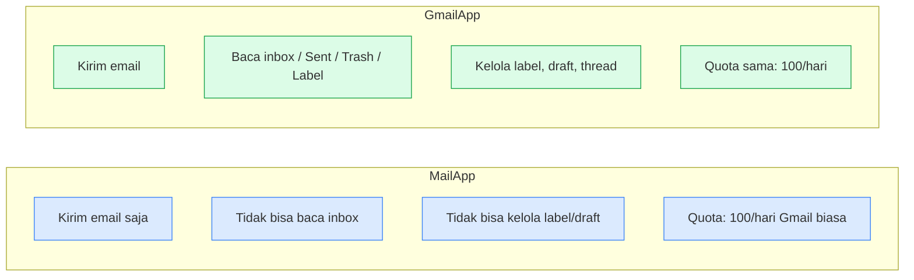
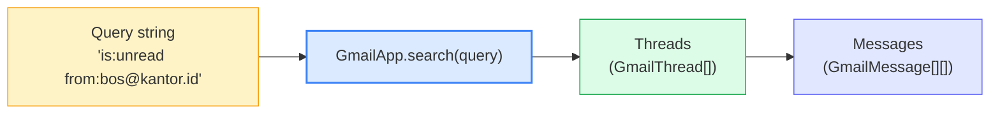

# Modul 4 — Gmail Automation

Setelah Modul 1 mengenalkan `MailApp.sendEmail` sebagai contoh tercepat, Modul 4 menggali fitur **Gmail otomasi** lebih dalam: kirim massal, attachment, template HTML, dan baca email masuk untuk diproses lebih lanjut.

---

## 1. MailApp vs GmailApp — Pilih Mana?

Apps Script punya **dua service email** dengan kemampuan berbeda.



**Aturan praktis**:
- Cuma kirim email (newsletter, notifikasi, alert) → `MailApp` cukup, lebih ringkas.
- Butuh baca/proses email masuk, kelola label/draft → `GmailApp`.

> **Quota**: Gmail biasa 100 recipient/hari. Workspace berbayar 1.500/hari. Cek sisa quota: `MailApp.getRemainingDailyQuota()`.

---

## 2. Mengirim Email

### 2.1 Bentuk paling sederhana

```javascript
MailApp.sendEmail("alice@example.com", "Halo", "Ini body email.");
```

### 2.2 Bentuk lengkap dengan opsi

```javascript
MailApp.sendEmail({
  to:      "alice@example.com",
  cc:      "bob@example.com",
  bcc:     "audit@example.com",
  replyTo: "noreply@example.com",
  subject: "Laporan Mingguan",
  body:    "Versi plain text untuk client yang tidak support HTML.",
  htmlBody: "<h2>Laporan Mingguan</h2><p>Selamat siang,</p>",
  name:     "Bot Otomasi",      // nama pengirim yang tampil
  attachments: [pdfBlob]        // array Blob (lihat §4)
});
```

### 2.3 Email HTML

Tag HTML dasar didukung Gmail: `<h1>-<h6>`, `<p>`, `<a>`, `<table>`, ``, `<strong>`, `<ul>`, dll. CSS inline didukung; CSS eksternal/`<style>` dukungannya terbatas.

```javascript
const html = `
  <div style="font-family: Arial, sans-serif; max-width: 600px;">
    <h2 style="color: #1e40af;">Konfirmasi Pesanan ${nomor}</h2>
    <p>Halo <b>${nama}</b>,</p>
    <p>Pesanan Anda telah kami terima.</p>
    <table style="border-collapse: collapse;">
      <tr><td style="padding: 4px 12px;">Total</td><td><b>Rp ${total}</b></td></tr>
    </table>
  </div>
`;
MailApp.sendEmail({ to, subject, body: "lihat versi HTML", htmlBody: html });
```

> **Best practice**: selalu sertakan `body` plain text + `htmlBody`. Beberapa client hanya tampilkan plain.

### 2.4 Menangani Error Pengiriman

Email bisa gagal karena banyak hal: alamat typo, kuota habis, rate limit, network blip. `MailApp.sendEmail()` **akan throw exception** untuk kasus seperti kuota habis, format alamat parah, atau service error — tapi **tidak throw** untuk alamat yang valid formatnya tapi tujuannya tidak ada (itu jadi bounce async ke inbox sender, di luar jangkauan script).

Pola yang aman: **validasi dulu → kirim dengan try/catch → catat hasil per baris**.

```javascript
function _isEmailValid(s) {
  return typeof s === "string" && /^[^\s@]+@[^\s@]+\.[^\s@]+$/.test(s.trim());
}

function kirimDenganLogStatus(daftar) {
  // Cek kuota di awal — fail fast
  const sisa = MailApp.getRemainingDailyQuota();
  console.log(`Sisa kuota harian: ${sisa}`);
  if (sisa < daftar.length) {
    throw new Error(`Kuota tidak cukup: butuh ${daftar.length}, sisa ${sisa}`);
  }

  const stamp = Utilities.formatDate(
    new Date(), Session.getScriptTimeZone(), "yyyy-MM-dd HH:mm"
  );

  let sukses = 0, gagal = 0;
  const hasil = daftar.map((item) => {
    // 1) Pre-check format
    if (!_isEmailValid(item.email)) {
      gagal++;
      return { ...item, status: `GAGAL: format invalid "${item.email}"` };
    }

    // 2) Coba kirim — tangkap exception runtime
    try {
      MailApp.sendEmail({
        to: item.email,
        subject: item.subject,
        body: item.body
      });
      sukses++;
      return { ...item, status: stamp };
    } catch (err) {
      gagal++;
      return { ...item, status: `GAGAL: ${err.message}` };
    }
  });

  console.log(`✓ Sukses: ${sukses}  ✗ Gagal: ${gagal}`);
  return hasil;   // caller bisa tulis kembali kolom status ke Sheet
}
```

**Pola kolom marker multi-purpose** di Sheet:

| Email           | Notif Email                       |
|-----------------|-----------------------------------|
| sari@kantor.id  | `2026-05-19 14:23`                | ← sukses → timestamp
| typo@kantor     | `GAGAL: format invalid "typo@kantor"` | ← gagal pre-check
| nope@xxx.zz     | `GAGAL: Invalid email address`    | ← gagal runtime

Idempotency tetap jalan: `if (notif) continue;` skip baris yang sudah punya isi (entah sukses atau gagal). Untuk retry baris yang gagal, **kosongkan dulu sel marker-nya manual** lalu run ulang.

#### Hal-hal yang **tidak bisa** dideteksi langsung di script

| Kasus | Deteksi |
|---|---|
| Alamat format valid tapi mailbox tidak ada (bounce) | Async — baca inbox `from:mailer-daemon` setelah beberapa menit |
| Email masuk folder spam penerima | Tidak bisa (di sisi penerima) |
| Penerima blokir sender | Tidak bisa |
| Pesan tertunda di queue Gmail | Tidak bisa |

Untuk deteksi bounce, pola production: kirim → time-driven trigger 10–15 menit kemudian → `GmailApp.search("from:mailer-daemon after:...")` → cocokkan dengan baris yang baru dikirim → update statusnya. Bahan baca inbox ada di §5; trigger time-driven dibahas di Modul 6.

---

## 3. Pola Template — Gmail HTML dari File

Tulis HTML email panjang langsung di string susah dibaca. Pola yang **lebih maintainable**: simpan template sebagai file `.html` di project Apps Script, isi placeholder dari kode.

### Langkah

**1) Tambah file HTML di project**

Klik **+** di sidebar editor → **HTML** → beri nama `template-konfirmasi`. Isi:

```html
<!-- File: template-konfirmasi.html -->
<div style="font-family: Arial, sans-serif; max-width: 600px;">
  <h2>Konfirmasi Pesanan <?= nomor ?></h2>
  <p>Halo <b><?= nama ?></b>,</p>
  <p>Pesanan Anda telah kami terima dengan rincian berikut:</p>
  <ul>
    <li>Produk : <?= produk ?></li>
    <li>Qty    : <?= qty ?></li>
    <li>Total  : Rp <?= total ?></li>
  </ul>
  <p>Terima kasih.</p>
</div>
```

**2) Render dari Apps Script**

```javascript
function kirimKonfirmasi(data) {
  const tmpl = HtmlService.createTemplateFromFile("template-konfirmasi");
  Object.keys(data).forEach((key) => {
    tmpl[key] = data[key];                   // injek variable
  });
  const html = tmpl.evaluate().getContent();

  MailApp.sendEmail({
    to: data.email,
    subject: `Konfirmasi Pesanan ${data.nomor}`,
    body: `Pesanan ${data.nomor} dikonfirmasi.`,
    htmlBody: html
  });
}

kirimKonfirmasi({
  email: "alice@example.com",
  nama: "Sari",
  nomor: "TRX-001",
  produk: "Mouse",
  qty: 3,
  total: "450.000"
});
```

**Sintaks `HtmlService` di template**:
- `<?= var ?>` — print value (auto-escape HTML).
- `<?!= var ?>` — print mentah (raw HTML, hati-hati XSS).
- `<? if (kondisi) { ?> ... <? } ?>` — kontrol flow.
- `<? list.forEach((item) => { ?> ... <? }); ?>` — loop.

---

## 4. Attachment — Mengirim File

`attachments` menerima array **Blob**. Blob bisa berasal dari Drive, Doc/Sheet yang di-export, atau dibuat manual.

### 4.1 Attachment dari Drive

```javascript
const file = DriveApp.getFileById("1AbcXyz...");
const blob = file.getBlob();

MailApp.sendEmail({
  to: "alice@example.com",
  subject: "Lampiran",
  body: "Terlampir dokumen.",
  attachments: [blob]
});
```

### 4.2 Export Doc → PDF lalu kirim

```javascript
const doc = DocumentApp.openById("1AbcXyz...");
const pdfBlob = DriveApp.getFileById(doc.getId()).getAs("application/pdf");

MailApp.sendEmail({
  to: "alice@example.com",
  subject: "Laporan PDF",
  body: "Terlampir laporan.",
  attachments: [pdfBlob.setName("Laporan.pdf")]
});
```

### 4.3 Attachment buatan: CSV dari Sheet

```javascript
function csvDariSheet(sheet) {
  const data = sheet.getDataRange().getValues();
  const csv  = data.map((row) =>
    row.map((cell) => `"${String(cell).replace(/"/g, '""')}"`).join(",")
  ).join("\n");

  return Utilities.newBlob(csv, "text/csv", `${sheet.getName()}.csv`);
}

const blob = csvDariSheet(SpreadsheetApp.openById("...").getActiveSheet());
MailApp.sendEmail({
  to: "ops@kantor.id",
  subject: "Export CSV",
  body: "Terlampir export hari ini.",
  attachments: [blob]
});
```

---

## 5. Membaca Email Masuk

### 5.1 Pencarian dengan query Gmail



```javascript
const threads = GmailApp.search("is:unread from:bos@kantor.id newer_than:7d", 0, 20);

threads.forEach((thread) => {
  const messages = thread.getMessages();
  messages.forEach((msg) => {
    console.log(`Dari: ${msg.getFrom()}`);
    console.log(`Subject: ${msg.getSubject()}`);
    console.log(`Body (snippet): ${msg.getPlainBody().substring(0, 100)}`);
  });
});
```

### 5.2 Operator query Gmail (sama seperti di UI Gmail)

| Operator | Contoh |
|---|---|
| `from:` / `to:` | `from:alice@example.com` |
| `subject:` | `subject:invoice` |
| `is:unread` / `is:starred` / `is:important` | `is:unread` |
| `has:attachment` | `has:attachment` |
| `label:` | `label:auto-process` |
| `after:` / `before:` | `after:2026/05/01` |
| `newer_than:` / `older_than:` | `newer_than:7d` |
| Boolean | `AND`, `OR`, `(...)`, `-` (NOT) |

### 5.3 Pola: Proses email lalu tandai sudah diproses

```javascript
function prosesEmailInvoice() {
  const label = GmailApp.getUserLabelByName("Processed") ||
                GmailApp.createLabel("Processed");

  const threads = GmailApp.search("subject:invoice -label:Processed", 0, 50);

  threads.forEach((thread) => {
    const msg = thread.getMessages()[0];

    // ... proses (extract data, simpan ke Sheet, dll)
    console.log(`Diproses: ${msg.getSubject()}`);

    thread.addLabel(label);   // marker — pencarian berikutnya skip thread ini
    thread.markRead();
  });
}
```

### 5.4 Mengambil attachment

```javascript
function ambilAttachmentDariEmail() {
  const threads = GmailApp.search("has:attachment subject:laporan", 0, 5);

  threads.forEach((thread) => {
    thread.getMessages().forEach((msg) => {
      msg.getAttachments().forEach((att) => {
        const folder = DriveApp.getFolderById("FOLDER_ID");
        folder.createFile(att);   // simpan ke Drive
        console.log(`Disimpan: ${att.getName()}`);
      });
    });
  });
}
```

---

## 6. Draft & Reply

```javascript
// Buat draft (tidak terkirim)
GmailApp.createDraft("alice@example.com", "Draft", "Isi draft.");

// Reply ke thread terakhir dari pengirim tertentu
const thread = GmailApp.search("from:alice@example.com", 0, 1)[0];
if (thread) {
  thread.reply("Terima kasih, akan kami proses.");
}
```

---

## 7. Best Practices

1. **Selalu set `htmlBody` + `body`** — jangan hanya HTML.
2. **Cek quota** sebelum batch besar: `MailApp.getRemainingDailyQuota()`.
3. **Trottle batch besar**: untuk 500 email, beri jeda dengan `Utilities.sleep(100)` antar 50 email — menghindari rate-limit transien.
4. **Marker idempotent**: pakai label Gmail (`addLabel`) atau kolom Sheet (`Notif Terkirim`) untuk hindari kirim duplikat.
5. **Test ke diri sendiri dulu** — pakai `Session.getActiveUser().getEmail()` saat development sebelum ke daftar penerima asli.
6. **Hindari spam-trigger** — subject pakai HURUF KAPITAL SEMUA, banyak `!!!`, atau kata "FREE/GRATIS" sering masuk spam.
7. **Reply-to terpisah dari From** — pakai `replyTo` kalau email dikirim dari bot tapi balasan ingin masuk ke alamat manusia.

---

## 8. Penutup

**Yang harus dikuasai sebelum lanjut**:

- [ ] Bisa pilih MailApp vs GmailApp sesuai kebutuhan.
- [ ] Bisa kirim email plain text dan HTML.
- [ ] Bisa pakai `HtmlService` template untuk HTML email maintainable.
- [ ] Bisa lampirkan file dari Drive, export Doc → PDF, atau buat Blob CSV.
- [ ] Bisa search email dengan query Gmail dan iterasi thread/message.
- [ ] Bisa simpan attachment email ke Drive otomatis.
- [ ] Paham idempotent pattern dengan label Gmail.

**Selanjutnya: Modul 5 — Building UI Forms for Data Input.**
