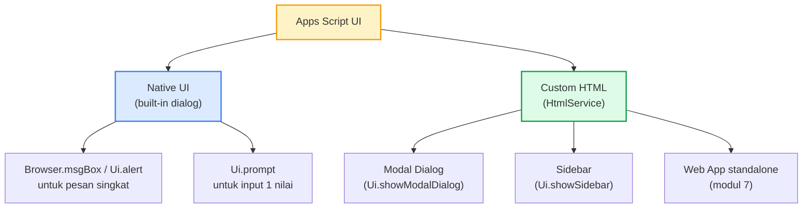
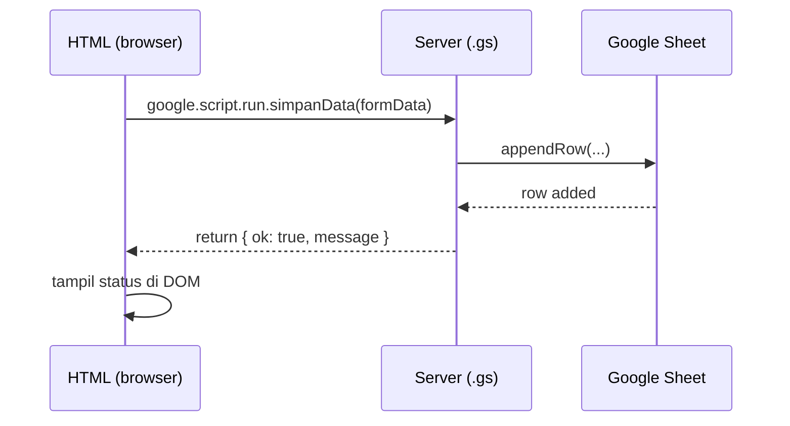
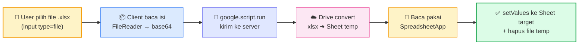

# Modul 5 — Building UI Forms for Data Input

Sampai Modul 4, semua interaksi dengan kode lewat **Run** di editor atau trigger otomatis. Modul 5 mengenalkan **antarmuka untuk pengguna akhir**: dialog, sidebar, dan custom form HTML yang berjalan di dalam Google Sheets/Docs.

---

## 1. Pilihan UI di Apps Script



| Pilihan | Untuk apa | Bound to |
|---|---|---|
| `Ui.alert` / `Ui.prompt` | Notifikasi/input cepat 1-2 nilai | Sheet/Doc bound |
| Sidebar HTML | Form panjang, panel tools, bisa scrollable | Sheet/Doc bound |
| Modal Dialog HTML | Form fokus untuk satu task | Sheet/Doc bound |
| Web App HTML | UI standalone untuk akses dari URL | (Modul 7) |

> Modul 5 fokus ke **container-bound UI** (Sheet/Doc). Web App standalone dibahas di Modul 7.

---

## 2. Native UI — `SpreadsheetApp.getUi()`

### 2.1 Alert dengan tombol

```javascript
function konfirmasiHapus() {
  const ui = SpreadsheetApp.getUi();
  const respon = ui.alert(
    "Konfirmasi",
    "Yakin mau menghapus baris terpilih?",
    ui.ButtonSet.YES_NO
  );

  if (respon === ui.Button.YES) {
    // ... eksekusi hapus
    ui.alert("Berhasil", "Baris dihapus.", ui.ButtonSet.OK);
  }
}
```

### 2.2 Prompt — input dari user

```javascript
function tambahKaryawanCepat() {
  const ui = SpreadsheetApp.getUi();
  const respon = ui.prompt(
    "Tambah Karyawan",
    "Masukkan nama:",
    ui.ButtonSet.OK_CANCEL
  );

  if (respon.getSelectedButton() === ui.Button.OK) {
    const nama = respon.getResponseText().trim();
    if (nama) {
      SpreadsheetApp.getActiveSheet().appendRow([nama, "", "", new Date()]);
    }
  }
}
```

### 2.3 Custom Menu

Custom menu adalah **pintu masuk utama** untuk user akhir memakai automation kita. Dia muncul di toolbar Sheet (sebelah menu Help) saat Sheet dibuka — dan setiap item bisa men-trigger function manapun di project.

#### Contoh lengkap (versi M5)

```javascript
function onOpen() {
  SpreadsheetApp.getUi()
    .createMenu("⚡ Form M5")                                    // 1. Bikin menu utama
    .addItem("Tambah cepat (prompt)",    "tambahKaryawanCepat")   // 2. Item → function
    .addItem("Konfirmasi hapus (alert)", "konfirmasiHapus")
    .addSeparator()                                               // 3. Garis pemisah
    .addItem("Buka Form (sidebar)",      "bukaSidebarForm")
    .addItem("Buka Form (modal)",        "bukaModalForm")
    .addItem("Buka Sidebar CRUD",        "bukaSidebarCRUD")
    .addItem("Import Excel",             "bukaUpload")
    .addToUi();                                                   // 4. Finalize → tampil di toolbar
}
```

Hasil di toolbar Sheet (setelah reload):

```
[File] [Edit] [View] ... [Help] [⚡ Form M5 ▾]
                                  ├─ Tambah cepat (prompt)
                                  ├─ Konfirmasi hapus (alert)
                                  ├──────────────────────
                                  ├─ Buka Form (sidebar)
                                  ├─ Buka Form (modal)
                                  ├─ Buka Sidebar CRUD
                                  └─ Import Excel
```

#### Anatomi method-by-method

| Method | Fungsi |
|---|---|
| **`SpreadsheetApp.getUi()`** | Ambil object `Ui` — root semua interaksi UI di container-bound script. Ada juga `DocumentApp.getUi()` untuk Doc, `FormApp.getUi()` untuk Form. |
| **`.createMenu(label)`** | Bikin menu builder dengan label yang akan tampil di toolbar. Boleh pakai emoji (`⚡`, `🤖`, `📊`) untuk visual hint. |
| **`.addItem(label, functionName)`** | Tambah baris menu. `functionName` adalah **string nama function** di project yang sama. Saat user klik → function dipanggil. |
| **`.addSeparator()`** | Garis pembatas — group item secara visual. Tidak bisa diklik. |
| **`.addSubMenu(menu)`** | Tambah sub-menu (menu di dalam menu). Argumennya `Menu` object lain. Akan tampil dengan tanda ▸ di kanan. |
| **`.addToUi()`** | Finalize — tanpa ini, menu **tidak akan tampil**. Wajib di akhir chain. |

#### Sub-menu (nested)

```javascript
function onOpen() {
  const ui = SpreadsheetApp.getUi();

  const submenuTools = ui.createMenu("🛠️ Tools")
    .addItem("Reset format",  "resetFormat")
    .addItem("Hapus chart",   "hapusChart");

  ui.createMenu("⚡ Form M5")
    .addItem("Tambah cepat", "tambahKaryawanCepat")
    .addSeparator()
    .addSubMenu(submenuTools)
    .addToUi();
}
```

Hasilnya:
```
⚡ Form M5 ▾
├─ Tambah cepat
├──────────────
└─ 🛠️ Tools ▸
              ├─ Reset format
              └─ Hapus chart
```

#### Aturan penting `onOpen`

1. **Nama function harus persis `onOpen`** — ini reserved name di Apps Script. Tidak boleh `onOpenMenu` atau `setupMenu`.
2. **Otomatis jalan saat user membuka Sheet** — tidak perlu trigger setup manual. Termasuk **simple trigger**, jadi akan jalan otomatis selama script container-bound.
3. **Container-bound only** — kalau script standalone, `onOpen` tidak akan terpicu karena tidak ada Sheet yang "dibuka". Untuk standalone, deploy sebagai library lalu panggil dari container-bound (lihat Modul 3 §7).
4. **Reload Sheet untuk lihat perubahan menu** — kalau ubah kode `onOpen`, Sheet harus di-refresh browser-nya supaya menu baru muncul.
5. **Simple trigger = akses terbatas** — `onOpen` versi simple trigger **tidak bisa** panggil service yang butuh authorisasi (MailApp, UrlFetchApp, dll). Tapi membuat menu yang **isinya** function yang panggil service tersebut — itu OK, karena trigger autorisasi terjadi saat user klik item.

#### `addItem` hanya menerima nama function di project yang sama

```javascript
// ❌ Tidak bekerja — addItem cuma menerima string nama function
.addItem("Halo", "MyLib.sapaUser")

// ✓ Bekerja — bikin stub di project ini yang panggil library
.addItem("Halo", "menuSapa")

function menuSapa() {
  MyLib.sapaUser();   // delegasi ke library
}
```

Pattern stub function ini sering dipakai saat code reuse via library (Modul 3 §7).

#### Variasi: dynamic menu

Menu bisa di-generate dinamis dari data:

```javascript
function onOpen() {
  const menu = SpreadsheetApp.getUi().createMenu("📋 Laporan");

  // Generate item per sheet di spreadsheet
  SpreadsheetApp.getActiveSpreadsheet().getSheets().forEach((s) => {
    menu.addItem(`Refresh ${s.getName()}`, `refresh_${s.getName()}`);
  });

  menu.addToUi();
}
```

> ⚠️ Hati-hati: nama function di `addItem` tetap harus **fixed string saat runtime** — peserta perlu tahu nama function-nya untuk dipanggil. Pattern ini umumnya dikombinasikan dengan switch/lookup table di handler.

---

## 3. HTML Sidebar & Modal

Untuk form lebih kompleks (banyak field, validasi, layout), pakai HtmlService.

### 3.1 Anatomi project

```
project Apps Script/
├── Code.gs                     ← server-side
├── ui-form.html                ← HTML sidebar/modal
└── (optional) ui-css.html      ← CSS dipisah
```

### 3.2 Server side: tampilkan sidebar

```javascript
// Code.gs
function onOpen() {
  SpreadsheetApp.getUi()
    .createMenu("⚡ Form")
    .addItem("Buka form", "bukaSidebar")
    .addToUi();
}

function bukaSidebar() {
  const html = HtmlService.createHtmlOutputFromFile("ui-form")
    .setTitle("Tambah Data")
    .setWidth(300);
  SpreadsheetApp.getUi().showSidebar(html);
}

// Function ini dipanggil dari client (HTML) via google.script.run
function simpanData(formData) {
  const sheet = SpreadsheetApp.getActiveSheet();
  sheet.appendRow([
    formData.nama,
    formData.divisi,
    parseFloat(formData.gaji) || 0,
    new Date()
  ]);
  return { ok: true, message: "Data tersimpan." };
}
```

### 3.3 Client side: HTML form

```html
<!-- ui-form.html -->
<!DOCTYPE html>
<html>
<head>
  <base target="_top">
  <style>
    body { font-family: Arial; padding: 12px; font-size: 14px; }
    label { display: block; margin: 8px 0 4px; font-weight: bold; }
    input, select { width: 100%; box-sizing: border-box; padding: 6px; }
    button { margin-top: 12px; padding: 8px 16px; background: #1e40af; color: white; border: none; border-radius: 4px; cursor: pointer; }
    .status { margin-top: 8px; padding: 6px; border-radius: 4px; }
    .ok    { background: #dcfce7; color: #166534; }
    .error { background: #fee2e2; color: #991b1b; }
  </style>
</head>
<body>
  <h3>Tambah Karyawan</h3>

  <label>Nama</label>
  <input id="nama" type="text" required>

  <label>Divisi</label>
  <select id="divisi">
    <option>Finance</option>
    <option>Marketing</option>
    <option>IT</option>
    <option>HR</option>
  </select>

  <label>Gaji (Rp)</label>
  <input id="gaji" type="number" min="0" step="100000">

  <button onclick="kirim()">Simpan</button>
  <div id="status"></div>

  <script>
    function kirim() {
      const data = {
        nama:   document.getElementById("nama").value.trim(),
        divisi: document.getElementById("divisi").value,
        gaji:   document.getElementById("gaji").value
      };

      if (!data.nama) {
        tampilStatus("Nama wajib diisi.", "error");
        return;
      }

      tampilStatus("Menyimpan...", "");

      google.script.run
        .withSuccessHandler((resp) => {
          tampilStatus(resp.message, "ok");
          document.getElementById("nama").value = "";
          document.getElementById("gaji").value = "";
        })
        .withFailureHandler((err) => {
          tampilStatus("Error: " + err.message, "error");
        })
        .simpanData(data);
    }

    function tampilStatus(msg, cls) {
      const el = document.getElementById("status");
      el.className = "status " + cls;
      el.textContent = msg;
    }
  </script>
</body>
</html>
```

### 3.4 Komunikasi Client ↔ Server



**Aturan penting `google.script.run`**:
- **Asynchronous**. Pakai `.withSuccessHandler(cb)` dan `.withFailureHandler(cb)`.
- Argumen yang dikirim **harus serializable** (object plain, array, string, number, bool, Date — TIDAK bisa function/Map/Set).
- Hasil return juga harus serializable.

---

## 4. Modal Dialog vs Sidebar — Kapan Pakai Apa?

| Aspek | Sidebar | Modal Dialog |
|---|---|---|
| Posisi | Panel kanan, persistent | Tengah, blocking |
| User bisa interaksi sheet di belakang | Ya | Tidak |
| Cocok untuk | Tools yang sering dipakai sambil scroll sheet | Form fokus, wizard step-by-step |
| Lebar | `.setWidth(300)` (tetap) | `.setWidth(W).setHeight(H)` |

```javascript
// Modal
function bukaModal() {
  const html = HtmlService.createHtmlOutputFromFile("ui-modal")
    .setWidth(500)
    .setHeight(400);
  SpreadsheetApp.getUi().showModalDialog(html, "Wizard Onboarding");
}
```

---

## 5. Pre-fill Form dari Server

Form sering perlu data awal: list pilihan dropdown dari sheet, default value, dll. Pakai **template HTML** seperti di Modul 4.

```javascript
function bukaFormDenganData() {
  const tmpl = HtmlService.createTemplateFromFile("ui-form-prefill");
  tmpl.divisiList = ["Finance", "Marketing", "IT", "HR"];   // dari Sheet
  tmpl.userEmail  = Session.getActiveUser().getEmail();

  const html = tmpl.evaluate().setTitle("Form Pre-fill").setWidth(320);
  SpreadsheetApp.getUi().showSidebar(html);
}
```

```html
<!-- ui-form-prefill.html (potongan) -->
<select id="divisi">
  <? divisiList.forEach((d) => { ?>
    <option><?= d ?></option>
  <? }); ?>
</select>

<small>Login sebagai: <?= userEmail ?></small>
```

---

## 6. Edit & Delete Record dari UI

Pola CRUD lengkap — list data di sidebar, klik baris untuk edit, tombol delete.


Implementasi lengkap di `contoh.js` (function `bukaSidebarCRUD`).

---

## 7. Upload File Excel untuk Input Data

Use case nyata yang sering dibutuhkan: user **upload file Excel (.xlsx)**, sistem parse, lalu insert ribuan baris ke Sheet sekaligus. Lebih cepat daripada input manual baris per baris.



### 7.1 Konsep Inti

Apps Script **tidak bisa baca .xlsx langsung**. Triknya: **upload file ke Drive sebagai Google Sheet** — Drive API otomatis konversi `.xlsx` → Sheet, lalu kita baca pakai `SpreadsheetApp` seperti biasa. Setelah selesai, file Sheet temp dihapus supaya tidak menumpuk di Drive.

> ⚠️ **Wajib enable Advanced Drive Service**: Editor → ikon **+** di **Services** (sidebar kiri) → cari **Drive API** → Add. Tanpa ini, `Drive.Files.insert(..., { convert: true })` tidak tersedia.

### 7.2 HTML Side

```html
<!-- ui-upload.html -->
<label>Upload Excel (.xlsx)</label>
<input type="file" id="file" accept=".xlsx,.xls">
<button onclick="upload()">Import</button>
<div id="status"></div>

<script>
function upload() {
  const file = document.getElementById("file").files[0];
  if (!file) return show("Pilih file dulu.", "error");

  // Batas ukuran: payload google.script.run ~50 MB
  if (file.size > 25 * 1024 * 1024) {
    return show("File terlalu besar (max 25 MB).", "error");
  }

  show("Mengupload...", "info");
  const reader = new FileReader();
  reader.onload = (e) => {
    // e.target.result = "data:application/vnd...;base64,XXXXX"
    const base64 = e.target.result.split(",")[1];   // bagian setelah comma

    google.script.run
      .withSuccessHandler((r) => show(`Berhasil: ${r.inserted} baris dimasukkan.`, "ok"))
      .withFailureHandler((err) => show("Error: " + err.message, "error"))
      .importExcel(base64, file.name, file.type);
  };
  reader.readAsDataURL(file);
}

function show(msg, cls) {
  const el = document.getElementById("status");
  el.className = "status " + cls;
  el.textContent = msg;
}
</script>
```

### 7.3 Server Side

```javascript
function bukaUpload() {
  const html = HtmlService.createHtmlOutputFromFile("ui-upload")
    .setTitle("Import Excel").setWidth(380);
  SpreadsheetApp.getUi().showSidebar(html);
}

function importExcel(base64, fileName, mimeType) {
  // 1. Decode base64 → Blob
  const bytes = Utilities.base64Decode(base64);
  const blob  = Utilities.newBlob(bytes, mimeType, fileName);

  // 2. Upload ke Drive sebagai Google Sheet (auto-convert xlsx)
  const resource = {
    title:    fileName.replace(/\.xlsx?$/i, "") + "-temp-import",
    mimeType: MimeType.GOOGLE_SHEETS
  };
  const uploadedFile = Drive.Files.insert(resource, blob, { convert: true });

  try {
    // 3. Baca dari Sheet hasil convert
    const tempSS = SpreadsheetApp.openById(uploadedFile.id);
    const tempSheet = tempSS.getSheets()[0];
    const data = tempSheet.getDataRange().getValues();

    if (data.length < 2) throw new Error("File kosong atau cuma header.");

    const headers = data[0];
    const rows    = data.slice(1);

    // 4. Validasi header
    const expectedHeaders = ["Nama", "Divisi", "Gaji"];
    const missing = expectedHeaders.filter((h) => !headers.includes(h));
    if (missing.length > 0) {
      throw new Error(`Kolom hilang: ${missing.join(", ")}`);
    }

    // 5. Insert ke Sheet tujuan (1 round-trip)
    const target = SpreadsheetApp.getActiveSpreadsheet().getSheetByName("Karyawan");
    const startRow = target.getLastRow() + 1;
    target.getRange(startRow, 1, rows.length, headers.length).setValues(rows);

    return { inserted: rows.length };
  } finally {
    // 6. Cleanup — hapus file Sheet temp di Drive (apapun hasil try block)
    DriveApp.getFileById(uploadedFile.id).setTrashed(true);
  }
}
```

### 7.4 Preview Sebelum Import (UX lebih baik)

User suka cemas saat upload file besar — "kira-kira datanya bener tidak ya?". Tambahkan **preview**: convert + baca di server, kembalikan struktur + 5 baris pertama, baru insert kalau user klik Confirm.

**Server**:

```javascript
function previewExcel(base64, fileName, mimeType) {
  const bytes = Utilities.base64Decode(base64);
  const blob  = Utilities.newBlob(bytes, mimeType, fileName);
  const uploaded = Drive.Files.insert(
    { title: "preview-" + Date.now(), mimeType: MimeType.GOOGLE_SHEETS },
    blob,
    { convert: true }
  );

  try {
    const sheet = SpreadsheetApp.openById(uploaded.id).getSheets()[0];
    const data  = sheet.getDataRange().getValues();
    return {
      totalRows: Math.max(0, data.length - 1),
      headers:   data[0] || [],
      preview:   data.slice(1, 6),    // 5 baris pertama
      tempId:    uploaded.id          // dikirim balik untuk confirmImport
    };
  } catch (err) {
    // Cleanup kalau preview gagal
    DriveApp.getFileById(uploaded.id).setTrashed(true);
    throw err;
  }
}

function confirmImport(tempId) {
  try {
    const sheet = SpreadsheetApp.openById(tempId).getSheets()[0];
    const data  = sheet.getDataRange().getValues();
    const headers = data[0];
    const rows    = data.slice(1);

    const target = SpreadsheetApp.getActiveSpreadsheet().getSheetByName("Karyawan");
    const startRow = target.getLastRow() + 1;
    target.getRange(startRow, 1, rows.length, headers.length).setValues(rows);

    return { inserted: rows.length };
  } finally {
    DriveApp.getFileById(tempId).setTrashed(true);
  }
}
```

**Client flow** (2-step):

```html
<button onclick="preview()">1. Preview</button>
<div id="previewArea"></div>
<button id="btn-confirm" style="display:none" onclick="kirimImport()">2. Import</button>

<script>
let cachedTempId;

function preview() {
  const file = document.getElementById("file").files[0];
  if (!file) return alert("Pilih file dulu.");

  const reader = new FileReader();
  reader.onload = (e) => {
    const base64 = e.target.result.split(",")[1];
    google.script.run
      .withSuccessHandler((r) => {
        cachedTempId = r.tempId;
        renderTabel(r);
        document.getElementById("btn-confirm").style.display = "inline";
      })
      .withFailureHandler((err) => alert("Error: " + err.message))
      .previewExcel(base64, file.name, file.type);
  };
  reader.readAsDataURL(file);
}

function kirimImport() {
  google.script.run
    .withSuccessHandler((r) => alert(`${r.inserted} baris dimasukkan.`))
    .confirmImport(cachedTempId);
}

function renderTabel(r) {
  const html = `
    <p>Total ${r.totalRows} baris, kolom: ${r.headers.join(", ")}</p>
    <table border="1" style="width:100%; border-collapse: collapse;">
      <tr>${r.headers.map((h) => `<th>${h}</th>`).join("")}</tr>
      ${r.preview.map((row) =>
        `<tr>${row.map((c) => `<td>${c}</td>`).join("")}</tr>`
      ).join("")}
    </table>
  `;
  document.getElementById("previewArea").innerHTML = html;
}
</script>
```

### 7.5 Best Practices

1. **Validasi header dulu** — gagal cepat kalau struktur file tidak sesuai. Pesan error harus sebutkan kolom yang hilang/salah.
2. **Validasi tiap baris** — cek tipe data (gaji harus angka, email harus valid). Kumpulkan error → tampilkan ke user, jangan langsung crash di baris pertama yang salah.
3. **Limit file size** — `google.script.run` ada batas payload ~50 MB. Cek `file.size` di client (`<input type="file">.files[0].size`) sebelum upload.
4. **Batch besar = pakai chunking** — kalau > 5.000 baris, pecah per 1.000 baris dengan `setValues` terpisah. Total round-trip masih jauh lebih sedikit dari per-cell.
5. **Selalu cleanup file temp** — kalau pakai pola convert Excel, hapus file Drive temp di `finally` block supaya tidak menumpuk.
6. **Preview sebelum Import** — pola 2-step jauh mengurangi user anxiety dan memungkinkan koreksi sebelum data masuk.
7. **Audit log** — catat ke Sheet `Audit-Log`: siapa upload, kapan, file apa, berapa baris, sukses/fail. Berguna saat ada masalah data nantinya.

---

## 8. Validasi — Client vs Server

**Validasi rangkap**: di client untuk UX cepat, di server untuk integritas data (jangan percaya client).

```javascript
// Client (HTML <script>)
if (data.gaji < 0 || isNaN(data.gaji)) {
  tampilStatus("Gaji harus angka positif.", "error");
  return;
}

// Server (.gs)
function simpanData(formData) {
  if (!formData.nama || formData.nama.length < 2) {
    throw new Error("Nama minimal 2 karakter.");
  }
  if (typeof formData.gaji !== "number" || formData.gaji < 0) {
    throw new Error("Gaji tidak valid.");
  }
  // ... lanjut simpan
}
```

`throw` di server akan masuk ke `withFailureHandler` di client.

---

## 9. Best Practices

1. **Pisahkan UI dan logic**: HTML untuk presentasi, server function untuk data ops.
2. **Selalu set `<base target="_top">`** di `<head>` HTML — supaya link tidak terjebak di iframe.
3. **Gunakan template HTML** untuk pre-fill data dari server, bukan rangkai string di JS.
4. **Validasi dua sisi** — client untuk feedback cepat, server untuk integritas.
5. **Tunjukkan status loading** untuk operasi yang > 500ms (animasi spinner sederhana).
6. **Reset form setelah sukses** — UX expect form bersih untuk input berikutnya.
7. **Tangani error dengan jelas** — pesan yang user bisa pahami, bukan stack trace.

---

## 10. Penutup

**Yang harus dikuasai sebelum lanjut**:

- [ ] Bisa pakai `Ui.alert` / `Ui.prompt` untuk interaksi sederhana.
- [ ] Bisa bikin custom menu di Sheet via `onOpen`.
- [ ] Bisa tampilkan sidebar dan modal HTML.
- [ ] Paham komunikasi client↔server via `google.script.run` (success/failure handler).
- [ ] Bisa pre-fill form pakai template HTML.
- [ ] Bisa bikin form CRUD lengkap (create/read/update/delete).
- [ ] Tahu kapan pakai sidebar vs modal.
- [ ] Validasi dua sisi (client + server).
- [ ] Bisa terima upload Excel via sidebar, convert via Drive, insert ke Sheet.
- [ ] Paham pola Preview → Confirm untuk import file besar.

**Selanjutnya: Modul 6 — Workflow Automation (Triggers).**
