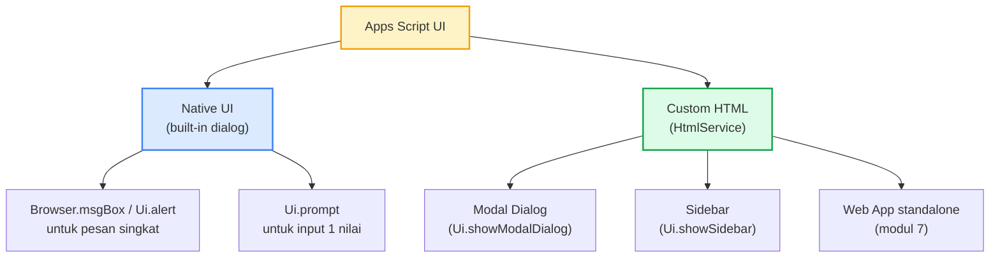
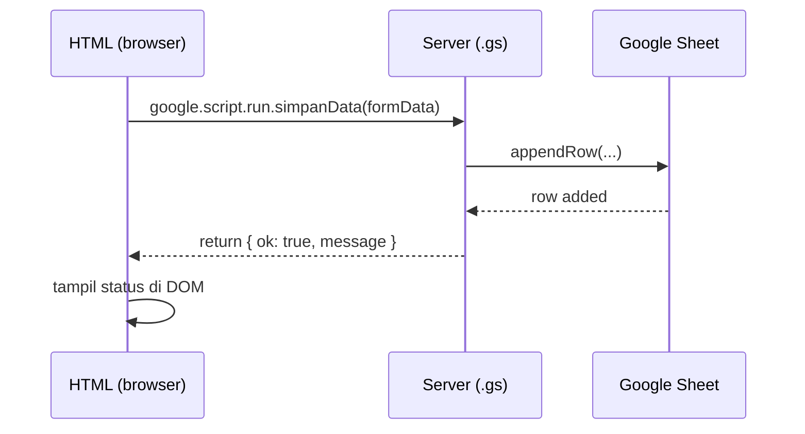
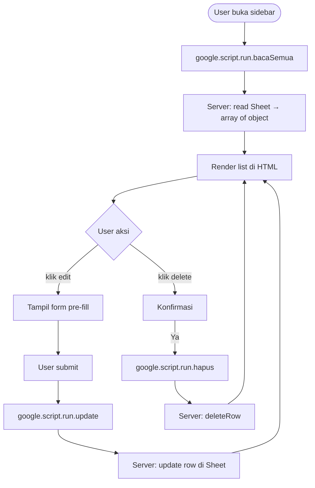

# Modul 5 — Building UI Forms for Data Input

Sampai Modul 4, semua interaksi dengan kode lewat **Run** di editor atau trigger otomatis. Modul 5 mengenalkan **antarmuka untuk pengguna akhir**: dialog, sidebar, dan custom form HTML yang berjalan di dalam Google Sheets/Docs.

---

## 1. Pilihan UI di Apps Script



| Pilihan | Untuk apa | Bound to |
|---|---|---|
| `Ui.alert` / `Ui.prompt` | Notifikasi/input cepat 1-2 nilai | Sheet/Doc bound |
| Sidebar HTML | Form panjang, panel tools, bisa scrollable | Sheet/Doc bound |
| Modal Dialog HTML | Form fokus untuk satu task | Sheet/Doc bound |
| Web App HTML | UI standalone untuk akses dari URL | (Modul 7) |

> Modul 5 fokus ke **container-bound UI** (Sheet/Doc). Web App standalone dibahas di Modul 7.

---

## 2. Native UI — `SpreadsheetApp.getUi()`

### 2.1 Alert dengan tombol

```javascript
function konfirmasiHapus() {
  const ui = SpreadsheetApp.getUi();
  const respon = ui.alert(
    "Konfirmasi",
    "Yakin mau menghapus baris terpilih?",
    ui.ButtonSet.YES_NO
  );

  if (respon === ui.Button.YES) {
    // ... eksekusi hapus
    ui.alert("Berhasil", "Baris dihapus.", ui.ButtonSet.OK);
  }
}
```

### 2.2 Prompt — input dari user

```javascript
function tambahKaryawanCepat() {
  const ui = SpreadsheetApp.getUi();
  const respon = ui.prompt(
    "Tambah Karyawan",
    "Masukkan nama:",
    ui.ButtonSet.OK_CANCEL
  );

  if (respon.getSelectedButton() === ui.Button.OK) {
    const nama = respon.getResponseText().trim();
    if (nama) {
      SpreadsheetApp.getActiveSheet().appendRow([nama, "", "", new Date()]);
    }
  }
}
```

### 2.3 Custom Menu (review dari Modul 3)

```javascript
function onOpen() {
  SpreadsheetApp.getUi()
    .createMenu("⚡ Otomasi")
    .addItem("Tambah karyawan", "tambahKaryawanCepat")
    .addItem("Konfirmasi hapus", "konfirmasiHapus")
    .addSeparator()
    .addSubMenu(
      SpreadsheetApp.getUi().createMenu("Tools")
        .addItem("Reset format", "resetFormat")
    )
    .addToUi();
}
```

---

## 3. HTML Sidebar & Modal

Untuk form lebih kompleks (banyak field, validasi, layout), pakai HtmlService.

### 3.1 Anatomi project

```
project Apps Script/
├── Code.gs                     ← server-side
├── ui-form.html                ← HTML sidebar/modal
└── (optional) ui-css.html      ← CSS dipisah
```

### 3.2 Server side: tampilkan sidebar

```javascript
// Code.gs
function onOpen() {
  SpreadsheetApp.getUi()
    .createMenu("⚡ Form")
    .addItem("Buka form", "bukaSidebar")
    .addToUi();
}

function bukaSidebar() {
  const html = HtmlService.createHtmlOutputFromFile("ui-form")
    .setTitle("Tambah Data")
    .setWidth(300);
  SpreadsheetApp.getUi().showSidebar(html);
}

// Function ini dipanggil dari client (HTML) via google.script.run
function simpanData(formData) {
  const sheet = SpreadsheetApp.getActiveSheet();
  sheet.appendRow([
    formData.nama,
    formData.divisi,
    parseFloat(formData.gaji) || 0,
    new Date()
  ]);
  return { ok: true, message: "Data tersimpan." };
}
```

### 3.3 Client side: HTML form

```html
<!-- ui-form.html -->
<!DOCTYPE html>
<html>
<head>
  <base target="_top">
  <style>
    body { font-family: Arial; padding: 12px; font-size: 14px; }
    label { display: block; margin: 8px 0 4px; font-weight: bold; }
    input, select { width: 100%; box-sizing: border-box; padding: 6px; }
    button { margin-top: 12px; padding: 8px 16px; background: #1e40af; color: white; border: none; border-radius: 4px; cursor: pointer; }
    .status { margin-top: 8px; padding: 6px; border-radius: 4px; }
    .ok    { background: #dcfce7; color: #166534; }
    .error { background: #fee2e2; color: #991b1b; }
  </style>
</head>
<body>
  <h3>Tambah Karyawan</h3>

  <label>Nama</label>
  <input id="nama" type="text" required>

  <label>Divisi</label>
  <select id="divisi">
    <option>Finance</option>
    <option>Marketing</option>
    <option>IT</option>
    <option>HR</option>
  </select>

  <label>Gaji (Rp)</label>
  <input id="gaji" type="number" min="0" step="100000">

  <button onclick="kirim()">Simpan</button>
  <div id="status"></div>

  <script>
    function kirim() {
      const data = {
        nama:   document.getElementById("nama").value.trim(),
        divisi: document.getElementById("divisi").value,
        gaji:   document.getElementById("gaji").value
      };

      if (!data.nama) {
        tampilStatus("Nama wajib diisi.", "error");
        return;
      }

      tampilStatus("Menyimpan...", "");

      google.script.run
        .withSuccessHandler((resp) => {
          tampilStatus(resp.message, "ok");
          document.getElementById("nama").value = "";
          document.getElementById("gaji").value = "";
        })
        .withFailureHandler((err) => {
          tampilStatus("Error: " + err.message, "error");
        })
        .simpanData(data);
    }

    function tampilStatus(msg, cls) {
      const el = document.getElementById("status");
      el.className = "status " + cls;
      el.textContent = msg;
    }
  </script>
</body>
</html>
```

### 3.4 Komunikasi Client ↔ Server



**Aturan penting `google.script.run`**:
- **Asynchronous**. Pakai `.withSuccessHandler(cb)` dan `.withFailureHandler(cb)`.
- Argumen yang dikirim **harus serializable** (object plain, array, string, number, bool, Date — TIDAK bisa function/Map/Set).
- Hasil return juga harus serializable.

---

## 4. Modal Dialog vs Sidebar — Kapan Pakai Apa?

| Aspek | Sidebar | Modal Dialog |
|---|---|---|
| Posisi | Panel kanan, persistent | Tengah, blocking |
| User bisa interaksi sheet di belakang | Ya | Tidak |
| Cocok untuk | Tools yang sering dipakai sambil scroll sheet | Form fokus, wizard step-by-step |
| Lebar | `.setWidth(300)` (tetap) | `.setWidth(W).setHeight(H)` |

```javascript
// Modal
function bukaModal() {
  const html = HtmlService.createHtmlOutputFromFile("ui-modal")
    .setWidth(500)
    .setHeight(400);
  SpreadsheetApp.getUi().showModalDialog(html, "Wizard Onboarding");
}
```

---

## 5. Pre-fill Form dari Server

Form sering perlu data awal: list pilihan dropdown dari sheet, default value, dll. Pakai **template HTML** seperti di Modul 4.

```javascript
function bukaFormDenganData() {
  const tmpl = HtmlService.createTemplateFromFile("ui-form-prefill");
  tmpl.divisiList = ["Finance", "Marketing", "IT", "HR"];   // dari Sheet
  tmpl.userEmail  = Session.getActiveUser().getEmail();

  const html = tmpl.evaluate().setTitle("Form Pre-fill").setWidth(320);
  SpreadsheetApp.getUi().showSidebar(html);
}
```

```html
<!-- ui-form-prefill.html (potongan) -->
<select id="divisi">
  <? divisiList.forEach((d) => { ?>
    <option><?= d ?></option>
  <? }); ?>
</select>

<small>Login sebagai: <?= userEmail ?></small>
```

---

## 6. Edit & Delete Record dari UI

Pola CRUD lengkap — list data di sidebar, klik baris untuk edit, tombol delete.



Implementasi lengkap di `contoh.js` (function `bukaSidebarCRUD`).

---

## 7. Validasi — Client vs Server

**Validasi rangkap**: di client untuk UX cepat, di server untuk integritas data (jangan percaya client).

```javascript
// Client (HTML <script>)
if (data.gaji < 0 || isNaN(data.gaji)) {
  tampilStatus("Gaji harus angka positif.", "error");
  return;
}

// Server (.gs)
function simpanData(formData) {
  if (!formData.nama || formData.nama.length < 2) {
    throw new Error("Nama minimal 2 karakter.");
  }
  if (typeof formData.gaji !== "number" || formData.gaji < 0) {
    throw new Error("Gaji tidak valid.");
  }
  // ... lanjut simpan
}
```

`throw` di server akan masuk ke `withFailureHandler` di client.

---

## 8. Best Practices

1. **Pisahkan UI dan logic**: HTML untuk presentasi, server function untuk data ops.
2. **Selalu set `<base target="_top">`** di `<head>` HTML — supaya link tidak terjebak di iframe.
3. **Gunakan template HTML** untuk pre-fill data dari server, bukan rangkai string di JS.
4. **Validasi dua sisi** — client untuk feedback cepat, server untuk integritas.
5. **Tunjukkan status loading** untuk operasi yang > 500ms (animasi spinner sederhana).
6. **Reset form setelah sukses** — UX expect form bersih untuk input berikutnya.
7. **Tangani error dengan jelas** — pesan yang user bisa pahami, bukan stack trace.

---

## 9. Penutup

**Yang harus dikuasai sebelum lanjut**:

- [ ] Bisa pakai `Ui.alert` / `Ui.prompt` untuk interaksi sederhana.
- [ ] Bisa bikin custom menu di Sheet via `onOpen`.
- [ ] Bisa tampilkan sidebar dan modal HTML.
- [ ] Paham komunikasi client↔server via `google.script.run` (success/failure handler).
- [ ] Bisa pre-fill form pakai template HTML.
- [ ] Bisa bikin form CRUD lengkap (create/read/update/delete).
- [ ] Tahu kapan pakai sidebar vs modal.
- [ ] Validasi dua sisi (client + server).

**Selanjutnya: Modul 6 — Workflow Automation (Triggers).**
