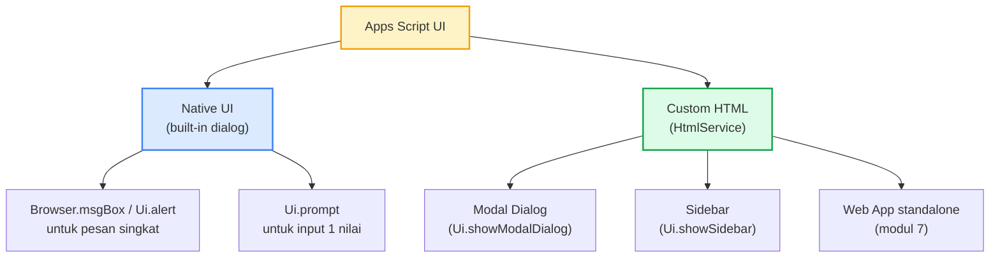
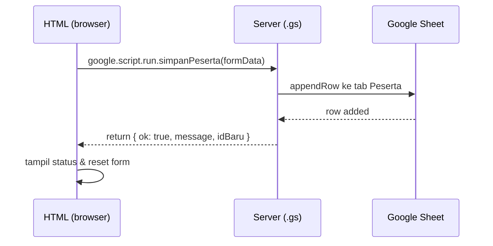

# Modul 5 — Building UI Forms for Data Input

Sampai Modul 4, semua interaksi dengan kode lewat **Run** di editor atau trigger otomatis. Modul 5 mengenalkan **antarmuka untuk pengguna akhir**: dialog, sidebar, dan custom form HTML yang berjalan di dalam Google Sheets/Docs.

> **Studi kasus berkelanjutan dari Modul 3**: data peserta & program lembaga pelatihan yang Anda olah di Modul 3 (tab `Peserta`, `Program`) sekarang akan diberi **antarmuka admin**. Bayangkan admin lembaga yang tidak menulis kode — mereka tetap perlu cara untuk tambah peserta baru, daftarkan ke program, ubah status, lihat daftar, dll. Itulah yang dibangun di modul ini.

### Struktur data yang dipakai di seluruh contoh modul ini

**Tab `Peserta`** (8 kolom):

| ID Peserta | Tanggal Daftar | Nama | Email | Instansi | Program | Nilai | Status |

> Fungsi form tambah peserta di modul ini hanya mengisi **6 kolom pertama** (`ID Peserta` → `Program`). Kolom `Nilai` & `Status` dibiarkan kosong saat input — diisi belakangan oleh proses lain (penilaian akhir, update status saat pelatihan jalan/selesai — lihat Modul 3).

**Tab `Program`** (7 kolom):

| Kode | Nama Program | Kapasitas | Biaya | Tanggal Mulai | Tanggal Selesai | Lokasi |

Persis sama dengan Modul 3 — Anda bisa pakai Sheet `Latihan-M3` yang sudah ada (atau bikin baru `Latihan-M5` dengan struktur sama).

---

## 1. Pilihan UI di Apps Script



| Pilihan | Untuk apa | Bound to |
|---|---|---|
| `Ui.alert` / `Ui.prompt` | Notifikasi/input cepat 1-2 nilai | Sheet/Doc bound |
| Sidebar HTML | Form panjang, panel tools, bisa scrollable | Sheet/Doc bound |
| Modal Dialog HTML | Form fokus untuk satu task | Sheet/Doc bound |
| Web App HTML | UI standalone untuk akses dari URL | (Modul 7) |

> Modul 5 fokus ke **container-bound UI** (Sheet/Doc). Web App standalone dibahas di Modul 7.

---

## 2. Native UI — `SpreadsheetApp.getUi()`

### 2.1 Custom Menu

Custom menu adalah **pintu masuk utama** untuk user akhir memakai automation kita. Dia muncul di toolbar Sheet (sebelah menu Help) saat Sheet dibuka — dan setiap item bisa men-trigger function manapun di project.

#### Contoh lengkap (dua gaya menu dalam satu `onOpen`)

Di project yang sama, hanya boleh ada **satu function bernama `onOpen`**. Tapi di dalam satu `onOpen` itu Anda bisa bikin **lebih dari satu menu** — masing-masing punya gaya berbeda. Contoh di bawah membuat dua menu sekaligus: satu **versi flat** (semua item di satu level), satu **versi bertingkat** (pakai sub-menu).

```javascript
function onOpen() {
  const ui = SpreadsheetApp.getUi();

  // ---- Menu 1: versi FLAT (semua item di satu level) ----
  ui.createMenu("Menu Pelatihan")                                 // 1. Bikin menu utama
    .addItem("Tambah peserta cepat (prompt)", "tambahPesertaCepat") // 2. Item → function
    .addItem("Konfirmasi hapus (alert)",      "konfirmasiHapus")
    .addSeparator()                                                 // 3. Garis pemisah
    .addItem("Form Peserta (sidebar)",        "bukaSidebarPeserta")
    .addItem("Form Program (modal)",          "bukaModalProgram")
    .addItem("CRUD Peserta",                  "bukaSidebarCRUD")
    .addItem("Import Peserta dari Excel",     "bukaUpload")
    .addToUi();                                                     // 4. Finalize → tampil di toolbar

  // ---- Menu 2: versi BERTINGKAT (sub-menu) ----
  const submenuPeserta = ui.createMenu("Peserta")
    .addItem("Tambah cepat (prompt)", "tambahPesertaCepat")
    .addItem("Form (sidebar)",        "bukaSidebarPeserta")
    .addItem("Buka CRUD",             "bukaSidebarCRUD");

  const submenuProgram = ui.createMenu("Program")
    .addItem("Form tambah program", "bukaModalProgram")
    .addItem("Lihat semua program", "tampilSemuaProgram");

  ui.createMenu("Admin Pelatihan")
    .addSubMenu(submenuPeserta)
    .addSubMenu(submenuProgram)
    .addSeparator()
    .addItem("Import Excel", "bukaUpload")
    .addToUi();
}
```

Hasil di toolbar Sheet (setelah reload — keduanya muncul side-by-side):

```
[File] [Edit] ... [Help] [Menu Pelatihan ▾] [Admin Pelatihan ▾]
                          │                  │
                          │ FLAT             │ BERTINGKAT
                          ├─ Tambah peserta  ├─ Peserta ▸
                          ├─ Konfirmasi      │           ├─ Tambah cepat (prompt)
                          ├──────────────    │           ├─ Form (sidebar)
                          ├─ Form Peserta    │           └─ Buka CRUD
                          ├─ Form Program    ├─ Program ▸
                          ├─ CRUD Peserta    │           ├─ Form tambah program
                          └─ Import Excel    │           └─ Lihat semua program
                                             ├──────────────
                                             └─ Import Excel
```

> **Kapan pakai mana?**
> - **Flat** lebih praktis untuk menu dengan ≤ 5–6 item. User langsung lihat semua aksi.
> - **Bertingkat** lebih rapi kalau ada banyak aksi yang bisa di-grup secara logis (Peserta, Program, Laporan, dll).

#### Anatomi method-by-method

| Method | Fungsi |
|---|---|
| **`SpreadsheetApp.getUi()`** | Ambil object `Ui` — root semua interaksi UI di container-bound script. Ada juga `DocumentApp.getUi()` untuk Doc, `FormApp.getUi()` untuk Form. |
| **`.createMenu(label)`** | Bikin menu builder dengan label yang akan tampil di toolbar. |
| **`.addItem(label, functionName)`** | Tambah baris menu. `functionName` adalah **string nama function** di project yang sama. Saat user klik → function dipanggil. |
| **`.addSeparator()`** | Garis pembatas — group item secara visual. Tidak bisa diklik. |
| **`.addSubMenu(menu)`** | Tambah sub-menu (menu di dalam menu). Argumennya `Menu` object lain (hasil `createMenu(...).addItem(...)` tanpa `.addToUi()`). Akan tampil dengan tanda ▸ di kanan. |
| **`.addToUi()`** | Finalize — tanpa ini, menu **tidak akan tampil**. Wajib di akhir chain. Boleh dipanggil **lebih dari sekali** dalam satu `onOpen` untuk bikin beberapa menu. |

#### Aturan penting `onOpen`

1. **Nama function harus persis `onOpen`** — ini reserved name di Apps Script. Tidak boleh `onOpenMenu` atau `setupMenu`.
2. **Otomatis jalan saat user membuka Sheet** — tidak perlu trigger setup manual. Termasuk **simple trigger**, jadi akan jalan otomatis selama script container-bound.
3. **Container-bound only** — kalau script standalone, `onOpen` tidak akan terpicu karena tidak ada Sheet yang "dibuka". Untuk standalone, deploy sebagai library lalu panggil dari container-bound (lihat Modul 3 §7).
4. **Reload Sheet untuk lihat perubahan menu** — kalau ubah kode `onOpen`, Sheet harus di-refresh browser-nya supaya menu baru muncul.
5. **Simple trigger = akses terbatas** — `onOpen` versi simple trigger **tidak bisa** panggil service yang butuh authorisasi (MailApp, UrlFetchApp, dll). Tapi membuat menu yang **isinya** function yang panggil service tersebut — itu OK, karena trigger autorisasi terjadi saat user klik item.

#### `addItem` hanya menerima nama function di project yang sama

```javascript
// ❌ Tidak bekerja — addItem cuma menerima string nama function
.addItem("Halo", "MyLib.sapaUser")

// ✓ Bekerja — bikin stub di project ini yang panggil library
.addItem("Halo", "menuSapa")

function menuSapa() {
  MyLib.sapaUser();   // delegasi ke library
}
```

Pattern stub function ini sering dipakai saat code reuse via library (Modul 3 §7).

#### Variasi: dynamic menu

Menu bisa di-generate dinamis dari data:

```javascript
function onOpen() {
  const menu = SpreadsheetApp.getUi().createMenu("Laporan");

  // Generate item per sheet di spreadsheet
  SpreadsheetApp.getActiveSpreadsheet().getSheets().forEach((s) => {
    menu.addItem(`Refresh ${s.getName()}`, `refresh_${s.getName()}`);
  });

  menu.addToUi();
}
```

> Hati-hati: nama function di `addItem` tetap harus **fixed string saat runtime** — peserta perlu tahu nama function-nya untuk dipanggil. Pattern ini umumnya dikombinasikan dengan switch/lookup table di handler.

---

### 2.2 Prompt — input dari user

Karena `ui.prompt()` hanya menerima **satu input per panggilan**, untuk mengisi 6 kolom kita panggil prompt **berurutan** — satu prompt per kolom. ID Peserta & Tanggal Daftar otomatis, jadi user cuma diminta 4 input.

```javascript
function tambahPesertaCepat() {
  const ui = SpreadsheetApp.getUi();

  // Helper kecil: minta input, return null kalau user klik Cancel atau kosong.
  function tanya(judul, label) {
    const respon = ui.prompt(judul, label, ui.ButtonSet.OK_CANCEL);
    if (respon.getSelectedButton() !== ui.Button.OK) return null;
    const teks = respon.getResponseText().trim();
    return teks || null;
  }

  // 4 prompt berturut-turut. Kalau salah satu Cancel/kosong → batal.
  const nama = tanya("Tambah Peserta (1/4)", "Nama:");
  if (!nama) return;

  const email = tanya("Tambah Peserta (2/4)", "Email:");
  if (!email) return;

  const instansi = tanya("Tambah Peserta (3/4)", "Instansi:");
  if (!instansi) return;

  const program = tanya("Tambah Peserta (4/4)", "Kode Program (mis. GAS-101):");
  if (!program) return;

  const sheet = SpreadsheetApp.getActiveSpreadsheet().getSheetByName("Peserta");

  // Generate ID sederhana: pakai jumlah baris data sekarang + 1.
  // Header di row 1, jadi getLastRow() = jumlah data + 1 → otomatis = nomor ID baru.
  // Format jadi 3 digit: 1 → "001", 12 → "012", 123 → "123".
  const nomor = sheet.getLastRow();              // mis. 8 (header + 7 peserta)
  const idBaru = `PST-${String(nomor).padStart(3, "0")}`;   // "PST-008"

  // [ID Peserta, Tanggal Daftar, Nama, Email, Instansi, Program]
  sheet.appendRow([idBaru, new Date(), nama, email, instansi, program]);

  ui.alert("Berhasil", `Peserta ${idBaru} (${nama}) tersimpan.`, ui.ButtonSet.OK);
}
```

> **Catatan**: pola `getLastRow()` ini sederhana tapi **assume row tidak pernah dihapus di tengah**. Kalau peserta dihapus, nomor ID bisa tabrakan dengan yang sudah ada. Untuk kebutuhan demo/training ini cukup; di production sebaiknya generate ID dari "ID terakhir di Sheet + 1" supaya tetap unik walau ada baris yang dihapus.

**Cara kerjanya** dari sisi user:

```
Klik menu "Tambah peserta cepat (prompt)"
  ├─ Dialog 1: "Tambah Peserta (1/4) — Nama:"         → user ketik → OK
  ├─ Dialog 2: "Tambah Peserta (2/4) — Email:"        → user ketik → OK
  ├─ Dialog 3: "Tambah Peserta (3/4) — Instansi:"     → user ketik → OK
  ├─ Dialog 4: "Tambah Peserta (4/4) — Kode Program:" → user ketik → OK
  └─ Alert: "Berhasil — Peserta PST-009 (Sari) tersimpan."
```

User bisa **Cancel di langkah manapun** untuk batalkan keseluruhan — tidak ada baris setengah-jadi yang tertulis ke Sheet karena `appendRow` baru dipanggil setelah semua input terkumpul.

> **Kalau form-nya panjang, sidebar/modal HTML lebih nyaman** — lihat section 3 untuk versi sidebar `bukaSidebarPeserta()` yang menampilkan semua field di satu form. Prompt cocok untuk **input kilat 1–4 field**; di luar itu UX-nya melelahkan.

### 2.3 Alert dengan tombol

Use case: user **klik salah satu sel di tab `Peserta`** untuk memilih baris yang mau dihapus, lalu run menu "Konfirmasi hapus". Function di bawah baca baris terpilih, tampilkan preview siapa yang akan dihapus, baru hapus setelah user konfirmasi.

```javascript
function konfirmasiHapus() {
  const ui = SpreadsheetApp.getUi();
  const sheet = SpreadsheetApp.getActiveSpreadsheet().getSheetByName("Peserta");

  // 1) Pastikan user lagi di sheet Peserta
  const aktif = SpreadsheetApp.getActiveSheet();
  if (aktif.getName() !== "Peserta") {
    ui.alert("Pilih dulu baris di tab Peserta.");
    return;
  }

  // 2) Ambil baris terpilih (row nomor dari posisi cursor)
  const row = aktif.getActiveRange().getRow();
  if (row === 1) {
    ui.alert("Tidak bisa hapus baris header.");
    return;
  }
  if (row > sheet.getLastRow()) {
    ui.alert("Baris kosong — tidak ada peserta untuk dihapus.");
    return;
  }

  // 3) Baca data baris untuk ditampilkan di preview konfirmasi
  const [idPeserta, , nama] = sheet.getRange(row, 1, 1, 3).getValues()[0];

  // 4) Konfirmasi dengan preview siapa yang akan dihapus
  const respon = ui.alert(
    "Konfirmasi Hapus",
    `Yakin mau menghapus peserta ini?\n\n${idPeserta} — ${nama}\n(baris ${row})`,
    ui.ButtonSet.YES_NO
  );

  // 5) Eksekusi hapus kalau user pilih YES
  if (respon === ui.Button.YES) {
    sheet.deleteRow(row);
    ui.alert("Berhasil", `${idPeserta} (${nama}) dihapus.`, ui.ButtonSet.OK);
  }
}
```

**Method-method baru yang muncul:**

| Method | Fungsi |
|---|---|
| `SpreadsheetApp.getActiveSheet()` | Sheet yang sedang dilihat user (bisa beda dari tab `Peserta` — makanya kita cek `.getName()`). |
| `sheet.getActiveRange()` | Range yang sedang dipilih user (kotak biru di Sheet). |
| `range.getRow()` | Nomor baris paling atas dari range terpilih (1-indexed). |
| `sheet.deleteRow(row)` | Hapus 1 baris di posisi tersebut. Baris di bawahnya geser naik. |
| `sheet.deleteRows(start, n)` | Hapus `n` baris mulai dari `start`. |

**Skenario yang ditangani:**

| Situasi | Hasil |
|---|---|
| User di tab lain (mis. `Program`) lalu run | Alert: "Pilih dulu baris di tab Peserta." |
| User pilih row 1 (header) | Alert: "Tidak bisa hapus baris header." |
| User pilih row kosong (di bawah data) | Alert: "Baris kosong — tidak ada peserta untuk dihapus." |
| User pilih baris valid + klik NO | Tidak terjadi apa-apa |
| User pilih baris valid + klik YES | Baris dihapus + alert sukses |

> `deleteRow` adalah operasi yang tidak bisa di-undo dari kode. Itu kenapa pola **preview + konfirmasi** penting — user lihat dulu siapa yang akan dihapus sebelum YES/NO.

## 3. HTML Sidebar & Modal

Untuk form lebih kompleks (banyak field, validasi, layout), pakai HtmlService.

### 3.1 Anatomi project

```
project Apps Script/
├── Code.gs                     ← server-side
├── ui-form.html                ← HTML sidebar/modal
└── (optional) ui-css.html      ← CSS dipisah
```

### 3.2 Server side: tampilkan sidebar

Function `bukaSidebarPeserta` ini **sudah terhubung** ke menu yang dibuat di §2.1 — lihat sub-menu **Peserta → Form (sidebar)** di versi BERTINGKAT (atau item **Form Peserta (sidebar)** di versi FLAT). Jadi cukup tambah dua function berikut di project — `onOpen` dari §2.1 sudah memanggilnya saat user klik menu.

```javascript
// Code.gs — function bukaSidebarPeserta dipanggil oleh menu di §2.1
function bukaSidebarPeserta() {
  const html = HtmlService.createHtmlOutputFromFile("ui-form-peserta")
    .setTitle("Tambah Peserta")
    .setWidth(320);
  SpreadsheetApp.getUi().showSidebar(html);
}

// Function ini dipanggil dari client (HTML) via google.script.run
function simpanPeserta(formData) {
  const sheet = SpreadsheetApp.getActiveSpreadsheet().getSheetByName("Peserta");

  // Generate ID sederhana — sama seperti versi prompt (§2.2)
  const idBaru = `PST-${String(sheet.getLastRow()).padStart(3, "0")}`;

  // Form hanya mengisi 6 kolom pertama.
  // Kolom Nilai & Status di-handle proses lain (default Sheet: kosong).
  sheet.appendRow([
    idBaru,             // 1. ID Peserta
    new Date(),         // 2. Tanggal Daftar
    formData.nama,      // 3. Nama
    formData.email,     // 4. Email
    formData.instansi,  // 5. Instansi
    formData.program    // 6. Program
  ]);

  return { ok: true, message: `Peserta ${idBaru} tersimpan.`, idBaru };
}
```

### 3.3 Client side: HTML form

```html
<!-- ui-form-peserta.html -->
<!DOCTYPE html>
<html>
<head>
  <base target="_top">
  <style>
    body { font-family: Arial; padding: 12px; font-size: 14px; }
    label { display: block; margin: 8px 0 4px; font-weight: bold; }
    input, select { width: 100%; box-sizing: border-box; padding: 6px; }
    button { margin-top: 12px; padding: 8px 16px; background: #1e40af; color: white; border: none; border-radius: 4px; cursor: pointer; }
    .status { margin-top: 8px; padding: 6px; border-radius: 4px; }
    .ok    { background: #dcfce7; color: #166534; }
    .error { background: #fee2e2; color: #991b1b; }
  </style>
</head>
<body>
  <h3>Tambah Peserta</h3>

  <label>Nama</label>
  <input id="nama" type="text" required>

  <label>Email</label>
  <input id="email" type="email" required>

  <label>Instansi</label>
  <input id="instansi" type="text" required>

  <label>Program</label>
  <select id="program">
    <option value="GAS-101">GAS-101 — Google Apps Script Fundamental</option>
    <option value="GAS-201">GAS-201 — Sheets & Gmail Automation</option>
    <option value="GAS-301">GAS-301 — Web Apps & API Integration</option>
  </select>

  <button onclick="kirim()">Simpan</button>
  <div id="status"></div>

  <script>
    function kirim() {
      const data = {
        nama:     document.getElementById("nama").value.trim(),
        email:    document.getElementById("email").value.trim(),
        instansi: document.getElementById("instansi").value.trim(),
        program:  document.getElementById("program").value
      };

      if (!data.nama || !data.email || !data.instansi) {
        tampilStatus("Semua field wajib diisi.", "error");
        return;
      }

      tampilStatus("Menyimpan...", "");

      google.script.run
        .withSuccessHandler((resp) => {
          tampilStatus(resp.message, "ok");
          document.getElementById("nama").value = "";
          document.getElementById("email").value = "";
          document.getElementById("instansi").value = "";
        })
        .withFailureHandler((err) => {
          tampilStatus("Error: " + err.message, "error");
        })
        .simpanPeserta(data);
    }

    function tampilStatus(msg, cls) {
      const el = document.getElementById("status");
      el.className = "status " + cls;
      el.textContent = msg;
    }
  </script>
</body>
</html>
```

### 3.4 Komunikasi Client ↔ Server



**Aturan penting `google.script.run`**:
- **Asynchronous**. Pakai `.withSuccessHandler(cb)` dan `.withFailureHandler(cb)`.
- Argumen yang dikirim **harus serializable** (object plain, array, string, number, bool, Date — TIDAK bisa function/Map/Set).
- Hasil return juga harus serializable.

---

## 4. Modal Dialog vs Sidebar — Kapan Pakai Apa?

| Aspek | Sidebar | Modal Dialog |
|---|---|---|
| Posisi | Panel kanan, persistent | Tengah, blocking |
| User bisa interaksi sheet di belakang | Ya | Tidak |
| Cocok untuk | Tools yang sering dipakai sambil scroll sheet | Form fokus, wizard step-by-step |
| Lebar | `.setWidth(300)` (tetap) | `.setWidth(W).setHeight(H)` |

```javascript
// Modal — contoh: wizard tambah program pelatihan
function bukaModalProgram() {
  const html = HtmlService.createHtmlOutputFromFile("ui-modal-program")
    .setWidth(500)
    .setHeight(400);
  SpreadsheetApp.getUi().showModalDialog(html, "Tambah Program Pelatihan");
}
```

---

## 5. Pre-fill Form dari Server

Form sering perlu data awal: list pilihan dropdown dari sheet, default value, dll. Pakai **template HTML** seperti di Modul 4.

Contoh kasus: dropdown **Program** di form peserta jangan hardcoded — ambil dari tab `Program` di Sheet. Kalau admin tambah program baru, dropdown otomatis ikut update tanpa perlu ubah kode.

```javascript
function bukaFormPesertaDinamis() {
  const tmpl = HtmlService.createTemplateFromFile("ui-form-peserta-prefill");
  tmpl.programList = _ambilDaftarProgram();                 // dari tab Program
  tmpl.userEmail   = Session.getActiveUser().getEmail();

  const html = tmpl.evaluate().setTitle("Tambah Peserta").setWidth(320);
  SpreadsheetApp.getUi().showSidebar(html);
}

function _ambilDaftarProgram() {
  const sheet = SpreadsheetApp.getActiveSpreadsheet().getSheetByName("Program");
  const data  = sheet.getDataRange().getValues();
  const headers = data.shift();
  const cKode  = headers.indexOf("Kode");
  const cNama  = headers.indexOf("Nama Program");
  return data.map((r) => ({ kode: r[cKode], nama: r[cNama] }));
}
```

```html
<!-- ui-form-peserta-prefill.html (potongan) -->
<label>Program</label>
<select id="program">
  <? programList.forEach((p) => { ?>
    <option value="<?= p.kode ?>"><?= p.kode ?> — <?= p.nama ?></option>
  <? }); ?>
</select>

<small>Login sebagai: <?= userEmail ?></small>
```

---

## 6. Edit & Delete Record dari UI

Pola CRUD lengkap untuk tab `Peserta` — list semua peserta di sidebar, klik baris untuk edit (ubah Nilai, Status, dll), tombol delete untuk hapus baris.


Implementasi lengkap di `contoh.js` (function `bukaSidebarCRUD`).

---

## 7. Upload File Excel untuk Input Data

Use case nyata di lembaga pelatihan: admin terima file Excel daftar peserta dari klien/instansi (ratusan baris), lalu perlu **import sekaligus** ke tab `Peserta` — daripada copy-paste manual baris per baris.

```mermaid
flowchart LR
    A["User pilih file .xlsx<br/>(input type=file)"]:::a
    --> B["Client baca isi<br/>FileReader → base64"]:::b
    --> C["google.script.run<br/>kirim ke server"]:::c
    --> D["Drive convert<br/>xlsx ➜ Sheet temp"]:::d
    --> E["Baca pakai<br/>SpreadsheetApp"]:::e
    --> F["setValues ke Sheet target<br/>+ hapus file temp"]:::f

    classDef a fill:#fef3c7,stroke:#f59e0b,stroke-width:2px
    classDef b fill:#dbeafe,stroke:#3b82f6
    classDef c fill:#e0e7ff,stroke:#6366f1
    classDef d fill:#fce7f3,stroke:#ec4899
    classDef e fill:#fef3c7,stroke:#f59e0b
    classDef f fill:#dcfce7,stroke:#16a34a,stroke-width:2px
```



### 7.1 Konsep Inti

Apps Script **tidak bisa baca .xlsx langsung**. Triknya: **upload file ke Drive sebagai Google Sheet** — Drive API otomatis konversi `.xlsx` → Sheet, lalu kita baca pakai `SpreadsheetApp` seperti biasa. Setelah selesai, file Sheet temp dihapus supaya tidak menumpuk di Drive.

> **Wajib enable Advanced Drive Service**: Editor → ikon **+** di **Services** (sidebar kiri) → cari **Drive API** → Add. Tanpa ini, `Drive.Files.insert(..., { convert: true })` tidak tersedia.

### 7.2 Format File Excel yang Diharapkan

Sebelum membahas kode, jelaskan ke admin **bagaimana file Excel harus disusun** supaya bisa di-import. Script kita expect:

- **Sheet pertama** (tab paling kiri) yang dibaca — tab lain diabaikan.
- **Baris 1 = header**, baris 2 ke bawah = data.
- **4 kolom wajib** dengan nama persis: `Nama`, `Email`, `Instansi`, `Program`.
- Urutan kolom **bebas** (script cari by name, bukan by index).
- Kolom tambahan di file Excel akan **diabaikan** (atau di-include kalau Anda mau — tergantung kode).

Contoh isi file `daftar-peserta.xlsx`:

| Nama          | Email             | Instansi   | Program  |
|---------------|-------------------|------------|----------|
| Sari Wulan    | sari@kantor.id    | PT Alpha   | GAS-101  |
| Budi Pratama  | budi@kantor.id    | PT Beta    | GAS-201  |
| Tina Sari     | tina@kantor.id    | PT Gamma   | GAS-101  |
| Andi Pratama  | andi@kantor.id    | PT Delta   | GAS-301  |
| Rina Wati     | rina@kantor.id    | PT Epsilon | GAS-101  |

**Aturan tambahan**:

| Aturan | Catatan |
|---|---|
| Nama kolom **case-sensitive** | `Nama` ≠ `nama` ≠ `NAMA`. Pastikan persis. |
| Tidak boleh ada baris kosong di antara data | Script baca sampai baris terakhir; baris kosong di tengah bisa bikin gap. |
| `Email` minimal harus berformat valid | Validasi di server akan reject baris yang email-nya bukan format email. |
| `Program` harus salah satu kode yang sudah ada di tab `Program` | mis. `GAS-101`, `GAS-201`, dst. Kalau tidak match → baris di-skip + dilaporkan. |
| Maks ukuran file 25 MB | Batas payload `google.script.run`. Lebih dari itu pakai upload langsung ke Drive (tidak dibahas di sini). |

**Template Excel**: admin bisa download template kosong (header sudah disiapkan) dari menu Sheet — pola umumnya: tambah item menu "Unduh template Excel" yang generate `.xlsx` lewat `SpreadsheetApp.create(...)` lalu kirim sebagai link ke user.

> Untuk modul ini, peserta cukup bikin file `.xlsx` manual via Microsoft Excel / Google Sheet → **File → Download → Microsoft Excel (.xlsx)** dengan struktur di atas.

### 7.3 HTML Side

```html
<!-- ui-upload.html -->
<label>Upload Excel (.xlsx)</label>
<input type="file" id="file" accept=".xlsx,.xls">
<button onclick="upload()">Import</button>
<div id="status"></div>

<script>
function upload() {
  const file = document.getElementById("file").files[0];
  if (!file) return show("Pilih file dulu.", "error");

  // Batas ukuran: payload google.script.run ~50 MB
  if (file.size > 25 * 1024 * 1024) {
    return show("File terlalu besar (max 25 MB).", "error");
  }

  show("Mengupload...", "info");
  const reader = new FileReader();
  reader.onload = (e) => {
    // e.target.result = "data:application/vnd...;base64,XXXXX"
    const base64 = e.target.result.split(",")[1];   // bagian setelah comma

    google.script.run
      .withSuccessHandler((r) => show(`Berhasil: ${r.inserted} baris dimasukkan.`, "ok"))
      .withFailureHandler((err) => show("Error: " + err.message, "error"))
      .importExcel(base64, file.name, file.type);
  };
  reader.readAsDataURL(file);
}

function show(msg, cls) {
  const el = document.getElementById("status");
  el.className = "status " + cls;
  el.textContent = msg;
}
</script>
```

### 7.4 Server Side

```javascript
function bukaUpload() {
  const html = HtmlService.createHtmlOutputFromFile("ui-upload")
    .setTitle("Import Excel").setWidth(380);
  SpreadsheetApp.getUi().showSidebar(html);
}

function importExcel(base64, fileName, mimeType) {
  // 1. Decode base64 → Blob
  const bytes = Utilities.base64Decode(base64);
  const blob  = Utilities.newBlob(bytes, mimeType, fileName);

  // 2. Upload ke Drive sebagai Google Sheet (auto-convert xlsx)
  const resource = {
    title:    fileName.replace(/\.xlsx?$/i, "") + "-temp-import",
    mimeType: MimeType.GOOGLE_SHEETS
  };
  const uploadedFile = Drive.Files.insert(resource, blob, { convert: true });

  try {
    // 3. Baca dari Sheet hasil convert
    const tempSS = SpreadsheetApp.openById(uploadedFile.id);
    const tempSheet = tempSS.getSheets()[0];
    const data = tempSheet.getDataRange().getValues();

    if (data.length < 2) throw new Error("File kosong atau cuma header.");

    const headers = data[0];
    const rows    = data.slice(1);

    // 4. Validasi header (minimum) — kolom wajib di file Excel admin
    const expectedHeaders = ["Nama", "Email", "Instansi", "Program"];
    const missing = expectedHeaders.filter((h) => !headers.includes(h));
    if (missing.length > 0) {
      throw new Error(`Kolom hilang: ${missing.join(", ")}`);
    }

    // 5. Insert ke tab Peserta (1 round-trip)
    const target = SpreadsheetApp.getActiveSpreadsheet().getSheetByName("Peserta");
    const startRow = target.getLastRow() + 1;
    target.getRange(startRow, 1, rows.length, headers.length).setValues(rows);

    return { inserted: rows.length };
  } finally {
    // 6. Cleanup — hapus file Sheet temp di Drive (apapun hasil try block)
    DriveApp.getFileById(uploadedFile.id).setTrashed(true);
  }
}
```

### 7.5 Preview Sebelum Import (UX lebih baik)

User suka cemas saat upload file besar — "kira-kira datanya bener tidak ya?". Tambahkan **preview**: convert + baca di server, kembalikan struktur + 5 baris pertama, baru insert kalau user klik Confirm.

**Server**:

```javascript
function previewExcel(base64, fileName, mimeType) {
  const bytes = Utilities.base64Decode(base64);
  const blob  = Utilities.newBlob(bytes, mimeType, fileName);
  const uploaded = Drive.Files.insert(
    { title: "preview-" + Date.now(), mimeType: MimeType.GOOGLE_SHEETS },
    blob,
    { convert: true }
  );

  try {
    const sheet = SpreadsheetApp.openById(uploaded.id).getSheets()[0];
    const data  = sheet.getDataRange().getValues();
    return {
      totalRows: Math.max(0, data.length - 1),
      headers:   data[0] || [],
      preview:   data.slice(1, 6),    // 5 baris pertama
      tempId:    uploaded.id          // dikirim balik untuk confirmImport
    };
  } catch (err) {
    // Cleanup kalau preview gagal
    DriveApp.getFileById(uploaded.id).setTrashed(true);
    throw err;
  }
}

function confirmImport(tempId) {
  try {
    const sheet = SpreadsheetApp.openById(tempId).getSheets()[0];
    const data  = sheet.getDataRange().getValues();
    const headers = data[0];
    const rows    = data.slice(1);

    const target = SpreadsheetApp.getActiveSpreadsheet().getSheetByName("Peserta");
    const startRow = target.getLastRow() + 1;
    target.getRange(startRow, 1, rows.length, headers.length).setValues(rows);

    return { inserted: rows.length };
  } finally {
    DriveApp.getFileById(tempId).setTrashed(true);
  }
}
```

**Client flow** (2-step):

```html
<button onclick="preview()">1. Preview</button>
<div id="previewArea"></div>
<button id="btn-confirm" style="display:none" onclick="kirimImport()">2. Import</button>

<script>
let cachedTempId;

function preview() {
  const file = document.getElementById("file").files[0];
  if (!file) return alert("Pilih file dulu.");

  const reader = new FileReader();
  reader.onload = (e) => {
    const base64 = e.target.result.split(",")[1];
    google.script.run
      .withSuccessHandler((r) => {
        cachedTempId = r.tempId;
        renderTabel(r);
        document.getElementById("btn-confirm").style.display = "inline";
      })
      .withFailureHandler((err) => alert("Error: " + err.message))
      .previewExcel(base64, file.name, file.type);
  };
  reader.readAsDataURL(file);
}

function kirimImport() {
  google.script.run
    .withSuccessHandler((r) => alert(`${r.inserted} baris dimasukkan.`))
    .confirmImport(cachedTempId);
}

function renderTabel(r) {
  const html = `
    <p>Total ${r.totalRows} baris, kolom: ${r.headers.join(", ")}</p>
    <table border="1" style="width:100%; border-collapse: collapse;">
      <tr>${r.headers.map((h) => `<th>${h}</th>`).join("")}</tr>
      ${r.preview.map((row) =>
        `<tr>${row.map((c) => `<td>${c}</td>`).join("")}</tr>`
      ).join("")}
    </table>
  `;
  document.getElementById("previewArea").innerHTML = html;
}
</script>
```

### 7.6 Best Practices

1. **Validasi header dulu** — gagal cepat kalau struktur file tidak sesuai. Pesan error harus sebutkan kolom yang hilang/salah.
2. **Validasi tiap baris** — cek tipe data (gaji harus angka, email harus valid). Kumpulkan error → tampilkan ke user, jangan langsung crash di baris pertama yang salah.
3. **Limit file size** — `google.script.run` ada batas payload ~50 MB. Cek `file.size` di client (`<input type="file">.files[0].size`) sebelum upload.
4. **Batch besar = pakai chunking** — kalau > 5.000 baris, pecah per 1.000 baris dengan `setValues` terpisah. Total round-trip masih jauh lebih sedikit dari per-cell.
5. **Selalu cleanup file temp** — kalau pakai pola convert Excel, hapus file Drive temp di `finally` block supaya tidak menumpuk.
6. **Preview sebelum Import** — pola 2-step jauh mengurangi user anxiety dan memungkinkan koreksi sebelum data masuk.
7. **Audit log** — catat ke Sheet `Audit-Log`: siapa upload, kapan, file apa, berapa baris, sukses/fail. Berguna saat ada masalah data nantinya.

---

## 8. Validasi — Client vs Server

**Validasi rangkap**: di client untuk UX cepat, di server untuk integritas data (jangan percaya client).

```javascript
// Client (HTML <script>) — feedback cepat sebelum kirim ke server
if (!/^[^\s@]+@[^\s@]+\.[^\s@]+$/.test(data.email)) {
  tampilStatus("Format email tidak valid.", "error");
  return;
}

// Server (.gs) — wajib re-validate, jangan percaya client
function simpanPeserta(formData) {
  if (!formData.nama || formData.nama.length < 3) {
    throw new Error("Nama minimal 3 karakter.");
  }
  if (!/^[^\s@]+@[^\s@]+\.[^\s@]+$/.test(formData.email || "")) {
    throw new Error("Format email tidak valid.");
  }
  // Cek Program harus exist di tab Program (lookup)
  const programValid = _ambilDaftarProgram().some((p) => p.kode === formData.program);
  if (!programValid) {
    throw new Error(`Program "${formData.program}" tidak terdaftar.`);
  }
  // Cek email duplikat
  const semuaEmail = SpreadsheetApp.getActiveSpreadsheet()
    .getSheetByName("Peserta").getDataRange().getValues()
    .slice(1).map((r) => r[3]);   // kolom Email (index 3)
  if (semuaEmail.includes(formData.email)) {
    throw new Error(`Email ${formData.email} sudah terdaftar.`);
  }
  // ... lanjut generate ID + appendRow
}
```

`throw` di server akan masuk ke `withFailureHandler` di client.

---

## 9. Best Practices

1. **Pisahkan UI dan logic**: HTML untuk presentasi, server function untuk data ops.
2. **Selalu set `<base target="_top">`** di `<head>` HTML — supaya link tidak terjebak di iframe.
3. **Gunakan template HTML** untuk pre-fill data dari server, bukan rangkai string di JS.
4. **Validasi dua sisi** — client untuk feedback cepat, server untuk integritas.
5. **Tunjukkan status loading** untuk operasi yang > 500ms (animasi spinner sederhana).
6. **Reset form setelah sukses** — UX expect form bersih untuk input berikutnya.
7. **Tangani error dengan jelas** — pesan yang user bisa pahami, bukan stack trace.

---

## 10. Penutup

**Yang harus dikuasai sebelum lanjut**:

- [ ] Bisa pakai `Ui.alert` / `Ui.prompt` untuk interaksi sederhana.
- [ ] Bisa bikin custom menu di Sheet via `onOpen`.
- [ ] Bisa tampilkan sidebar dan modal HTML.
- [ ] Paham komunikasi client↔server via `google.script.run` (success/failure handler).
- [ ] Bisa pre-fill form pakai template HTML.
- [ ] Bisa bikin form CRUD lengkap (create/read/update/delete).
- [ ] Tahu kapan pakai sidebar vs modal.
- [ ] Validasi dua sisi (client + server).
- [ ] Bisa terima upload Excel via sidebar, convert via Drive, insert ke Sheet.
- [ ] Paham pola Preview → Confirm untuk import file besar.

**Selanjutnya: Modul 6 — Workflow Automation (Triggers).**
