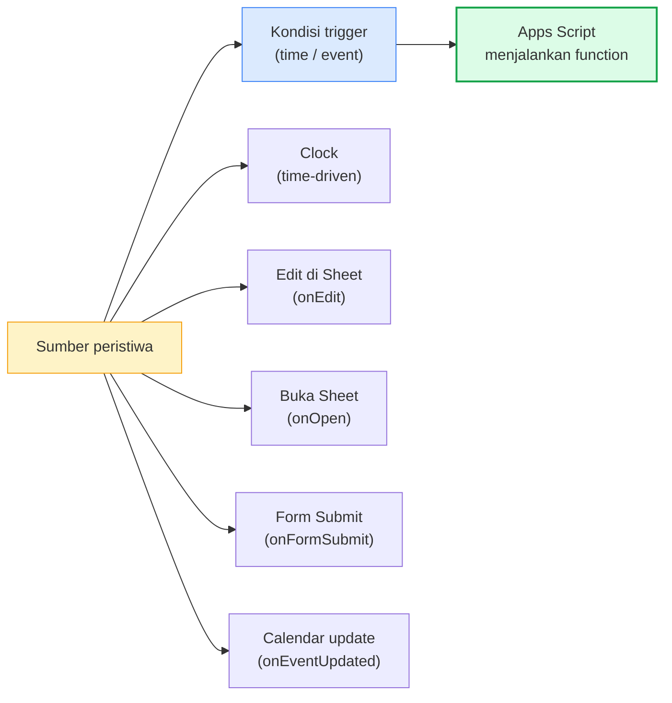
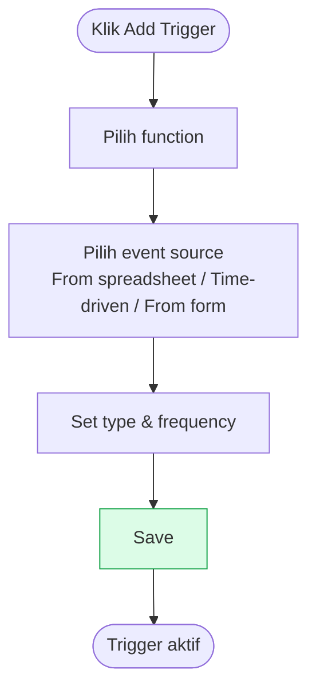
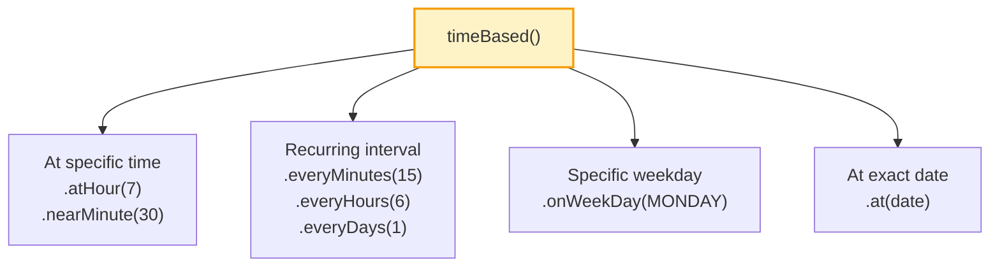
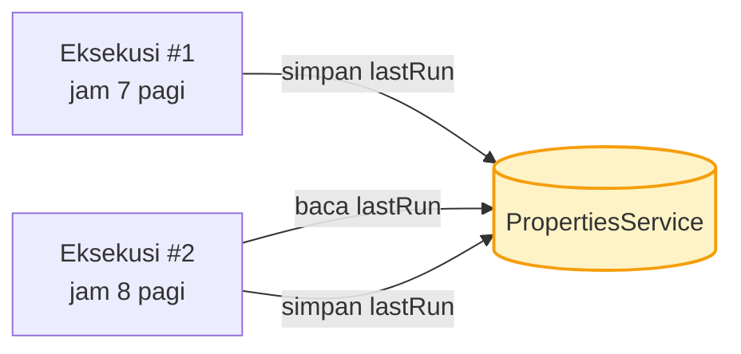
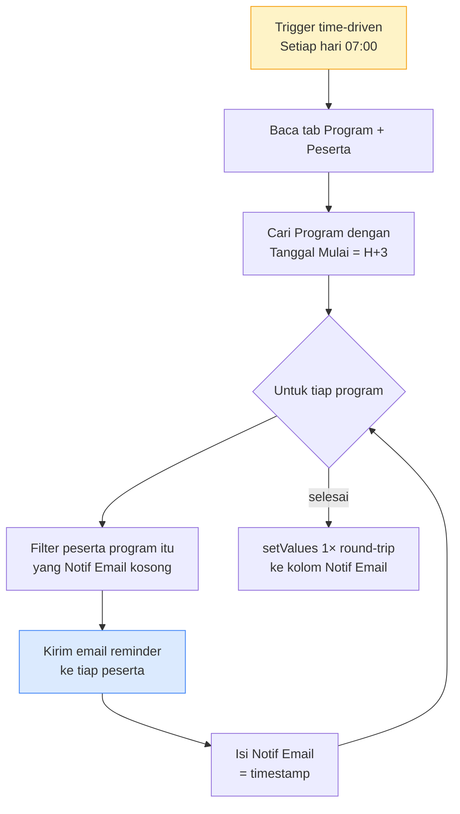

# Modul 6 — Workflow Automation (Triggers)

Sampai modul sebelumnya, semua kode dijalankan **manual** lewat tombol Run, custom menu, atau form. Modul 6 mengotomasi langkah ini: kode yang **berjalan sendiri** berdasarkan waktu (cron) atau peristiwa (event di Sheet/Form/Calendar).

> **Studi kasus berkelanjutan**: Anda tetap mengelola data peserta & program lembaga pelatihan dari Modul 3 & 5. Sekarang admin tidak perlu lagi klik menu manual untuk hal-hal rutin — script jalan sendiri: reminder peserta H-3 sebelum pelatihan, auto-update status saat nilai diisi, auto-kirim email saat form pendaftaran masuk, dll. Struktur tab `Peserta` (10 kolom) dan `Program` (7 kolom) sama persis dengan modul sebelumnya.

---

## 1. Apa itu Trigger?

Trigger adalah aturan yang menyuruh Apps Script **menjalankan function tertentu otomatis** ketika kondisi tertentu terpenuhi.



---

## 2. Dua Jenis Trigger

| Jenis | Cara dibuat | Kapan jalan | Autorisasi |
|---|---|---|---|
| **Simple trigger** | Function dengan nama spesial: `onOpen`, `onEdit`, `onSelectionChange` | Otomatis (built-in event) | Terbatas — tidak bisa MailApp/UrlFetch |
| **Installable trigger** | Dipasang via **kode** atau **UI Triggers** | Berdasarkan setting (waktu/event) | Penuh — bisa semua service |

> **Aturan praktis**: kalau butuh kirim email atau panggil API → installable. Kalau cuma manipulasi sheet sederhana → simple trigger cukup.

---

## 3. Simple Triggers

### 3.1 `onEdit(e)` — saat user edit sel

```javascript
function onEdit(e) {
  // e.range  → Range yang diedit
  // e.value  → nilai baru
  // e.oldValue → nilai sebelumnya (kalau cuma 1 sel)
  // e.source → Spreadsheet
  // e.user   → user yang edit (di Workspace)

  const sheet = e.range.getSheet();

  // Otomatis: kalau kolom "Status" di tab Peserta diset "Lulus",
  // warnai seluruh baris hijau muda sebagai visual marker.
  if (sheet.getName() !== "Peserta") return;

  const headers = sheet.getRange(1, 1, 1, sheet.getLastColumn()).getValues()[0];
  const colStatus = headers.indexOf("Status") + 1;   // 1-indexed
  if (e.range.getColumn() !== colStatus) return;

  if (e.value === "Lulus") {
    sheet.getRange(e.range.getRow(), 1, 1, sheet.getLastColumn())
         .setBackground("#dcfce7");
  } else if (e.value === "Tidak Lulus") {
    sheet.getRange(e.range.getRow(), 1, 1, sheet.getLastColumn())
         .setBackground("#fee2e2");
  }
}
```

### 3.2 `onOpen()` — saat sheet dibuka

Sudah dipakai sejak Modul 5 untuk custom menu.

```javascript
function onOpen() {
  SpreadsheetApp.getUi()
    .createMenu("Menu Pelatihan")
    .addItem("Sync data peserta", "syncDataPeserta")
    .addToUi();
}
```

### 3.3 Keterbatasan Simple Trigger

- Tidak bisa panggil service yang butuh autorisasi: `MailApp`, `GmailApp`, `UrlFetchApp`, `CalendarApp` (sebagian), Drive yang tulis.
- Kalau butuh kirim email saat onEdit → **upgrade ke installable trigger**.

---

## 4. Installable Triggers

Punya kemampuan penuh, tapi harus **dipasang dulu**. Dua cara: lewat UI dan lewat kode.

### 4.1 Lewat UI (manual)

Sidebar editor → **Triggers** (ikon ⏰) → **+ Add Trigger** → pilih function, event source, type, frequency.



Bagus untuk eksperimen — tidak perlu kode tambahan.

### 4.2 Lewat kode (programmatic)

Cocok untuk script yang harus self-deploy (deploy via clasp atau berbagi project antar tim).

```javascript
function pasangTriggerHarian() {
  // Hapus trigger lama dengan nama function yang sama (idempotent)
  ScriptApp.getProjectTriggers().forEach((t) => {
    if (t.getHandlerFunction() === "kirimReminderPelatihan") {
      ScriptApp.deleteTrigger(t);
    }
  });

  // Pasang baru: tiap hari jam 7 pagi → kirim reminder ke peserta
  // yang program-nya akan dimulai dalam 3 hari ke depan.
  ScriptApp.newTrigger("kirimReminderPelatihan")
    .timeBased()
    .atHour(7)
    .everyDays(1)
    .create();
}

function listTrigger() {
  ScriptApp.getProjectTriggers().forEach((t) => {
    console.log(`${t.getHandlerFunction()} | ${t.getTriggerSource()} | ${t.getEventType()}`);
  });
}
```

---

## 5. Time-Driven Trigger (Cron)



### 5.1 Contoh pola umum

```javascript
// Setiap jam — sync data peserta dari sumber lain (opsional)
ScriptApp.newTrigger("syncDataPeserta").timeBased().everyHours(1).create();

// Setiap hari jam 7 pagi — kirim reminder pelatihan H-3
ScriptApp.newTrigger("kirimReminderPelatihan")
  .timeBased().atHour(7).everyDays(1).create();

// Setiap Senin jam 8 pagi — rekap mingguan peserta lulus → email manager
ScriptApp.newTrigger("rekapMingguanLulus")
  .timeBased().onWeekDay(ScriptApp.WeekDay.MONDAY).atHour(8).create();

// Tiap 15 menit — cek balasan email peserta (kalau ada workflow inbox)
ScriptApp.newTrigger("checkInboxPeserta").timeBased().everyMinutes(15).create();

// Sekali pada tanggal tertentu — kirim survey kepuasan H+1 setelah pelatihan
const tgl = new Date("2026-06-04T08:00:00+07:00");
ScriptApp.newTrigger("kirimSurveyKepuasan").timeBased().at(tgl).create();
```

> **Catatan presisi**: trigger `everyMinutes(N)` **tidak persis** N menit. Google jadwalkan dalam window N menit. Untuk `atHour(7)`, biasanya jalan jam 7:00–7:59. Tidak ada cron presisi detik.

---

## 6. Event-Driven Triggers

### 6.1 Sheet — `onEdit` / `onChange` (installable)

Use case: admin update kolom `Status` peserta jadi `Lulus` → otomatis kirim email konfirmasi ke peserta. `MailApp` butuh autorisasi penuh, jadi simple trigger tidak cukup — wajib installable.

```javascript
function pasangTriggerEditPeserta() {
  ScriptApp.newTrigger("onEditPeserta")
    .forSpreadsheet(SpreadsheetApp.getActive())
    .onEdit()
    .create();
}

function onEditPeserta(e) {
  const sheet = e.range.getSheet();
  if (sheet.getName() !== "Peserta") return;

  // Cari index kolom Status & Email dari header
  const headers = sheet.getRange(1, 1, 1, sheet.getLastColumn()).getValues()[0];
  const colStatus = headers.indexOf("Status") + 1;
  if (e.range.getColumn() !== colStatus) return;
  if (e.value !== "Lulus") return;

  const row = e.range.getRow();
  const nama  = sheet.getRange(row, headers.indexOf("Nama")  + 1).getValue();
  const email = sheet.getRange(row, headers.indexOf("Email") + 1).getValue();

  MailApp.sendEmail({
    to: email,
    subject: `Selamat, ${nama} — Anda LULUS pelatihan`,
    body: `Halo ${nama},\n\nAnda telah dinyatakan LULUS. Sertifikat menyusul.\n\nSalam,\nPenyelenggara.`
  });
}
```

`onChange` = struktur sheet berubah (insert row, hapus sheet, dll). `onEdit` = isi sel berubah.

### 6.2 Form — `onFormSubmit`

Workflow paling sering di lembaga pelatihan: **Google Form pendaftaran → otomatis masuk tab `Peserta` → email konfirmasi ke peserta + notif ke admin**.

Form Google harus punya minimum field: `Nama`, `Email`, `Instansi`, `Program` (sesuai struktur tab `Peserta`).

```javascript
function pasangTriggerFormPendaftaran() {
  const form = FormApp.openById("FORM_ID");
  ScriptApp.newTrigger("prosesPendaftaranPeserta")
    .forForm(form)
    .onFormSubmit()
    .create();
}

function prosesPendaftaranPeserta(e) {
  // e.response = FormResponse
  const respon = e.response;
  const items = respon.getItemResponses();

  // Ambil jawaban form jadi object berdasarkan judul pertanyaan
  const data = {};
  items.forEach((item) => {
    data[item.getItem().getTitle()] = item.getResponse();
  });

  // 1) Append ke tab Peserta dengan ID auto-generated
  const sheet = SpreadsheetApp.getActive().getSheetByName("Peserta");
  const idBaru = `PST-${String(sheet.getLastRow()).padStart(3, "0")}`;
  sheet.appendRow([
    idBaru,           // ID Peserta
    new Date(),       // Tanggal Daftar
    data.Nama,        // Nama
    data.Email,       // Email
    data.Instansi,    // Instansi
    data.Program      // Program
    // Nilai, Status, Notif Email, Link Sertifikat dibiarkan kosong
  ]);

  // 2) Email konfirmasi ke peserta
  MailApp.sendEmail({
    to: data.Email,
    subject: `Pendaftaran pelatihan ${data.Program} diterima`,
    htmlBody: `<p>Halo <b>${data.Nama}</b>,</p>
               <p>Pendaftaran Anda untuk program <b>${data.Program}</b> telah kami terima.</p>
               <p>ID Peserta: <b>${idBaru}</b></p>`
  });

  // 3) Notif ke admin
  MailApp.sendEmail({
    to: "admin@lembaga-pelatihan.id",
    subject: `Pendaftaran baru: ${idBaru} — ${data.Nama}`,
    body: JSON.stringify({ idBaru, ...data }, null, 2)
  });
}
```

### 6.3 Calendar — `onEventUpdated`

Trigger saat event ditambah/diubah/dihapus di kalender user. Berguna saat admin mengubah jadwal pelatihan di Calendar dan ingin auto-sync ke tab `Program` di Sheet.

```javascript
function pasangTriggerKalenderPelatihan() {
  ScriptApp.newTrigger("onUpdateJadwalPelatihan")
    .forUserCalendar(Session.getActiveUser().getEmail())
    .onEventUpdated()
    .create();
}

function onUpdateJadwalPelatihan(e) {
  console.log("Calendar event updated: " + e.calendarId);
  // Contoh: refresh `Tanggal Mulai` / `Tanggal Selesai` di tab Program
  // berdasar Event ID yang sudah disimpan saat bikin event (lihat Modul 3 Soal 1).
}
```

---

## 7. PropertiesService — State Antar Eksekusi

Trigger jalan terjadwal, tapi setiap eksekusi terpisah — variabel global tidak bertahan. Pakai `PropertiesService` untuk simpan state.



```javascript
function syncDataPeserta() {
  const props = PropertiesService.getScriptProperties();
  const lastRun = props.getProperty("lastSyncTime");
  const now     = new Date();

  console.log(`Last sync peserta: ${lastRun || "(belum pernah)"}`);

  // ... lakukan sync (mis. baca peserta baru dari sistem lain sejak lastRun
  //     → append ke tab Peserta). Hanya proses baris yang Tanggal Daftar > lastRun.

  props.setProperty("lastSyncTime", now.toISOString());
}
```

**Tiga scope**:
- `getScriptProperties()` — global untuk seluruh project, semua user.
- `getUserProperties()` — per-user (user yang trigger script).
- `getDocumentProperties()` — per-spreadsheet (di container-bound).

> **Kuota**: 9KB per property, 500KB total. Jangan simpan data besar — simpan ke Sheet/Drive untuk itu.

---

## 8. Lock Service — Hindari Race Condition

Kalau trigger time-driven `everyMinutes(1)` dan eksekusi #1 belum selesai sebelum eksekusi #2 mulai → bisa double-process. Solusi: `LockService`.

```javascript
function syncPesertaAman() {
  const lock = LockService.getScriptLock();
  if (!lock.tryLock(10000)) {   // tunggu max 10 detik
    console.log("Sync lain sedang jalan. Skip.");
    return;
  }

  try {
    // ... pekerjaan kritikal (mis. append banyak peserta sekaligus)
    syncDataPeserta();
  } finally {
    lock.releaseLock();
  }
}
```

---

## 9. Mini-Project — Reminder Pelatihan H-3 (Time-driven)

Skenario nyata di lembaga pelatihan: peserta sering lupa jadwal. Solusi: setiap pagi jam 7, script otomatis kirim **email reminder H-3** ke peserta yang program-nya akan dimulai 3 hari lagi.

Data yang dibutuhkan:
- Tab `Peserta` (kolom `Email`, `Program`, `Nama`, `Notif Email`).
- Tab `Program` (kolom `Kode`, `Nama Program`, `Tanggal Mulai`, `Lokasi`).

Logic:
1. Hitung tanggal target: 3 hari dari hari ini.
2. Dari tab `Program`, cari program yang `Tanggal Mulai`-nya **sama dengan tanggal target**.
3. Dari tab `Peserta`, cari peserta yang **terdaftar di program itu** dan kolom `Notif Email` masih kosong.
4. Kirim email reminder ke tiap peserta + isi `Notif Email` jadi timestamp (idempotent marker).



Implementasi lengkap di `contoh.js` (`kirimReminderPelatihan`).

> **Idempotent**: kolom `Notif Email` di tab `Peserta` jadi marker. Run kedua di hari yang sama → log "0 email dikirim" karena peserta yang sudah dapat reminder skip otomatis.

---

## 10. Best Practices

1. **Idempotent**: trigger kemungkinan dipanggil berulang — pastikan dijalankan dua kali tidak menghasilkan dua hasil. Pakai marker (kolom `Notif Sent`, label Gmail, atau `PropertiesService`).
2. **Hindari kerja > 6 menit** per eksekusi. Pecah jadi batch + simpan progress di `PropertiesService`, panggil ulang dengan trigger.
3. **Logging eksekusi**: di **Executions** sidebar, periksa keberhasilan rutin. Set up `try/catch` global yang log error ke Sheet untuk audit.
4. **Pasang trigger lewat kode** (Sheet `pasangTrigger()`) untuk reproducibility, bukan klik manual.
5. **Hapus trigger lama** sebelum pasang baru — kalau tidak, akan jalan dua kali.
6. **Test fungsi trigger secara manual dulu** dengan `Run` di editor sebelum dipasang.
7. **Quota**: max 20 trigger per project per user. Kalau butuh banyak schedule, gabung ke 1 trigger yang `if (jam === X) doA()`.

---

## 11. Penutup

**Yang harus dikuasai sebelum lanjut**:

- [ ] Paham beda simple vs installable trigger.
- [ ] Bisa pasang time-driven trigger (`everyHours`, `atHour`, `onWeekDay`) lewat kode.
- [ ] Bisa pasang event trigger (`onEdit`, `onFormSubmit`) lewat kode.
- [ ] Bisa pakai `PropertiesService` untuk state antar eksekusi.
- [ ] Sadar pentingnya `LockService` untuk task yang bisa overlap.
- [ ] Bisa list & hapus trigger via `ScriptApp.getProjectTriggers()`.
- [ ] Memahami batas 6 menit eksekusi & strategi batch.

**Selanjutnya: Modul 7 — Web Apps & API Integration.**
