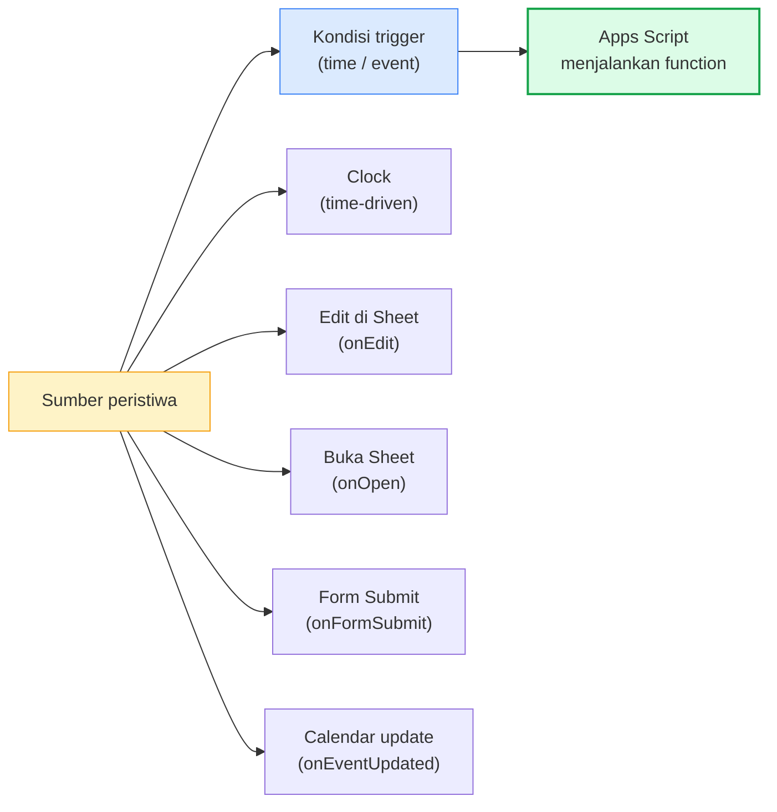
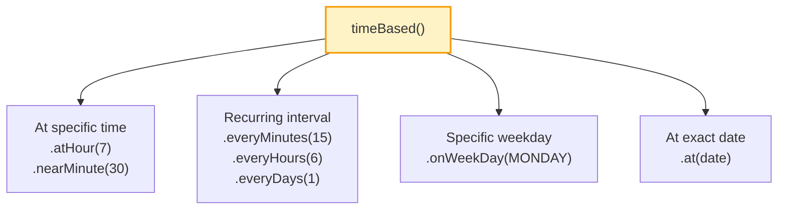
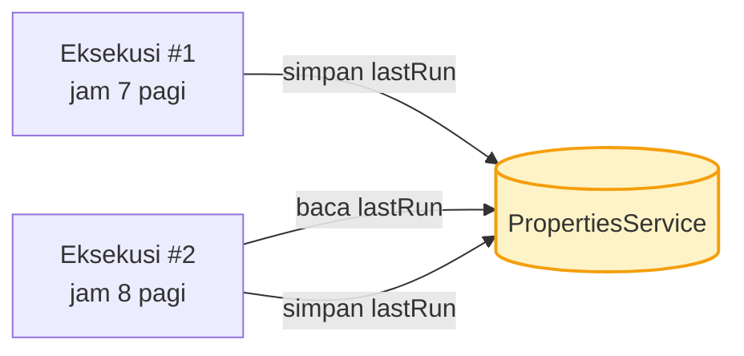
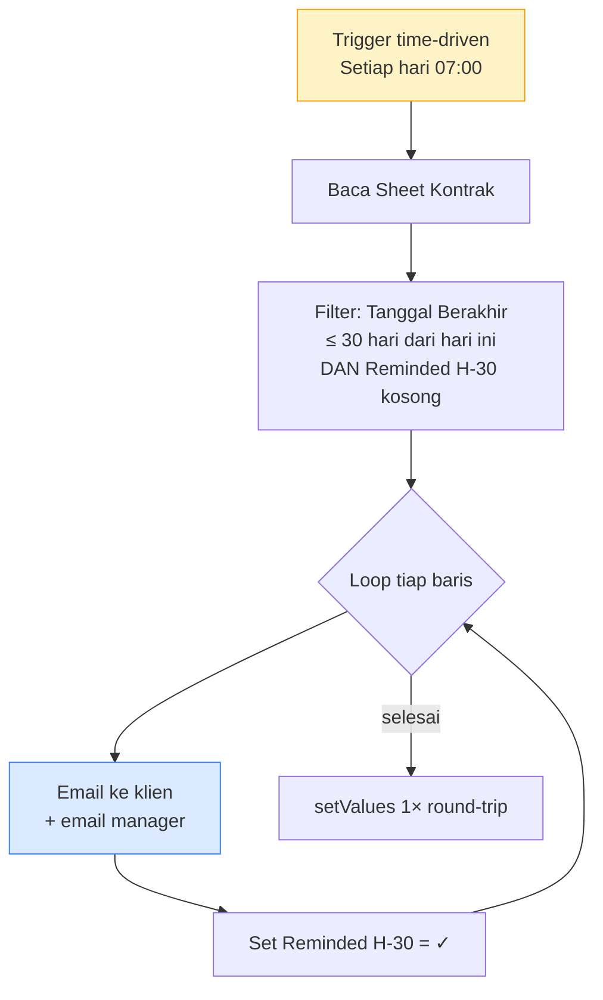

# Modul 6 — Workflow Automation (Triggers)

Sampai modul sebelumnya, semua kode dijalankan **manual** lewat tombol Run, custom menu, atau form. Modul 6 mengotomasi langkah ini: kode yang **berjalan sendiri** berdasarkan waktu (cron) atau peristiwa (event di Sheet/Form/Calendar).

---

## 1. Apa itu Trigger?

Trigger adalah aturan yang menyuruh Apps Script **menjalankan function tertentu otomatis** ketika kondisi tertentu terpenuhi.



---

## 2. Dua Jenis Trigger

| Jenis | Cara dibuat | Kapan jalan | Autorisasi |
|---|---|---|---|
| **Simple trigger** | Function dengan nama spesial: `onOpen`, `onEdit`, `onSelectionChange` | Otomatis (built-in event) | Terbatas — tidak bisa MailApp/UrlFetch |
| **Installable trigger** | Dipasang via **kode** atau **UI Triggers** | Berdasarkan setting (waktu/event) | Penuh — bisa semua service |

> **Aturan praktis**: kalau butuh kirim email atau panggil API → installable. Kalau cuma manipulasi sheet sederhana → simple trigger cukup.

---

## 3. Simple Triggers

### 3.1 `onEdit(e)` — saat user edit sel

```javascript
function onEdit(e) {
  // e.range  → Range yang diedit
  // e.value  → nilai baru
  // e.oldValue → nilai sebelumnya (kalau cuma 1 sel)
  // e.source → Spreadsheet
  // e.user   → user yang edit (di Workspace)

  const sheet = e.range.getSheet();
  const col = e.range.getColumn();

  // Otomatis: kalau kolom "Status" diset "DONE", warnai background hijau
  if (sheet.getName() === "Tugas" && col === 4 && e.value === "DONE") {
    sheet.getRange(e.range.getRow(), 1, 1, sheet.getLastColumn())
         .setBackground("#dcfce7");
  }
}
```

### 3.2 `onOpen()` — saat sheet dibuka

Sudah dipakai sejak Modul 5 untuk custom menu.

```javascript
function onOpen() {
  SpreadsheetApp.getUi()
    .createMenu("⚡ Otomasi")
    .addItem("Run Sync", "doSync")
    .addToUi();
}
```

### 3.3 Keterbatasan Simple Trigger

- Tidak bisa panggil service yang butuh autorisasi: `MailApp`, `GmailApp`, `UrlFetchApp`, `CalendarApp` (sebagian), Drive yang tulis.
- Kalau butuh kirim email saat onEdit → **upgrade ke installable trigger**.

---

## 4. Installable Triggers

Punya kemampuan penuh, tapi harus **dipasang dulu**. Dua cara: lewat UI dan lewat kode.

### 4.1 Lewat UI (manual)

Sidebar editor → **Triggers** (ikon ⏰) → **+ Add Trigger** → pilih function, event source, type, frequency.


Bagus untuk eksperimen — tidak perlu kode tambahan.

### 4.2 Lewat kode (programmatic)

Cocok untuk script yang harus self-deploy (deploy via clasp atau berbagi project antar tim).

```javascript
function pasangTriggerHarian() {
  // Hapus trigger lama dengan nama function yang sama (idempotent)
  ScriptApp.getProjectTriggers().forEach((t) => {
    if (t.getHandlerFunction() === "kirimLaporanHarian") {
      ScriptApp.deleteTrigger(t);
    }
  });

  // Pasang baru: tiap hari jam 7 pagi
  ScriptApp.newTrigger("kirimLaporanHarian")
    .timeBased()
    .atHour(7)
    .everyDays(1)
    .create();
}

function listTrigger() {
  ScriptApp.getProjectTriggers().forEach((t) => {
    Logger.log(`${t.getHandlerFunction()} | ${t.getTriggerSource()} | ${t.getEventType()}`);
  });
}
```

---

## 5. Time-Driven Trigger (Cron)



### 5.1 Contoh pola umum

```javascript
// Setiap jam (untuk sync ringan)
ScriptApp.newTrigger("syncData").timeBased().everyHours(1).create();

// Setiap hari jam 7 pagi
ScriptApp.newTrigger("kirimLaporanHarian")
  .timeBased().atHour(7).everyDays(1).create();

// Setiap Senin jam 8 pagi
ScriptApp.newTrigger("laporanMingguan")
  .timeBased().onWeekDay(ScriptApp.WeekDay.MONDAY).atHour(8).create();

// Tiap 15 menit (sering pakai untuk mini-poll)
ScriptApp.newTrigger("checkInbox").timeBased().everyMinutes(15).create();

// Sekali pada tanggal tertentu (mis. reminder kontrak berakhir)
const tgl = new Date("2026-12-31T08:00:00+07:00");
ScriptApp.newTrigger("notifKontrak").timeBased().at(tgl).create();
```

> **Catatan presisi**: trigger `everyMinutes(N)` **tidak persis** N menit. Google jadwalkan dalam window N menit. Untuk `atHour(7)`, biasanya jalan jam 7:00–7:59. Tidak ada cron presisi detik.

---

## 6. Event-Driven Triggers

### 6.1 Sheet — `onEdit` / `onChange` (installable)

```javascript
ScriptApp.newTrigger("onEditWithMail")
  .forSpreadsheet(SpreadsheetApp.getActive())
  .onEdit()
  .create();

function onEditWithMail(e) {
  if (e.range.getColumn() === 5 && e.value === "URGENT") {
    MailApp.sendEmail(
      Session.getActiveUser().getEmail(),
      "Item URGENT terdeteksi",
      `Baris ${e.range.getRow()} di-flag URGENT.`
    );
  }
}
```

`onChange` = struktur sheet berubah (insert row, hapus sheet, dll). `onEdit` = isi sel berubah.

### 6.2 Form — `onFormSubmit`

Workflow paling sering: **Form → Sheet → Email/Action**.

```javascript
function pasangTriggerForm() {
  const form = FormApp.openById("FORM_ID");
  ScriptApp.newTrigger("prosesPendaftaran")
    .forForm(form)
    .onFormSubmit()
    .create();
}

function prosesPendaftaran(e) {
  // e.response = FormResponse
  // e.values   = array jawaban (kalau trigger dari Sheet response)

  const respon = e.response;
  const items = respon.getItemResponses();

  const data = {};
  items.forEach((item) => {
    data[item.getItem().getTitle()] = item.getResponse();
  });

  // Kirim konfirmasi
  MailApp.sendEmail({
    to: data.Email,
    subject: `Pendaftaran ${data.Nama} diterima`,
    htmlBody: `<p>Halo <b>${data.Nama}</b>, pendaftaran Anda diterima.</p>`
  });

  // Notif ke admin
  MailApp.sendEmail({
    to: "admin@kantor.id",
    subject: "Pendaftaran baru",
    body: JSON.stringify(data, null, 2)
  });
}
```

### 6.3 Calendar — `onEventUpdated`

Trigger saat event ditambah/diubah/dihapus di kalender user.

```javascript
function pasangTriggerKalender() {
  ScriptApp.newTrigger("onEventCalendar")
    .forUserCalendar(Session.getActiveUser().getEmail())
    .onEventUpdated()
    .create();
}

function onEventCalendar(e) {
  Logger.log("Calendar event updated: " + e.calendarId);
  // Sinkron ke Sheet, dll
}
```

---

## 7. PropertiesService — State Antar Eksekusi

Trigger jalan terjadwal, tapi setiap eksekusi terpisah — variabel global tidak bertahan. Pakai `PropertiesService` untuk simpan state.



```javascript
function syncIncremental() {
  const props = PropertiesService.getScriptProperties();
  const lastRun = props.getProperty("lastSyncTime");
  const now     = new Date();

  Logger.log(`Last sync: ${lastRun || "(belum pernah)"}`);

  // ... lakukan sync data sejak lastRun

  props.setProperty("lastSyncTime", now.toISOString());
}
```

**Tiga scope**:
- `getScriptProperties()` — global untuk seluruh project, semua user.
- `getUserProperties()` — per-user (user yang trigger script).
- `getDocumentProperties()` — per-spreadsheet (di container-bound).

> **Kuota**: 9KB per property, 500KB total. Jangan simpan data besar — simpan ke Sheet/Drive untuk itu.

---

## 8. Lock Service — Hindari Race Condition

Kalau trigger time-driven `everyMinutes(1)` dan eksekusi #1 belum selesai sebelum eksekusi #2 mulai → bisa double-process. Solusi: `LockService`.

```javascript
function syncDataAman() {
  const lock = LockService.getScriptLock();
  if (!lock.tryLock(10000)) {   // tunggu max 10 detik
    Logger.log("Sync lain sedang jalan. Skip.");
    return;
  }

  try {
    // ... pekerjaan kritikal
    syncIncremental();
  } finally {
    lock.releaseLock();
  }
}
```

---

## 9. Mini-Project — Notifikasi Kontrak Berakhir (Time-driven)

Skenario: Sheet `Kontrak` berisi kolom `Nama Klien`, `Email`, `Tanggal Berakhir`. Setiap pagi jam 7, script harus:
1. Cari kontrak yang akan berakhir dalam **30 hari ke depan**.
2. Kirim reminder ke email klien + ke email manager.
3. Catat status `Reminded H-30 = ✓` supaya tidak kirim ulang.



Implementasi lengkap di `contoh.js` (`reminderKontrakHarian`).

---

## 10. Best Practices

1. **Idempotent**: trigger kemungkinan dipanggil berulang — pastikan dijalankan dua kali tidak menghasilkan dua hasil. Pakai marker (kolom `Notif Sent`, label Gmail, atau `PropertiesService`).
2. **Hindari kerja > 6 menit** per eksekusi. Pecah jadi batch + simpan progress di `PropertiesService`, panggil ulang dengan trigger.
3. **Logging eksekusi**: di **Executions** sidebar, periksa keberhasilan rutin. Set up `try/catch` global yang log error ke Sheet untuk audit.
4. **Pasang trigger lewat kode** (Sheet `pasangTrigger()`) untuk reproducibility, bukan klik manual.
5. **Hapus trigger lama** sebelum pasang baru — kalau tidak, akan jalan dua kali.
6. **Test fungsi trigger secara manual dulu** dengan `Run` di editor sebelum dipasang.
7. **Quota**: max 20 trigger per project per user. Kalau butuh banyak schedule, gabung ke 1 trigger yang `if (jam === X) doA()`.

---

## 11. Penutup

**Yang harus dikuasai sebelum lanjut**:

- [ ] Paham beda simple vs installable trigger.
- [ ] Bisa pasang time-driven trigger (`everyHours`, `atHour`, `onWeekDay`) lewat kode.
- [ ] Bisa pasang event trigger (`onEdit`, `onFormSubmit`) lewat kode.
- [ ] Bisa pakai `PropertiesService` untuk state antar eksekusi.
- [ ] Sadar pentingnya `LockService` untuk task yang bisa overlap.
- [ ] Bisa list & hapus trigger via `ScriptApp.getProjectTriggers()`.
- [ ] Memahami batas 6 menit eksekusi & strategi batch.

**Selanjutnya: Modul 7 — Web Apps & API Integration.**
