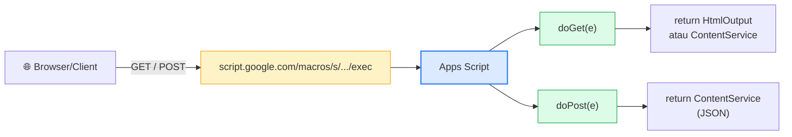
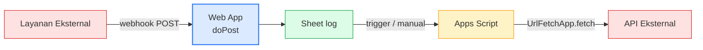

# Modul 7 — Web Apps & API Integration

Modul 5 membahas UI di dalam Sheet/Doc (sidebar/dialog). Modul 7 membuka pintu lebih lebar: **Web App** standalone yang punya URL publik sendiri, plus **integrasi dengan API eksternal** (cuaca, currency, webhook, dll).

Outcome: kita bisa buat halaman dengan URL `script.google.com/macros/s/.../exec` yang melayani user lewat browser, dan bisa konsumsi/mengirim data dari/ke layanan luar.

---

## 1. Apa itu Web App?

Web App di Apps Script = **endpoint HTTP** yang hosted gratis di server Google. Kita tulis dua function: `doGet(e)` dan/atau `doPost(e)`. Setiap kali ada request HTTP ke URL Web App, function tersebut dipanggil.



### Pola umum:

- **doGet** → return HTML page atau JSON (untuk visit dari browser).
- **doPost** → menerima data dari client/integrasi, return JSON (untuk POST API).

---

## 2. Web App Pertama — Halaman Sederhana

```javascript
function doGet(e) {
  return HtmlService.createHtmlOutput(`
    <h1>Halo dari Web App!</h1>
    <p>Waktu server: ${new Date().toString()}</p>
  `);
}
```

Setelah save, deploy: **Deploy → New deployment → Type: Web app → Execute as: Me, Who has access: Anyone (atau Anyone with Google account, atau Only myself)**. Klik Deploy → autorisasi → dapatkan **URL Web App**.

Buka URL di browser → halaman tampil.

> Setiap kali kode berubah, **buat New version** dari Deploy menu, atau pakai **Test deployments** untuk preview cepat tanpa version baru.

---

## 3. Membaca Query String — `doGet(e)`

```javascript
function doGet(e) {
  // URL: .../exec?nama=Sari&umur=28
  const nama = e.parameter.nama || "Tamu";
  const umur = e.parameter.umur || "—";

  return HtmlService.createHtmlOutput(`
    <h1>Halo, ${nama}</h1>
    <p>Umur: ${umur}</p>
  `);
}
```

`e.parameter` = object key-value dari query string. `e.parameters` (jamak) = nilai sebagai array kalau ada key dobel.

---

## 4. Return JSON — `ContentService`

Kalau Web App dipakai sebagai **API endpoint**, return JSON:

```javascript
function doGet(e) {
  const data = {
    timestamp: new Date().toISOString(),
    user:      Session.getActiveUser().getEmail(),
    server:    "apps-script"
  };

  return ContentService
    .createTextOutput(JSON.stringify(data))
    .setMimeType(ContentService.MimeType.JSON);
}
```

Test dengan `curl`:
```bash
curl https://script.google.com/macros/s/.../exec
```

---

## 5. doPost — Menerima Data dari Luar

```javascript
function doPost(e) {
  // e.postData.contents = body request mentah (JSON string)
  // e.postData.type      = content type (mis. "application/json")

  let payload;
  try {
    payload = JSON.parse(e.postData.contents);
  } catch (err) {
    return _json({ ok: false, error: "Invalid JSON" });
  }

  // ... proses payload
  const sheet = SpreadsheetApp.openById("...").getSheetByName("Logs");
  sheet.appendRow([new Date(), JSON.stringify(payload)]);

  return _json({ ok: true, received: payload });
}

function _json(obj) {
  return ContentService
    .createTextOutput(JSON.stringify(obj))
    .setMimeType(ContentService.MimeType.JSON);
}
```

Test:
```bash
curl -X POST -H "Content-Type: application/json" \
  -d '{"event":"new_signup","email":"alice@example.com"}' \
  https://script.google.com/macros/s/.../exec
```

> **Webhook receiver** — pola ini jadi pintu masuk untuk webhook dari Stripe, Slack, GitHub, Zapier, dll.

---

## 6. Web App dengan UI Lengkap

Pakai HTML file terpisah (mirip Modul 5) tapi public-facing.

```javascript
function doGet(e) {
  const tmpl = HtmlService.createTemplateFromFile("page");
  tmpl.judul = "Pendaftaran Event";
  tmpl.user  = Session.getActiveUser().getEmail();
  return tmpl.evaluate()
    .setTitle("Pendaftaran")
    .addMetaTag("viewport", "width=device-width, initial-scale=1");
}

function daftarEvent(formData) {
  // dipanggil dari client lewat google.script.run
  const sheet = SpreadsheetApp.openById("...").getSheetByName("Pendaftar");
  sheet.appendRow([new Date(), formData.nama, formData.email, formData.kategori]);
  return { ok: true };
}
```

`page.html` mirip pola di Modul 5, hanya ini di-host sebagai standalone URL. Sudah bisa diakses dari handphone/laptop manapun yang punya akses sesuai setting deploy.

---

## 7. UrlFetchApp — Memanggil API Eksternal

Apps Script bisa keluar memanggil HTTP API mana saja.

### 7.1 GET sederhana

```javascript
function ambilCuaca(kota) {
  // Gunakan API publik yang gratis & tidak butuh auth (contoh: wttr.in)
  const url = `https://wttr.in/${encodeURIComponent(kota)}?format=j1`;
  const respon = UrlFetchApp.fetch(url);
  const data = JSON.parse(respon.getContentText());

  const cuaca = data.current_condition[0];
  console.log(`${kota}: ${cuaca.temp_C}°C, ${cuaca.weatherDesc[0].value}`);
}
```

### 7.2 POST dengan body JSON

```javascript
function kirimKeWebhook(payload) {
  const opsi = {
    method:  "post",
    contentType: "application/json",
    payload: JSON.stringify(payload),
    muteHttpExceptions: true   // jangan throw, kita handle sendiri
  };

  const respon = UrlFetchApp.fetch("https://hooks.slack.com/services/...", opsi);
  console.log(`Status: ${respon.getResponseCode()}`);
  console.log(`Body: ${respon.getContentText()}`);
}
```

### 7.3 Authentication

```javascript
// Bearer token
const opsi = {
  method: "get",
  headers: {
    "Authorization": "Bearer " + token,
    "Accept": "application/json"
  }
};

// Basic auth
const auth = Utilities.base64Encode(`${user}:${pass}`);
const opsi2 = {
  method: "get",
  headers: { "Authorization": "Basic " + auth }
};
```

### 7.4 Best practice: simpan secret di PropertiesService

**Jangan hardcode API key di kode** — gunakan PropertiesService.

```javascript
function setApiKey() {
  PropertiesService.getScriptProperties().setProperty("API_KEY", "rahasia123");
  console.log("Key tersimpan.");
}

function panggilApi() {
  const key = PropertiesService.getScriptProperties().getProperty("API_KEY");
  // ... pakai key
}
```

Atau set lewat UI: **Project Settings → Script Properties → Add property**.

---

## 8. Integrasi Dua Arah — Pola Umum



**Use case nyata**:
- **Slack webhook** → notifikasi otomatis ke channel tim saat Form baru disubmit.
- **Currency API** → update kurs di Sheet tiap jam.
- **WhatsApp Business API / Telegram** → bot notifikasi.
- **Stripe webhook** → catat pembayaran masuk ke Sheet.

---

## 9. Mini-Project — Bot Telegram dengan Webhook

Skenario: User kirim pesan ke bot Telegram, bot membalas dengan info dari Sheet.

### Langkah:

**1) Bikin bot di Telegram** lewat @BotFather → dapat `BOT_TOKEN`.

**2) Tulis Web App** Apps Script yang menerima webhook:

```javascript
const BOT_TOKEN = PropertiesService.getScriptProperties().getProperty("BOT_TOKEN");

function doPost(e) {
  const update = JSON.parse(e.postData.contents);
  if (!update.message) return _json({ ok: true });

  const chatId = update.message.chat.id;
  const text   = (update.message.text || "").trim();

  let reply;
  if (text.startsWith("/start")) {
    reply = "Halo! Ketik /menu untuk daftar perintah.";
  } else if (text.startsWith("/menu")) {
    reply = "Perintah:\n/menu - daftar perintah\n/info - info tim";
  } else if (text.startsWith("/info")) {
    reply = "Tim Otomasi Workspace v1.0";
  } else {
    reply = `Pesan diterima: "${text}"`;
  }

  kirimPesan(chatId, reply);
  return _json({ ok: true });
}

function kirimPesan(chatId, text) {
  const url = `https://api.telegram.org/bot${BOT_TOKEN}/sendMessage`;
  UrlFetchApp.fetch(url, {
    method: "post",
    contentType: "application/json",
    payload: JSON.stringify({ chat_id: chatId, text: text })
  });
}

function _json(obj) {
  return ContentService.createTextOutput(JSON.stringify(obj))
    .setMimeType(ContentService.MimeType.JSON);
}
```

**3) Deploy sebagai Web App** → dapat URL.

**4) Daftarkan webhook ke Telegram**:
```javascript
function setWebhook() {
  const URL = "https://script.google.com/macros/s/.../exec";
  const r = UrlFetchApp.fetch(
    `https://api.telegram.org/bot${BOT_TOKEN}/setWebhook?url=${encodeURIComponent(URL)}`
  );
  console.log(r.getContentText());
}
```

**5) Test**: kirim pesan ke bot di Telegram → bot balas otomatis.

---

## 10. Keamanan & Quota

### Setting akses Web App

| Pilihan | Cocok untuk |
|---|---|
| **Only myself** | Eksperimen, internal admin |
| **Anyone with Google account** | Internal Workspace organisasi |
| **Anyone (including anonymous)** | Webhook receiver, public API/page |

### Execute as

| Pilihan | Yang jalan dengan permission siapa |
|---|---|
| **Me (user yang deploy)** | Permission deployer — script bisa akses Drive deployer |
| **User accessing the web app** | Permission user yang buka — butuh login Google |

> Untuk **webhook receiver** (anonim), wajib pilih **Execute as: Me + Anyone**. Tapi hati-hati: spam webhook bisa makan quota cepat.

### Quota

- `UrlFetchApp.fetch`: 20.000 / hari (gratis), 100.000 / hari (Workspace).
- Web App execution: durasi max 6 menit per request.
- Concurrent execution: limit ~30 request bersamaan per user.

---

## 11. Best Practices

1. **Simpan secret di PropertiesService**, bukan di kode (hindari masuk ke git).
2. **Validasi origin webhook** — periksa header secret atau signature kalau penyedia mendukung (mis. `X-Hub-Signature` di GitHub).
3. **Rate-limit di sisi script** dengan PropertiesService timestamp + LockService kalau webhook deras.
4. **Logging request** ke Sheet untuk audit & debug, terutama untuk integrasi production.
5. **Versi deployment** — set "Test deployment" untuk staging, "Production" untuk URL stabil.
6. **`muteHttpExceptions: true`** saat fetch — supaya error HTTP tidak kill script, kita handle status code sendiri.
7. **CORS**: Web App Apps Script tidak set header CORS otomatis. Kalau dipanggil dari browser frontend, harus dari domain yang sama atau via JSONP, atau pakai backend proxy.

---

## 12. Penutup

**Yang harus dikuasai sebelum lanjut**:

- [ ] Bisa bikin doGet/doPost Web App dengan return HTML atau JSON.
- [ ] Bisa baca query parameter dan request body.
- [ ] Bisa deploy Web App dan mengelola versi.
- [ ] Bisa panggil API eksternal pakai UrlFetchApp (GET/POST/auth).
- [ ] Bisa simpan & ambil secret pakai PropertiesService.
- [ ] Paham bedanya Execute as Me vs User, Anyone vs Anyone Logged In.
- [ ] Bisa receive webhook dari layanan eksternal.
- [ ] Bisa bangun integrasi 2-arah (terima + kirim).

**Selanjutnya: Modul 8 — Integrating Multiple Google Services.**
