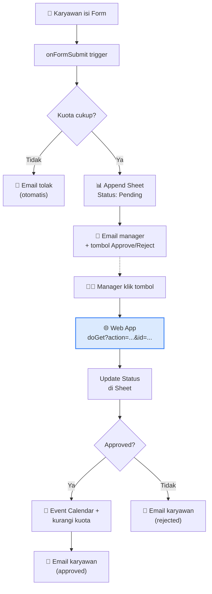

# Modul 8 — Project Akhir: Sistem Cuti Lengkap

Modul ini bukan materi teori. Anda akan langsung **membangun satu sistem nyata** yang menggabungkan semua yang sudah dipelajari: Sheet, Form, Gmail, Calendar, Web App, dan Trigger.

Setelah selesai, Anda punya sistem cuti karyawan yang sungguhan bisa dipakai di kantor.

---

## Apa yang Akan Kita Bangun

**Skenario**:
1. Karyawan isi **Google Form** pengajuan cuti.
2. Sistem otomatis **cek sisa kuota** karyawan di Sheet.
   - Kalau kuota tidak cukup → email tolak otomatis.
   - Kalau cukup → catat di Sheet sebagai "Pending" + email ke manager dengan tombol Approve/Reject.
3. Manager klik tombol di email → buka **Web App** → status di-update.
4. Kalau Approved: bikin event Calendar, kurangi kuota, email ke karyawan.
5. Kalau Rejected: email ke karyawan dengan alasan.



---

## Langkah 0 — Persiapan

### 0.1 Buat Spreadsheet

Buat Spreadsheet baru bernama **`Sistem-Cuti`** dengan 3 tab:

**Tab `Kuota-Cuti`** (data master kuota tiap karyawan):

| Email | Nama | Sisa |
|---|---|---|
| `karyawan1@perusahaan.com` | Sari Wulandari | 12 |
| `karyawan2@perusahaan.com` | Budi Setiawan | 12 |

Isi minimal 2 baris dengan email karyawan yang nanti akan submit form.

**Tab `Pengajuan-Cuti`** (riwayat semua pengajuan):

| ID | Timestamp | Nama | Email | Jenis Cuti | Tanggal Mulai | Tanggal Selesai | Alasan | Status |
|---|---|---|---|---|---|---|---|---|

Cukup baris header, isi nanti otomatis.

**Tab `Audit`** (log untuk debugging):

| Timestamp | User | Aksi | Detail |
|---|---|---|---|

### 0.2 Buat Google Form

Buat Form baru bernama **`Pengajuan Cuti`** dengan field:

| Field | Type | Required |
|---|---|---|
| Email | Email (Settings → Collect email addresses) | ✓ |
| Nama | Short answer | ✓ |
| Jenis Cuti | Multiple choice: Tahunan / Sakit / Khusus | ✓ |
| Tanggal Mulai | Date | ✓ |
| Tanggal Selesai | Date | ✓ |
| Alasan | Paragraph | — |

### 0.3 Buat Apps Script Project

Di Spreadsheet `Sistem-Cuti`: **Extensions → Apps Script**. Project baru terbuka (sudah bound ke Sheet).

### 0.4 Set Script Properties

**Project Settings ⚙️ → Script Properties → Add property**:

| Key | Value |
|---|---|
| `SHEET_ID` | ID Spreadsheet `Sistem-Cuti` (dari URL antara `/d/` dan `/edit`) |
| `FORM_ID` | ID Form `Pengajuan Cuti` (dari URL antara `/d/` dan `/edit`) |
| `ADMIN_EMAIL` | Email manager yang akan dapat notif approval |

> `WEB_APP_URL` belum diisi sekarang — kita akan deploy dulu, baru update di Langkah 4.

---

## Langkah 1 — Helper Dasar

Di file `Code.gs`, tulis helper yang akan dipakai berulang.

```javascript
// ===== Config & Helper =====
function _props() {
  return PropertiesService.getScriptProperties();
}

function _sheet(nama) {
  const SHEET_ID = _props().getProperty("SHEET_ID");
  return SpreadsheetApp.openById(SHEET_ID).getSheetByName(nama);
}

function _audit(aksi, detail) {
  _sheet("Audit").appendRow([
    new Date(),
    Session.getActiveUser().getEmail() || "system",
    aksi,
    JSON.stringify(detail).substring(0, 1000)
  ]);
}

// Hitung jumlah hari cuti (inclusive)
function _hitungHari(mulai, selesai) {
  const m = new Date(mulai);
  const s = new Date(selesai);
  return Math.round((s - m) / (24 * 60 * 60 * 1000)) + 1;
}
```

> **Test cepat**: ketik di console editor `_audit("test", { hello: "world" })` lalu **Run**. Cek tab `Audit` — harus muncul baris baru.

---

## Langkah 2 — Function Cek Kuota

Function ini cari email karyawan di tab `Kuota-Cuti` dan return sisa kuota-nya.

```javascript
function cekKuota(email) {
  const data = _sheet("Kuota-Cuti").getDataRange().getValues();
  const header = data[0];
  const cEmail = header.indexOf("Email");
  const cSisa  = header.indexOf("Sisa");

  for (let i = 1; i < data.length; i++) {
    if (String(data[i][cEmail]).toLowerCase() === email.toLowerCase()) {
      return Number(data[i][cSisa]) || 0;
    }
  }
  return 0;   // email tidak terdaftar → 0
}
```

**Test**: ganti `email_anda@...` dengan email yang ada di tab Kuota-Cuti, lalu run:

```javascript
function ujiCekKuota() {
  console.log(cekKuota("karyawan1@perusahaan.com"));   // harus print 12
  console.log(cekKuota("tidak.ada@example.com"));      // harus print 0
}
```

---

## Langkah 3 — Handler Form Submit

Inilah inti workflow: function yang dipanggil otomatis setiap kali ada submit form.

```javascript
function pengajuanCutiHandler(e) {
  // 1. Ambil jawaban form jadi object {Nama: "...", Email: "...", ...}
  const data = {};
  e.response.getItemResponses().forEach((item) => {
    data[item.getItem().getTitle()] = item.getResponse();
  });
  // Form Settings → Collect email addresses → akses lewat:
  data["Email"] = e.response.getRespondentEmail();

  try {
    // 2. Hitung kebutuhan vs sisa kuota
    const sisa = cekKuota(data["Email"]);
    const butuh = _hitungHari(data["Tanggal Mulai"], data["Tanggal Selesai"]);

    if (sisa < butuh) {
      MailApp.sendEmail({
        to: data["Email"],
        subject: "❌ Pengajuan cuti ditolak — kuota tidak cukup",
        body: `Halo ${data["Nama"]},\n\nMaaf, sisa kuota Anda ${sisa} hari, ` +
              `sedangkan pengajuan ${butuh} hari.\n\nSilakan koordinasi dengan HR.`
      });
      _audit("tolak-kuota", { email: data["Email"], sisa, butuh });
      return;
    }

    // 3. Simpan pengajuan ke Sheet dengan ID unik
    const cutiId = "CUT-" + Date.now();
    _sheet("Pengajuan-Cuti").appendRow([
      cutiId,
      new Date(),
      data["Nama"],
      data["Email"],
      data["Jenis Cuti"],
      data["Tanggal Mulai"],
      data["Tanggal Selesai"],
      data["Alasan"] || "",
      "Pending"
    ]);

    // 4. Email manager dengan tombol approve/reject
    kirimEmailApproval(cutiId, data, butuh);

    _audit("submit", { cutiId, email: data["Email"], butuh });
  } catch (err) {
    _audit("submit-error", { error: err.message, data });
    throw err;
  }
}

function kirimEmailApproval(cutiId, data, jumlahHari) {
  const adminEmail = _props().getProperty("ADMIN_EMAIL");
  const webAppUrl  = _props().getProperty("WEB_APP_URL") || "(belum di-set)";

  const linkOK    = `${webAppUrl}?action=approve&id=${cutiId}`;
  const linkBatal = `${webAppUrl}?action=reject&id=${cutiId}`;

  MailApp.sendEmail({
    to: adminEmail,
    subject: `[Approval Cuti] ${data["Nama"]} — ${jumlahHari} hari`,
    htmlBody: `
      <p><b>${data["Nama"]}</b> mengajukan cuti.</p>
      <ul>
        <li>Jenis: ${data["Jenis Cuti"]}</li>
        <li>Tanggal: ${data["Tanggal Mulai"]} — ${data["Tanggal Selesai"]} (${jumlahHari} hari)</li>
        <li>Alasan: ${data["Alasan"] || "(tidak diisi)"}</li>
      </ul>
      <p>
        <a href="${linkOK}"    style="background:#16a34a;color:white;padding:8px 16px;text-decoration:none;border-radius:4px;">✓ Approve</a>
        &nbsp;
        <a href="${linkBatal}" style="background:#dc2626;color:white;padding:8px 16px;text-decoration:none;border-radius:4px;">✗ Reject</a>
      </p>
    `
  });
}
```

### Pasang trigger Form Submit

```javascript
function pasangTrigger() {
  const FORM_ID = _props().getProperty("FORM_ID");

  // Hapus trigger lama dulu (biar tidak dobel kalau dijalankan ulang)
  ScriptApp.getProjectTriggers()
    .filter((t) => t.getHandlerFunction() === "pengajuanCutiHandler")
    .forEach((t) => ScriptApp.deleteTrigger(t));

  ScriptApp.newTrigger("pengajuanCutiHandler")
    .forForm(FormApp.openById(FORM_ID))
    .onFormSubmit()
    .create();

  console.log("Trigger terpasang ✓");
}
```

**Run `pasangTrigger` sekali** → autorisasi → selesai.

---

## Langkah 4 — Web App untuk Approve / Reject

Saat manager klik tombol di email, browser membuka URL Web App kita. Function `doGet` yang melayani.

```javascript
function doGet(e) {
  const action = e.parameter.action;   // "approve" atau "reject"
  const id     = e.parameter.id;       // cutiId

  if (!action || !id) {
    return _halamanPesan(false, "Parameter tidak lengkap.");
  }

  const hasil = prosesApproval(id, action);
  return _halamanPesan(hasil.ok, hasil.pesan);
}

function prosesApproval(id, action) {
  if (action !== "approve" && action !== "reject") {
    return { ok: false, pesan: "Aksi tidak valid." };
  }

  const sheet = _sheet("Pengajuan-Cuti");
  const data = sheet.getDataRange().getValues();
  const h = data[0];
  const cId     = h.indexOf("ID");
  const cStatus = h.indexOf("Status");

  // Cari baris dengan ID matching
  for (let i = 1; i < data.length; i++) {
    if (data[i][cId] !== id) continue;

    // Cegah double-proses (kalau manager refresh)
    if (data[i][cStatus] !== "Pending") {
      return { ok: false, pesan: `Pengajuan sudah ${data[i][cStatus]}.` };
    }

    const status = action === "approve" ? "Approved" : "Rejected";
    sheet.getRange(i + 1, cStatus + 1).setValue(status);

    const nama  = data[i][h.indexOf("Nama")];
    const email = data[i][h.indexOf("Email")];
    const mulai = data[i][h.indexOf("Tanggal Mulai")];
    const sel   = data[i][h.indexOf("Tanggal Selesai")];

    if (action === "approve") {
      buatEventCalendar(nama, email, mulai, sel);
      kurangiKuota(email, _hitungHari(mulai, sel));

      MailApp.sendEmail({
        to: email,
        subject: "✅ Cuti Anda di-Approved",
        htmlBody: `<p>Halo ${nama},</p>` +
                  `<p>Pengajuan cuti Anda <b>${mulai} — ${sel}</b> telah disetujui. Event Calendar sudah dibuat.</p>`
      });
    } else {
      MailApp.sendEmail({
        to: email,
        subject: "❌ Cuti Anda di-Reject",
        htmlBody: `<p>Halo ${nama},</p>` +
                  `<p>Pengajuan cuti Anda <b>${mulai} — ${sel}</b> ditolak. Silakan hubungi manager.</p>`
      });
    }

    _audit("approval-" + action, { id, nama });
    return { ok: true, pesan: `Pengajuan ${nama} berhasil di-${status}.` };
  }

  return { ok: false, pesan: "ID tidak ditemukan." };
}

function buatEventCalendar(nama, emailKaryawan, tglMulai, tglSelesai) {
  const cal = CalendarApp.getDefaultCalendar();
  const mulai = new Date(tglMulai);
  // Calendar all-day event butuh tanggal selesai = hari setelah hari terakhir cuti
  const selesai = new Date(new Date(tglSelesai).getTime() + 24 * 60 * 60 * 1000);

  cal.createAllDayEvent(`Cuti — ${nama}`, mulai, selesai, {
    description: `Cuti karyawan ${nama}`,
    guests: emailKaryawan,
    sendInvites: true
  });
}

function kurangiKuota(email, jumlah) {
  const sheet = _sheet("Kuota-Cuti");
  const data = sheet.getDataRange().getValues();
  const cEmail = data[0].indexOf("Email");
  const cSisa  = data[0].indexOf("Sisa");

  for (let i = 1; i < data.length; i++) {
    if (String(data[i][cEmail]).toLowerCase() === email.toLowerCase()) {
      sheet.getRange(i + 1, cSisa + 1).setValue((data[i][cSisa] || 0) - jumlah);
      return;
    }
  }
}

// Halaman HTML sederhana untuk feedback ke manager
function _halamanPesan(ok, pesan) {
  const warna = ok ? "#16a34a" : "#dc2626";
  const icon  = ok ? "✅" : "❌";
  return HtmlService.createHtmlOutput(`
    <html><body style="font-family:Arial;padding:40px;max-width:500px;margin:auto;">
      <div style="border-left:4px solid ${warna};padding-left:16px;">
        <h2>${icon} ${ok ? "Berhasil" : "Gagal"}</h2>
        <p>${pesan}</p>
      </div>
    </body></html>
  `);
}
```

### Deploy Web App

1. **Deploy → New deployment**.
2. Type: **Web app**.
3. Execute as: **Me**.
4. Who has access: **Anyone** (karena manager mungkin tidak login Google saat klik dari email).
5. Deploy → autorisasi → copy **Web App URL**.

### Update Script Properties

Buka Project Settings → Script Properties → tambah/edit:

| Key | Value |
|---|---|
| `WEB_APP_URL` | URL dari hasil deploy (yang `/exec` di akhir) |

Tanpa langkah ini, link Approve/Reject di email tidak akan berfungsi.

---

## Langkah 5 — Test End-to-End

Sekarang waktunya uji coba beneran:

1. **Buka Form** (link sharing form Anda) di browser.
2. **Submit** pengajuan dengan email yang ada di tab `Kuota-Cuti`. Pilih tanggal cuti misal 3 hari.
3. **Cek inbox manager** (email `ADMIN_EMAIL`) → harus ada email "Approval Cuti" dengan 2 tombol.
4. **Cek tab `Pengajuan-Cuti`** → harus ada baris baru status `Pending`.
5. **Klik tombol Approve** di email.
6. Browser membuka halaman "Berhasil".
7. **Cek**:
   - Tab `Pengajuan-Cuti` → Status berubah jadi `Approved`.
   - Tab `Kuota-Cuti` → angka Sisa berkurang.
   - **Calendar** Anda → event "Cuti — <nama>" muncul.
   - **Inbox karyawan** → email "✅ Cuti Anda di-Approved".
   - Tab `Audit` → ada log "approval-approve".

**Test kasus tolak kuota**: submit pengajuan 20 hari padahal sisa cuma 12. Karyawan harus dapat email tolak otomatis, dan tidak ada baris masuk ke `Pengajuan-Cuti`.

---

## Langkah 6 — Update Kode Setelah Selesai Test

Karena ini Web App `/exec`, **setiap kali ubah kode, kode lama yang dipakai sampai Anda re-deploy**.

- Update minor (untuk test): pakai **Test deployments** URL.
- Update final: **Deploy → Manage deployments → Edit ✏️ → Version: New version → Deploy**. URL tetap sama.

---

## Langkah 7 — (Opsional) Anti Double-Proses

Kadang trigger Form Submit jalan dua kali (network glitch). Kalau tidak di-handle, pengajuan sama bisa masuk dobel.

Bungkus `pengajuanCutiHandler` dengan cache check:

```javascript
function pengajuanCutiHandler(e) {
  const responseId = e.response.getId();
  const cache = CacheService.getScriptCache();

  if (cache.get(`cuti:${responseId}`)) {
    console.log("Sudah diproses. Skip.");
    return;
  }

  const lock = LockService.getScriptLock();
  lock.tryLock(10000);
  try {
    if (cache.get(`cuti:${responseId}`)) return;   // double-check

    _prosesPengajuan(e);                            // logic asli dipindah ke sini
    cache.put(`cuti:${responseId}`, "1", 21600);   // tandai sudah diproses, 6 jam
  } finally {
    lock.releaseLock();
  }
}

function _prosesPengajuan(e) {
  // ... isi logika asli pengajuanCutiHandler (Langkah 3) ditaruh di sini
}
```

> Pola yang sama bisa Anda terapkan di Web App `doGet` kalau khawatir manager double-klik tombol Approve.

---

## Checklist Selesai

- [ ] Karyawan bisa submit Form → pengajuan masuk Sheet.
- [ ] Kalau kuota tidak cukup → otomatis dapat email tolak.
- [ ] Manager dapat email dengan tombol Approve/Reject.
- [ ] Tombol Approve menulis status, bikin event Calendar, kurangi kuota, email karyawan.
- [ ] Tombol Reject menulis status dan email karyawan.
- [ ] Tab `Audit` mencatat semua langkah.
- [ ] Saya paham kenapa harus re-deploy setelah ubah kode.
- [ ] (Bonus) Sudah implement anti double-proses dengan Cache + Lock.

**Selamat! 🎉 Sistem cuti Anda sudah berfungsi end-to-end.**

Inilah project akhir dari materi ini. Pola yang sama bisa Anda terapkan untuk **sistem internal apa pun** — pengadaan barang, klaim reimburse, request lembur, dll.
