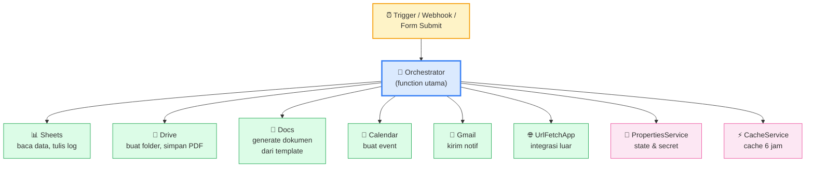
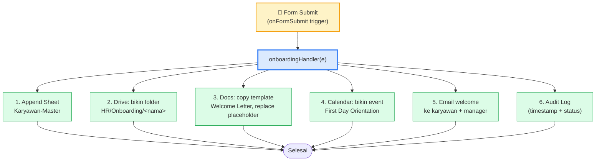
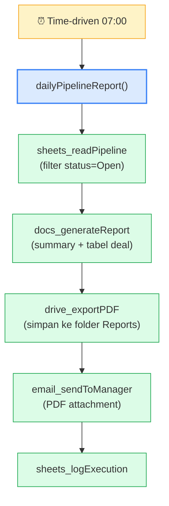
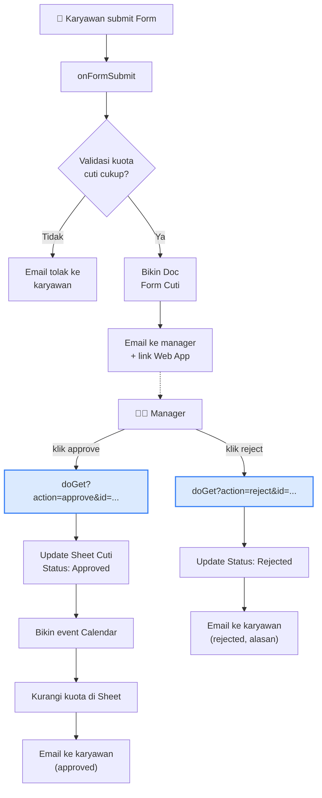

# Modul 8 — Integrating Multiple Google Services

Modul terakhir ini menyatukan semua yang sudah dipelajari. Kalau modul-modul sebelumnya menggali satu service per kali, modul ini menampilkan **arsitektur akhir** ketika 4-5 service bekerja sama dalam satu workflow nyata.

Outcome: peserta bisa men-design dan implementasi otomatisasi end-to-end yang reliable dan maintainable.

---

## 1. Arsitektur Multi-Service



**Prinsip arsitektur**:
- Satu orchestrator = satu function tinggi yang men-koordinasi semua service.
- Tiap service-call dibungkus helper kecil (single-responsibility).
- State persisten di PropertiesService.
- Cache pakai CacheService untuk yang sering dipanggil tapi jarang berubah.

---

## 2. Pola Modular — File Organization

Project Apps Script bisa berisi banyak file `.gs`. Organisasi yang baik membuat code maintainable.

```
project Apps Script/
├── Main.gs                ← orchestrator + trigger
├── Sheets.gs              ← helper Sheets (read/write)
├── Drive.gs               ← helper Drive (folder, copy, search)
├── Docs.gs                ← helper Docs (template, replace)
├── Email.gs               ← helper Gmail/MailApp
├── External.gs            ← UrlFetchApp wrappers
├── Utils.gs               ← logging, format, helper
└── (HTML files)
```

**Aturan**:
- Tiap file fokus ke satu service/concern.
- Function di file mana pun bisa saling memanggil tanpa import.
- Konstanta global di top file `Main.gs` atau `Config.gs`.

> Apps Script tidak punya module system. Hindari nama function generic seperti `init()` yang bisa konflik. Pakai prefix: `sheets_read`, `drive_findOrCreate`, `email_sendKonfirmasi`.

---

## 3. CacheService — Cache Cepat

Lebih ringan dari PropertiesService untuk data sementara. Max 6 jam, max 100KB per key.

```javascript
function ambilDataKurs() {
  const cache = CacheService.getScriptCache();
  const cached = cache.get("kurs");
  if (cached) {
    console.log("Cache hit!");
    return JSON.parse(cached);
  }

  console.log("Cache miss, fetching...");
  const r = UrlFetchApp.fetch("https://api.exchangerate-api.com/v4/latest/USD");
  const data = JSON.parse(r.getContentText());

  cache.put("kurs", JSON.stringify(data), 3600);   // simpan 1 jam (max 21600)
  return data;
}
```

**Kapan pakai apa**:
- **CacheService**: data yang boleh stale beberapa menit/jam (kurs, weather, lookup tables).
- **PropertiesService**: state penting yang harus persist (API key, lastSyncTime, config).

---

## 4. Pola Project Nyata #1: Onboarding Karyawan Baru

Skenario: HR submit form "karyawan baru". Sistem otomatis:
1. Tambah ke Sheet `Karyawan-Master`.
2. Bikin Google Doc "Welcome Letter" dari template, save di folder Drive `HR/Onboarding/<nama>`.
3. Bikin event Calendar "First Day Orientation" di tanggal mulai.
4. Kirim email welcome ke karyawan + notif ke manager.
5. Catat semua langkah ke `Audit Log`.



Implementasi (high-level — detail di `contoh.js`):

```javascript
function onboardingHandler(e) {
  const data = parseFormResponse(e.response);

  try {
    sheets_appendKaryawan(data);
    const folder = drive_createOnboardingFolder(data.nama);
    const docUrl = docs_generateWelcomeLetter(data, folder);
    const eventId = calendar_createOrientation(data);
    email_sendWelcome(data, docUrl);
    audit_log("onboarding-success", data);
  } catch (err) {
    audit_log("onboarding-failed", { ...data, error: err.message });
    throw err;   // re-throw supaya muncul di Executions
  }
}
```

---

## 5. Pola Project Nyata #2: Sales Pipeline Sync

Skenario: setiap pagi jam 7, ambil data deal dari Sheet `Pipeline`, bikin laporan PDF, kirim ke manager.



---

## 6. Error Handling & Logging

Multi-service workflow rentan terhadap kegagalan parsial (mis. Sheet sukses, tapi email gagal). Pola yang baik:

### 6.1 Catch granular, log detail

```javascript
function onboardingHandler(data) {
  const ctx = { stage: "init", data };

  try {
    ctx.stage = "sheet";
    sheets_appendKaryawan(data);

    ctx.stage = "drive";
    const folder = drive_createOnboardingFolder(data.nama);

    ctx.stage = "docs";
    const docUrl = docs_generateWelcomeLetter(data, folder);

    ctx.stage = "calendar";
    calendar_createOrientation(data);

    ctx.stage = "email";
    email_sendWelcome(data, docUrl);

    audit_log("success", { ...ctx, result: "all-stages" });
  } catch (err) {
    audit_log("failed", { ...ctx, error: err.message, stack: err.stack });
    throw err;
  }
}
```

`ctx.stage` membantu debug — kalau gagal di stage `"docs"`, langsung tahu di mana.

### 6.2 Sheet sebagai Audit Log

```javascript
function audit_log(status, payload) {
  const SHEET_ID = PropertiesService.getScriptProperties().getProperty("AUDIT_SHEET_ID");
  if (!SHEET_ID) return;

  const sheet = SpreadsheetApp.openById(SHEET_ID).getSheetByName("Audit");
  sheet.appendRow([
    new Date(),
    Session.getActiveUser().getEmail(),
    status,
    JSON.stringify(payload).substring(0, 5000)
  ]);
}
```

### 6.3 Notif ke admin saat error

```javascript
function audit_logFailure(payload) {
  const ADMIN = PropertiesService.getScriptProperties().getProperty("ADMIN_EMAIL");
  MailApp.sendEmail({
    to: ADMIN,
    subject: "[Workflow Error] " + payload.stage,
    body: JSON.stringify(payload, null, 2)
  });
}
```

---

## 7. Idempotency di Workflow Multi-Step

Trigger bisa dipanggil dua kali (network glitch, retry, manual run). Workflow harus aman dijalankan ulang.

### Strategi:

1. **External marker**: kolom Sheet `Status: Processed` — skip kalau sudah.
2. **Idempotency key**: pakai key unik (`Form Response ID`, `Email Message ID`) → cek di Sheet/Properties sebelum proses.
3. **Atomic check-then-do**: di Sheet, gunakan `LockService` saat baca → cek → tulis status → release.

```javascript
function onboardingHandlerIdempotent(e) {
  const responseId = e.response.getId();   // unik per submission

  const cache = CacheService.getScriptCache();
  if (cache.get(`onboarding:${responseId}`)) {
    console.log("Sudah diproses. Skip.");
    return;
  }

  // Lock supaya 2 trigger paralel tidak race
  const lock = LockService.getScriptLock();
  lock.tryLock(10000);

  try {
    if (cache.get(`onboarding:${responseId}`)) return;   // double-check

    onboardingHandler(parseFormResponse(e.response));
    cache.put(`onboarding:${responseId}`, "1", 21600);
  } finally {
    lock.releaseLock();
  }
}
```

---

## 8. Performance — Hindari N+1 Round-Trip

Kalau orchestrator memanggil 10 helper, masing-masing baca Sheet 1×, total 10× round-trip yang sama. Pola lebih baik: **read-once, share via parameter**.

```javascript
// ❌ Kurang efisien
function dailyReport() {
  const totalDeal = sheets_countDeal();        // baca sheet 1×
  const topProduct = sheets_topProduct();       // baca sheet 1×
  const totalRevenue = sheets_totalRevenue();   // baca sheet 1×
}

// ✓ Read once, hitung di memory
function dailyReportV2() {
  const data = sheets_readPipeline();          // 1× round-trip

  const totalDeal = data.length;
  const topProduct = analyze_topProduct(data);
  const totalRevenue = analyze_totalRevenue(data);
}
```

---

## 9. Mini-Project: Sistem Cuti Lengkap

Use case lengkap multi-service:

**User flow**:
1. Karyawan submit Google Form (kolom: nama, jenis cuti, tanggal mulai, tanggal selesai, alasan).
2. Trigger `onFormSubmit` jalan.
3. Sistem:
   - Validasi: cek sisa kuota cuti di Sheet `Kuota`.
   - Bikin Doc "Form Cuti — <nama> — <tgl>" dari template.
   - Kirim email ke manager (subject: `[Approval Cuti] <nama>`) + link approve/reject Web App.
4. Manager klik link approve → Web App update Sheet, kirim email ke karyawan, bikin event Calendar (kalau approved), kurangi kuota.
5. Audit log semua langkah.



Implementasi lengkap di `contoh.js` (`pengajuanCutiHandler`, `doGet` untuk approve/reject).

---

## 10. Best Practices Akhir

1. **Modularkan** ke beberapa file `.gs` per concern. `Main.gs` cuma orchestrator + trigger.
2. **Setiap helper return value yang berguna** (URL, ID) — bukan cuma side-effect, supaya bisa di-chain.
3. **Audit log selalu** untuk workflow production. Sheet `Audit` adalah teman terbaik debug.
4. **Catat secret di Script Properties**, bukan kode.
5. **Idempotent by default** — assume trigger akan jalan dua kali.
6. **Lock untuk race condition** kalau bisa overlap.
7. **Read-once, compute many** — hindari N+1 round-trip.
8. **Test end-to-end** di test Sheet/Folder/Calendar dulu sebelum production.
9. **Trigger production dipasang lewat kode** (`pasangSemuaTrigger()`) supaya reproducible.
10. **Pisahkan config**: `Config.gs` berisi semua ID, email, threshold supaya gampang diubah.

---

## 11. Penutup

**Yang harus dikuasai sebelum lanjut**:

- [ ] Bisa men-design arsitektur multi-service dengan orchestrator + helper.
- [ ] Bisa modularkan project ke beberapa file `.gs`.
- [ ] Bisa pakai CacheService dan PropertiesService sesuai konteks.
- [ ] Paham pola idempotency dengan response ID + cache.
- [ ] Bisa implement audit log dan error handling granular.
- [ ] Sadar trade-off N+1 round-trip — read once, compute many.
- [ ] Bisa bangun workflow end-to-end seperti onboarding atau cuti.

**Selanjutnya: Capstone Project (di folder `Capstone-Project`).**
